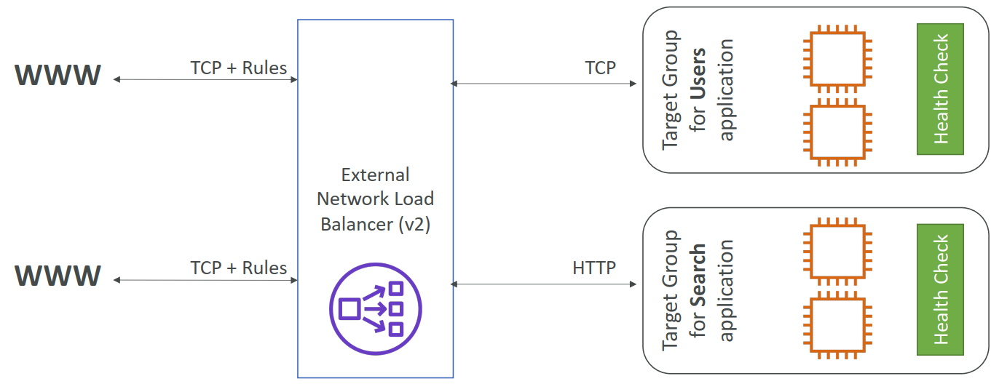

### 1. Why use a load balancer?

- 跨多个下游实例分散负载
- 向应用程序公开单点访问（DNS）
- 无缝处理下游实例的故障
- 定期对实例进行运行状况检查
- 为您的网站提供SSL终止（HTTPS）
- 使用Cookie强制粘性
- 跨区域的高可用性
- 将公共交通与私人交通分开

### 2. Types of load balancer on AWS

- AWS有 4 种托管负载平衡器
- **Classic Load Balancer** (v1 - old generation) – 2009 – CLB
  - HTTP, HTTPS, TCP, SSL (secure TCP)
  - Supports TCP (Layer 4), HTTP & HTTPS (Layer 7)
  - 运行状况检查基于 TCP 或 HTTP
  - 固定主机名：xxx.region.elb.amazonaws.com

- **Application Load Balancer** (v2 - new generation) – 2016 – ALB
  - HTTP、HTTPS、WebSocket
  - 应用程序负载均衡器是第7层（HTTP）
  - 跨计算机（目标组）实现多个HTTP应用程序的负载平衡
  - 同一台机器上多个应用程序的负载平衡（例如：容器）
  - 支持HTTP/2和WebSocket
  - 支持重定向（例如从HTTP到HTTPS）
  - 将表路由到不同的目标组：
    - 基于URL中路径的路由（example.com/用户&example.com/<font-color=blue>帖子）
    - 基于URL中主机名的路由（one.example.com&other.examplecom）
    - 基于查询字符串、标头的路由（例如.com/users？id=123&order=false）
  - ALB非常适合微服务和基于容器的应用程序（例如：Docker和Amazon ECS）
  - 具有端口映射功能，可重定向到ECS中的动态端口
  - 相比之下，每个应用程序需要多个经典负载均衡器
  - **Target Groups:**
    - EC2实例（可由自动缩放组管理）–HTTP
    - ECS任务（由ECS自己管理）-HTTP
    - Lambda函数–HTTP请求被转换为JSON事件
    - IP地址–必须是专用IP
  - ALB可以路由到多个目标群体
  - 健康检查在目标群体级别
  - 固定主机名（xxx.aregion.elb.amazonaws.com）
  - 应用程序服务器无法直接看到客户端的IP
  - 客户端的真实IP插入标头**X-Forwarded-For**请求标头可自动添加并帮助您识别客户端的 IP地址
  - We can also get Port (X-Forwarded-Port 请求标头可帮助您识别客户端与您的负载均衡器连接时所用的目标端口) and proto (X-Forwarded-Proto 请求标头可帮助您识别客户端与您的负载均衡器连接时所用的协议 (HTTP 或 HTTPS))

- **Network Load Balancer** (v2 - new generation) – 2017 – NLB
  - TCP、TLS（安全TCP）、UDP
  - 网络负载平衡器（第4层）允许：
    - 将TCP和UDP流量转发到您的实例
    - 每秒处理数百万个请求
    - 延迟更短～100毫秒（ALB为400毫秒）
  - **NLB每个AZ有<u>一个静态IP</u>，并支持分配弹性IP**（有助于将特定IP列入白名单）
  - NLB用于极端性能、TCP或UDP通信
  - **目标群体：**
    - EC2实例
    - IP地址–必须是专用IP
    - 应用程序负载平衡器

- **网关负载均衡器** – 2020 – GWLB
  - 在第3层（网络层）运行——IP协议
  - 在AWS中部署、扩展和管理第三方网络虚拟设备
  - 示例：防火墙、入侵检测和预防系统、深度数据包检测系统、有效负载操作等…
  - 在第3层（网络层）操作–IP数据包
  - 组合了以下功能：
    - **透明网络网关**–所有流量的单一入口/出口
    - **负载均衡器**–将流量分配到虚拟设备
  - 在端口**6081上使用**GENEVE**协议**
  - *目标群体：**
    - EC2 instances
    - IP Addresses – must be private IPs

### 3. Sticky Sessions (Session Affinity)

- 可以实现粘性，以便始终将同一客户端重定向到负载平衡器后面的同一实例
- 这适用于经典负载平衡器和应用程序负载平衡器
- 用于粘性的“cookie”的有效期由您控制
- 用例：确保用户不会丢失会话数据
- 启用粘性可能会导致后端EC2实例的负载失衡

### 4. Sticky Sessions – Cookie Names

- **Application-based Cookies**
  
   - Custom cookie
     - 由目标生成
     - 可以包括应用程序所需的任何自定义属性
     - 必须为每个目标组单独指定Cookie名称
     - 不要使用**AWSALB**、**AWSALBAPP**或**AWSALBTG**（保留供ELB使用）
   - Application cookie
     - 由负载平衡器生成
     - Cookie名称为**AWSALBAPP**
     - **基于持续时间的Cookie**
   
   - 负载平衡器生成的Cookie
   - Cookie名称为**AWSALB**表示ALB，**AWSELB**表示CLB

### 5. Cross-Zone Load Balancing

- **Application Load Balancer**
  - 始终打开（无法禁用）
  - AZ间数据不收费
- **Network Load Balancer**  
  - 默认情况下禁用
  - 如果启用，您将为AZ间数据支付费用（$）
- **Classic Load Balancer**
  - 默认情况下禁用
  - 如果启用，则不收取AZ间数据的费用

### 6. SSL – Server Name Indication (SNI)
SSL指的是安全套接字层，用于加密连接
TLS指的是较新版本的传输层安全性

- SNI解决了将**多个SSL证书加载到一个web服务器**（为多个网站服务）的问题
- 这是一个“较新”的协议，要求客户端在初始SSL握手中**指示**目标服务器的主机名
- 然后，服务器将找到正确的证书，或返回默认证书

*注：

- 仅适用于ALB和NLB（新一代），CloudFront
- 不适用于CLB（老一代）

### 7. Elastic Load Balancers – SSL Certificates

- **Classic Load Balancer (v1)**
  - 仅支持一个SSL证书
  - 必须为具有多个SSL证书的多个主机名使用多个CLB
- **Application Load Balancer (v2)** & **Network Load Balancer (v2)**
  - 支持具有多个SSL证书的多个侦听器
  - 使用服务器名称指示（SNI）使其工作

### 8. ASG Brain Dump

- 缩放策略可以基于CPU、网络……甚至可以基于自定义指标或基于时间表（如果您知道访客模式）
- ASG使用启动配置或启动模板（更新）
- 要更新ASG，您必须提供新的启动配置/启动模板
- 附加到ASG的IAM角色将分配给EC2实例
- ASG是免费的。您为正在启动的基础资源付费
- 在ASG下拥有实例意味着，如果它们因任何原因被终止，ASG将自动**创建新实例作为替换**。额外的安全！
- ASG可以终止LB标记为不健康的实例（并因此替换它们）

### 9. Auto Scaling Groups - Scaling Cooldowns

- 缩放活动发生后，您处于**冷却期（默认为300秒）**
- 在冷却期间，ASG不会启动或终止其他实例（以使指标稳定）
- 建议：使用现成的AMI来减少配置时间，以便为请求禁食者提供服务并缩短冷却时间

### 10. ASG for Solutions Architects

- **ASG默认终止规则（简化版）：**
  - 找到实例数量最多的AZ
  - 如果AZ中有多个实例可供选择，请删除启动配置最旧的实例
- **ASG尝试在默认情况下平衡AZ中的实例数量**

### 11. ASG for Solutions Architects - Lifecycle Hooks
- 默认情况下，一旦在ASG中启动实例，它就处于服务状态。
- 您可以在实例投入服务之前执行额外的步骤（挂起状态）
- 您可以在实例终止之前执行一些操作（正在终止状态）