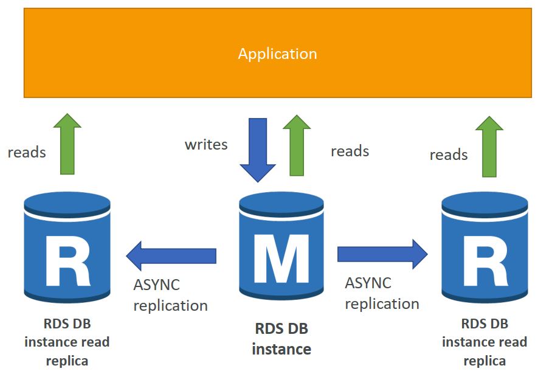
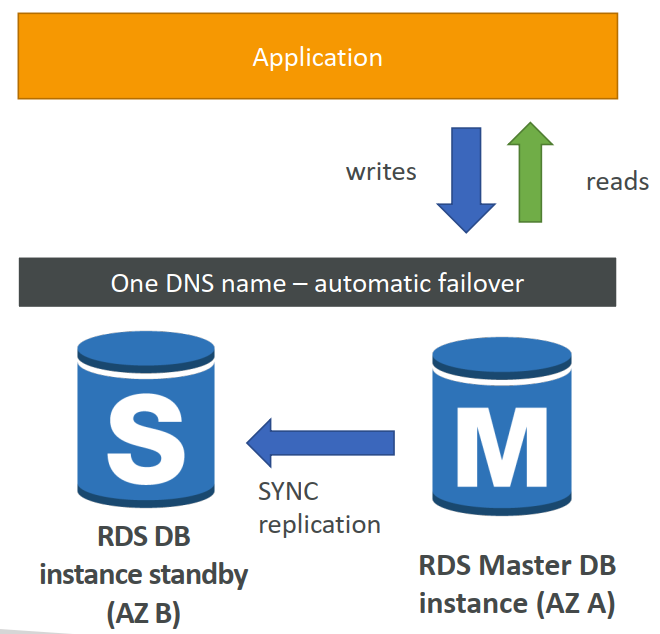
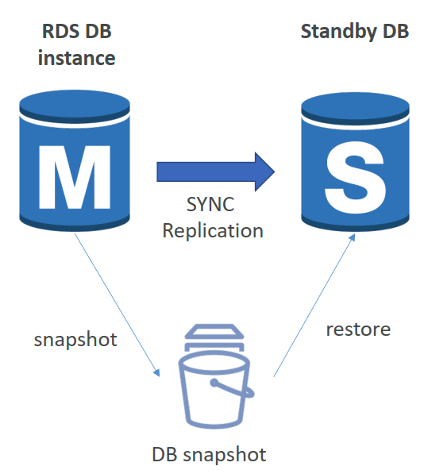

### 1. RDS Backups

- RDS中自动启用备份
- 自动化备份：
  - 数据库的每日完整备份（在维护窗口期间）
  - RDS每5分钟备份一次事务日志
  - =>能够恢复到任何时间点（从最旧的备份到5分钟前）
  - 7天保留期（可增加到35天）
- DB Snapshots:
  - 用户手动触发
  - 根据需要保留备份

### 2. RDS – Storage Auto Scaling

- 帮助您动态增加RDS数据库实例的存储空间
- 当RDS检测到您的可用数据库存储空间不足时，它会自动扩展
- 避免手动扩展数据库存储
- 您必须设置**最大存储阈值**（数据库存储的最大限制）
- 在以下情况下自动修改存储：
  - 可用存储空间小于已分配存储空间的10%
  - 低存储时间至少5分钟
  - 距离上次修改已经过去了6个小时
- 适用于具有**不可预测工作负载的应用程序**
- 支持所有RDS数据库引擎（MariaDB、MySQL、PostgreSQL、SQL Server、Oracle）

### 3. 用于读取可扩展性的RDS读取副本

- 最多5个读取复制副本
- AZ内、跨AZ或跨区域
- 复制是**ASYNC**，因此读取最终是一致的
- 副本可以升级到自己的数据库
- 应用程序必须更新连接字符串才能利用读取副本

### 4. RDS Read Replicas – Network Cost

- 在AWS中，当数据从一个AZ传输到另一个时，会产生网络成本
- **对于同一区域内的RDS读取副本，您不需要支付该费用**

### 5. RDS Multi AZ (Disaster Recovery)

- **SYNC** replication, Increase **availability**

### 6. RDS – From Single-AZ to Multi-AZ

- 零停机操作（无需停止数据库）
- 只需点击数据库的“修改”
- 以下情况在内部发生：
  - 拍摄快照
  - 在新的AZ中从快照恢复新的DB
  - 在两个数据库之间建立同步

### 7. RDS Security - Encryption

- 静态加密
  - 可以使用AWS KMS-AES-256加密对主副本和读取副本进行加密
  - 必须在启动时定义加密
  - **如果主机未加密，则读取的复制副本<u>无法</u>加密**
  - 可用于Oracle和SQL Server的透明数据加密（TDE）
- In-flight encryption
  - SSL证书将数据加密到飞行中的RDS
  - 在连接到数据库时提供带有信任证书的SSL选项
  - 要<u>强制执行</u>SSL：
    - **PostgreSQL**：在AWS rds控制台中rds.force_ssl=1（参数组）
    - **MySQL**：在数据库中： `GRANT USAGE ON *.* TO 'mysqluser'@'%' **REQUIRE SSL**;`

### 8. RDS Security – IAM

- Access Management
  - IAM策略有助于控制谁可以**管理**AWS RDS（通过RDS API）
  - 传统用户名和密码可用于**登录**数据库
  - 基于IAM的身份验证可用于登录RDS MySQL和PostgreSQL

### 9. RDS - IAM Authentication

- IAM数据库身份验证适用于**MySQL**和**PostgreSQL**
- 您不需要密码，只需通过IAM和RDS API调用获得身份验证令牌
- 身份验证令牌的生存期为15分钟
- 优点：
  - 网络输入/输出必须使用SSL加密
  - IAM将集中管理用户而不是DB
  - 可以利用IAM角色和EC2实例配置文件进行轻松集成

### 10. Amazon Aurora

- Aurora是AWS的专有技术（非开源）
- Postgres和MySQL都支持Aurora数据库（这意味着你的驱动程序将像Aurora是Postgres或MySQL数据库一样工作）
- Aurora是“AWS云优化”，声称在RDS上的性能比MySQL提高了5倍，是Postgres在RDS上性能的3倍以上
- Aurora存储以10GB的增量自动增长，最高可达128 TB。
- Aurora可以有15个副本，而MySQL有5个，并且复制过程更快（副本延迟不到10毫秒）
- Aurora中的故障切换是即时的。它是HA（高可用性）本机。
- Aurora的成本高于RDS（高出20%），但效率更高

### 11. Aurora High Availability and Read Scaling

- 6 copies of your data across 3 AZ:
  - 写入需要6份副本中的4份
  - 6份中有3份需要被读取
  - 使用对等复制实现自我修复
  - 存储跨100个卷进行条带化
- 一个Aurora实例需要写入（主）
- 在不到30秒内实现主设备的自动故障切换
- Master+最多15个Aurora Read副本提供读取
- **支持跨区域复制**

### 12. Aurora – Custom Endpoints

- 将Aurora实例的子集定义为自定义端点
- 示例：对特定复制副本运行分析查询
- 在定义自定义端点之后，通常不会使用读取器端点

### 13. Global Aurora

- **Aurora Cross Region Read Replicas:**
  - 对灾难恢复有用
  - 易于安装
- **Aurora Global Database (recommended):**
  - 1主区域（读/写）
  - 最多5个辅助（只读）区域，复制滞后时间小于1秒
  - 每个辅助区域最多16个读取副本
  - 有助于降低延迟
  - 升级另一个区域（用于灾难恢复）的RTO小于1分钟

### 14. ElastiCache – Redis vs Memcached
Redis：

- **带自动故障切换的多AZ**
- *读取副本**以扩展读取并具有**高可用性
- **使用AOF持久性的数据持久性**
- 备份和恢复功能**

Memcached：
- 用于数据分区（分片）的多节点
- **没有高可用性（复制）**
- *非持久性
- 无备份和恢复**
- 多线程体系结构

### 15. ElastiCache – Cache Security

- ElastiCache中的所有缓存：
  - **<u>不支持IAM身份验证</u>**
  - ElastiCache上的IAM策略仅用于AWS API级安全
- **Redis AUTH**
  - 创建Redis集群时可以设置“密码/令牌”
  - 这是缓存的额外安全级别（位于安全组之上）
  - 支持SSL飞行中加密
- Memcached
  - 支持基于SASL的身份验证（高级）

### 16. Patterns for ElastiCache

- **懒惰加载**：所有读取的数据都被缓存，数据可能会在缓存中变得过时
- **直写**：在写入数据库时添加或更新缓存中的数据（无陈旧数据）
- **会话存储**：将临时会话数据存储在缓存中（使用TTL功能）

*引用：在计算机科学中只有两件困难的事情：缓存失效缓存失效 并命名事物*

### 17. ElastiCache – Redis Use Case

- 游戏排行榜的复杂计算
- Redis排序集保证了唯一性和元素顺序
- 每次添加新元素时，都会对其进行实时排名，然后添加到正确的顺序