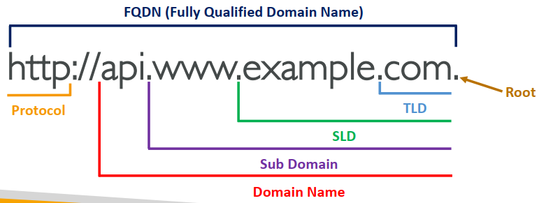

### 1. DNS Terminologies

- **Domain Registrar**: Amazon Route 53, GoDaddy, …
- **DNS Records**: A, AAAA, CNAME, NS, …
- **Zone File**: contains DNS records
- **Name Server**: resolves DNS queries (Authoritative or Non-Authoritative)
- **Top Level Domain (TLD)**: .com, .us, .in, .gov, .org, …
- **Second Level Domain (SLD)**: amazon.com, google.com, …

### 2. Amazon Route 53

- 一个高度可用、可扩展、完全管理且具有权威性的DNS
  - 权威=客户（您）可以更新DNS记录
- Route 53也是域名注册商
- 能够检查资源的健康状况
- 唯一提供100%可用性SLA（服务级别协议服务级协定)
- 为什么选择Route 53？53是对传统DNS端口的引用
- 每个托管区域每月0.50美元

### 3. Route 53 – Records

- **Domain/subdomain Name** – e.g., example.com
- **Record Type** – e.g., A or AAAA
- **Value** – e.g., 12.34.56.78
- **Routing Policy** – how Route 53 responds to queries
- **TTL** – amount of time the record cached at DNS Resolvers

### 4. Route 53 – Record Types

- **A** – maps a hostname to IPv4
- **AAAA** – maps a hostname to IPv6
- **CNAME** – maps a hostname to another hostname
  - 目标是必须具有a或AAAA记录的域名
  - 无法为DNS命名空间（Zone Apex）的顶部节点创建CNAME记录
  - 示例：您不能为Example.com创建，但可以为www.Example.com创建
- **NS** – 托管区域的命名服务器
  - 控制域的流量路由方式

### 5. Route 53 – Records TTL (Time To Live)
除了Alias记录外，TTL对于每个DNS记录都是强制性的

### 6. CNAME vs Alias
AWS Resources (Load Balancer, CloudFront...) expose an AWS hostname: lb1-1234.us-east-2.elb.amazonaws.com and you want myapp.mydomain.com
CNAME:

- 将主机名指向任何其他主机名（app.mydomain.com=>blabla.anything.com）
- **仅适用于非根域（又名something.mydomain.com）**

Alias:
- 将主机名指向AWS资源（app.mydomain.com=>blabla.amazonaws.com）
- **适用于根域和非根域（又名mydomain.com）**
- 免费
- 本地健康检查
- 对于AWS资源（IPv4/IPv6），别名记录的类型始终为A/AAAA
- 您无法设置TTL
- 不能为EC2 DNS名称设置ALIAS记录

### 7. Routing Policies - Simple
- 如果返回多个值，则客户端将随机选择一个值
- 启用Alias后，仅指定一个AWS资源
- 无法与健康检查关联

### 8. Routing Policies – Weighted

- 控制发送到每个特定资源的请求的百分比
- 为每条记录分配一个相对权重，权重总和不需要达到100
- DNS记录必须具有相同的名称和类型
- 可以与健康检查关联
- 用例：区域之间的负载平衡，测试新的应用程序版本…
- 为记录分配权重0以停止向资源发送流量
- 如果所有记录的权重都为0，则所有记录都将平等返回

### 9. Route 53 – Health Checks
HTTP运行状况检查仅适用于公共资源

- 运行状况检查=>自动DNS故障转移：
  - 监控端点（应用程序、服务器、其他AWS资源）的运行状况检查
  - 监测其他健康检查的健康检查（计算健康检查）
  - 监控CloudWatch警报的运行状况检查（完全控制！！）——例如，DynamoDB的节流阀、RDS上的警报、自定义指标……（有助于私人资源）
  
- 健康检查与CW指标集成

### 10. Health Checks – Monitor an Endpoint

- **大约15名全球健康检查人员将检查端点健康状况**
  - 健康/不健康阈值–3（默认值）
  - 间隔–30秒（可设置为10秒–成本更高）
  - 支持的协议：HTTP、HTTPS和TCP
  - 如果>18%的健康检查人员报告终点是健康的，则路线53认为它是健康的。否则就是不健康
  - 能够选择您希望Route 53使用的位置
- 只有当端点以2xx和3xx状态代码响应时，运行状况检查才通过
- 健康检查可以根据响应的前**5120字节**中的文本设置为通过/失败
- 配置路由器/防火墙以允许来自Route 53 Health Checkers的传入请求

### 11. Routing Policies – Multi-Value

- 将流量路由到多个资源时使用
- Route 53返回多个值/资源
- 可以与运行状况检查关联（仅返回运行状况资源的值）
- 每个多值查询最多返回8条健康记录
- **多值不能代替ELB**

### 12. Instantiating Applications quickly

- EC2 Instances:
  - **使用Golden AMI**：提前安装应用程序、操作系统依赖项等，并从Golden AMI启动EC2实例
  - **使用用户数据引导**：对于动态配置，请使用用户数据脚本
  - **混合**：混合Golden AMI和用户数据（Elastic Beanstalk）
- RDS Databases:
  - 从快照恢复：数据库将准备好架构和数据！
- EBS Volumes:
  - 从快照还原：磁盘将已格式化并具有数据！

### 13. Elastic Beanstalk – Overview

- Elastic Beanstalk是在AWS上部署应用程序的以开发人员为中心的视图
- 它使用了我们以前见过的所有组件：EC2、ASG、ELB、RDS…
- 托管服务
  - 自动处理容量调配、负载平衡、扩展、应用程序运行状况监视、实例配置…
  - 只是应用程序代码是开发人员的责任
- 我们仍然可以完全控制配置
- Beanstalk是免费的，但您需要为底层实例付费

### 14. Elastic Beanstalk – Components

- **应用程序**：Elastic Beanstalk组件的集合（环境、版本、配置…）
- **应用程序版本**：应用程序代码的迭代
- **环境**
  - 运行应用程序版本的AWS资源集合（一次只能运行一个应用程序版本）
  - **层**：Web服务器环境层和工作环境层
  - 您可以创建多个环境（开发、测试、生产…）