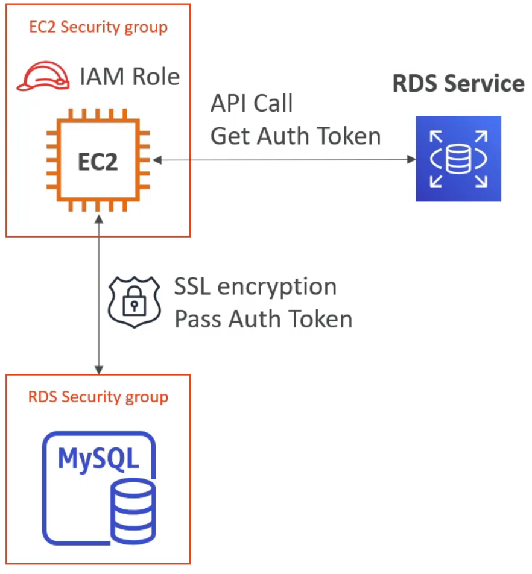
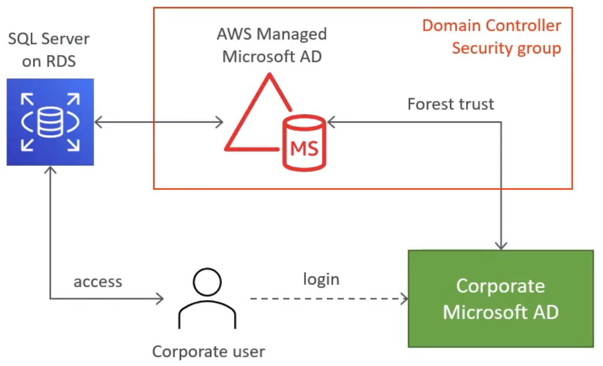

### 1. OLTP（Online Transaction Processing）和 OLAP（Online Analytical Processing）

OLTP 和 OLAP 是两种常见的数据处理技术，用于处理不同类型的数据和满足不同的业务需求。

- OLTP是一种用于处理事务性数据的技术。它主要用于日常的业务操作，例如订单处理、交易记录、库存管理等。OLTP系统通常针对大量的短期事务，需要高并发性和快速的数据插入、更新和查询能力。这些系统通常强调数据的一致性和准确性，并追求低延迟的响应时间。OLTP数据库通常采用关系型数据库管理系统（RDBMS），如Oracle、MySQL、Microsoft SQL Server等。

- OLAP则是一种用于处理分析性数据的技术。它主要用于数据分析、决策支持和业务智能等领域。OLAP系统通常面对复杂的查询和多维数据分析，需要支持大规模数据的聚合、切片、切块和透视等操作。这些系统通常强调数据的可读性和多维度的分析能力，并追求高性能的数据查询和计算。OLAP数据库通常采用特定的数据存储和处理技术，如多维数据库（例如OLAP立方体）或列式数据库。

### 2. BASE（Basically Available, Soft state, Eventually consistent）

BASE 是非关系型数据库系统设计的一种原则，与ACID（原子性、一致性、隔离性、持久性）相对应。它强调在大规模分布式系统中的可用性和性能，而放松了强一致性的要求。

下面是BASE原则的解释：

1. Basically Available（基本可用）：系统保持基本的可用性，即使在面临部分故障或分区的情况下也能继续提供服务。它意味着系统可以接受部分故障，但仍然能够返回响应或执行部分功能。
2. Soft state（软状态）：系统在没有输入时可以处于不确定的状态，这是允许的。与ACID中的强一致性要求不同，软状态允许系统的状态在时间上存在一定的延迟和不一致性，而这些不一致性可以通过后续的操作或时间来纠正。
3. Eventually consistent（最终一致性）：系统的状态最终将达到一致状态，尽管在分布式环境中不同节点之间的状态可能存在一段时间的不一致。最终一致性并不要求实时或即时的一致性，而是通过后续的同步和协调机制使系统最终达到一致状态。

BASE原则在分布式系统和大规模数据处理中更为适用，特别是在面对高可用性、可扩展性和性能需求的场景下。相对于强一致性的ACID，BASE提供了更灵活的数据一致性模型，可以在牺牲一部分一致性的前提下获得更高的可用性和性能。

需要注意的是，BASE原则并非一种具体的技术实现或标准，而是一种设计思想和原则的概念。具体的非关系型数据库系统可以根据BASE原则进行设计和实现，以满足不同的可用性、一致性和性能需求。常见的非关系型数据库系统包括MongoDB、Cassandra、Redis等。

### 3. 关系型数据库和非关系型数据库的对比

| 关系型数据库                     | 非关系型数据库             |
| -------------------------------- | -------------------------- |
| 数据存储在表中，通过外键建立关系 | 数据用集合或键值对存储     |
| 严格的ACID原则                   | BASE原则                   |
| 结构化数据                       | 半结构化或非结构化数据     |
| 垂直扩展（换成更大的instance）   | 水平扩展（添加新node）     |
| 使用SQL                          | 使用基于对象的APIs         |
| 适配OLTP和OLAP                   | 适配OLTP（网页、移动应用） |

### 4. 概述

支持的引擎：PostgreSQL，MySQL，MariaDB，Oracle，Microsoft SQL Server，Aurora

在一个VPC内启动：常使用私有子网，用 security groups 控制权限（如使用 Lambda 时）

使用 EBS 储存：gp2 或 io1，可自动扩展容量

备份：自动根据时间点恢复，备份过期

监控：使用 CloudWatch

RDS Events：SNS 事件提醒

1 credit = CPU 核心利用率100%一分钟

### 5. 参数组（Parameter groups）

动态参数（修改立即生效，可能会导致停机）和静态参数（需要手动重启，状态从 in-sync -> pending-reboot -> in-sync）

### 6. 选项组（Option groups）

数据库引擎功能选项（默认为空），修改则需要创建新的选项组

### 7. Security - Network

数据库创建（通常是在子网中 ）后 VPC 就无法修改了

<center></center>

### 8. Security - IAM 身份验证

- 您不需要密码，只需通过 IAM 和 RDS API 调用获得身份验证令牌
- 身份验证令牌的生存期为15分钟
- 优点：
  - 进出流量必须使用SSL
  - 取代数据库，IAM 集中化管理用户

<center></center>

### 如何使用 IAM DB 身份认证？

- 在数据库群集上启用 IAM 数据库身份验证
- 创建数据库用户（不带密码）
- 附加 IAM 策略以将 DB 用户映射到 IAM 角色
- 将 IAM 角色附加到 IAM 用户（或 EC2 实例）
- 现在您可以通过 SSL 使用 IAM 令牌连接到 DB

MySQL 实现方式：

```mysql
-- 创建用户
CREATE USER {db_username} IDENTIFIED WITH AWSAuthenticationPlugin as 'RDS';
-- 授予SSL权限
GRANT USAGE ON *.* TO '{db_username}'@'REQUIRE SSL;
```

```bash
-- 下载SSL密钥
wget "https://s3.amazonaws.com/rds-downloads/rds-ca-2019-root.pem"
-- 使用CLI生成token
TOKEN="$(aws rds generate-db-auth-token 
	--hostname {db_or_cluster_endpoint}
	--port 3306 --username {db_username})"
-- 连接数据库
mysql --host={db_or_cluster_endpoint} --port=3306
	--ssl-ca=/home/ec2-user/rds-combined-ca-bundle.pem
	--enable-cleartext-plugin
	--user={db_username} --password=$TOKEN
```

PostgreSQL 实现方式：

不需要修改配置文件`pg_hba.conf`

```postgresql
CREATE USER {db_username};
GRANT rds_iam to {db_username};
```

```bash
wget "https://s3.amazonaws.com/rds-downloads/rds-ca-2019-root.pem"

export PGPASSWORD="$(aws rds generate-db-auth-token 
	--hostname={db_endpoint} --port=5432 --username={db_username}
	--region us-west-2)"

psql -h {db_endpoint} -p 5432 "dbname={db_name} user={db_username} password=$PGPASSWORD sslrootcert=/home/ec2-user/rds-combined-ca-bundle.pem sslmode=verify-ca"
```

### 轮换 RDS DB 证书

- 使用 AWS Security Manager
- 集中、安全地存储凭证，支持审计
- 支持 secrets 的自动轮换
- Secrets Manager 提供了一个 Lambda 轮换函数，并自动用 ARN（Amazon Resource Name）填充 secret
- 与 RDS 中的 MySQL、PostgreSQL 和 Aurora 集成

### RDS SQL Server 的 Windows 身份认证

- 创建 AWS 托管的 Microsoft AD 目录，并在您的公司 AD 和 AWS 托管的AD之间建立信任关系（称为 forest trust 域信任）
- 如果您有超过5000个用户，并且需要与您的前置目录建立信任关系，则 AWS 托管 AD 是最佳选择
- 或者，您也可以使用 AD 连接器（用于现有的本地目录）或简单 AD（如果您的用户少于5000）
- 在 AD 中设置用户和组
- 在 RDS 实例中启用 SQL Server Windows 身份验证以将目录映射到 DB 实例（自动创建适当的lAM角色）
- 使用主用户凭据登录到数据库，并为 AD 用户创建 SQL Server Windows 登录

<center></center>

### 强制使用 SSL

- SQL Server 或 PostgreSQL：在参数组中设置参数`rds.force ssl=1`（静态参数，需要手动重新启动）
- MySQL 或 MariaDB：`ALTER USER 'mysqluser'@'%' REQUIRE SSL`
- Oracle：将 SSL 选项添加到 DB 实例选项组

### SSL连接选项

```bash
# PostgreSQL
sslrootcert=rds-cert.pem sslmode=[verify-ca | verify-full]
# MySQL
--ssl-ca=rds-cert.pem --ssl-mode=VERIFY_IDENTITY (MySQL 5.7+)
# MariaDB
--ss1-ca=rds-cert.pem --ssl-mode=REQUIRED (MaraDB 10.2+)
# MySOL/MariaDB (older versions)
--ss1-ca=rds-cert.pem --ssl-verify-server-cert
```

### RDS 数据加密

- RDS 支持 AES-256 加密算法
- 通过 KMS 管理的密钥
- 可以同时加密主副本和读取副本必须在启动时定义加密
- RDS 还支持 TDE（透明数据加密）
  - For SQL Server（仅限 Enterprise Edition）和 Oracle DB 实例
  - 通过设置选项组启用
  - 对 Oracle 启用 TDE 选项
  - 对 SQL Server 启用 TRANSPARENT_DATA_ENCRYPTION 选项
- 如果同时使用 TDE 和 静态加密，可能会略微影响数据库性能

### 复制和分享加密的 snapshots

- 使用默认RDSencryption密钥加密的快照不能直接共享
  - 使用自定义加密密钥复制快照，然后共享[密钥+快照]
- 无法共享具有某些自定义选项组的快照（例如TDE）

<center></center>