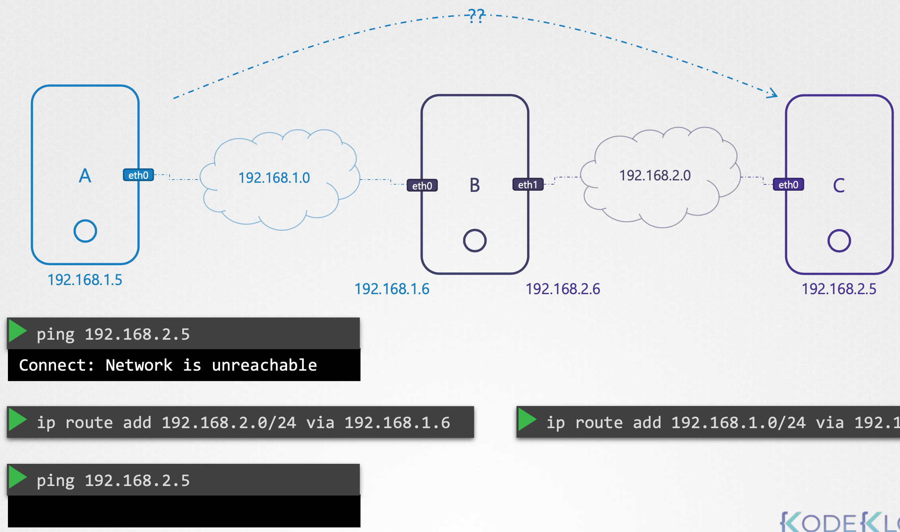

### 1. Docker Networking

<center></center>

当您运行容器时，您有不同的网络选项可供选择：

- container无法到达外部，外部也无法访问container `docker run --network none nginx`

- 容器链接到host，host和容器之间没有网络隔离无需接口转发，但两个进程无法同时侦听同一端口 `docker run --network host nginx`

- 第三种网络选项是bridge，在这种情况下，会创建一个内部专用网络，Docker主机和容器将连接到该网络。

Docker在内部使用了一种类似于我们在network ns中讲的技术，即运行类型设置为bridge的IP link add 命令，`ip link add docker0 type bridge`。

当Docker安装在主机上时，默认情况下，会创建一个称为 `bridge` 的内部专用网络，可由 `docker network ls` 查看。但在host上由 `ip link` 查看，显示为 `docker0`。

根据`ip link` 查看 `docker0`接口状态为 `DOWN`，接口或网络当前已关闭。

还记得我们说过，bridge网络就像是host的接口，但它也是host内部ns或者container的交换机。根据`ip addr`可以查看`docker0`被分配的IP地址。

每当创建container时，Docker都会为其创建一个ns，运行 `ip netns`命令可以列出ns（需要设置）。

`docker inspect ns-name`可以看到与每个容器关联的ns。

docker或者说 ns 连接到 bridge 上的方式和之前说的一样。如果在docker host上运行 `ip link`，我们会看到接口的一端连接到本地 bridge `master docker0`

用 `ip -n b3165c10a92b link` 连接到container上，可以看到对应的接口，用 `ip -n b3165c10a92b addr` 查看对应IP地址

接口通常成对匹配，container偶数，bridge接口为奇数

将docker上的8080端口映射到container的80上：`docker run -p 8080:80 nginx`，实现原理也一样 `iptables -t nat -A DOCKER --dport 80 --to-destination 172.17.0.3:80 -j DNAT`，查看的命令 `iptables -nvL -t nat`

### 2. CNI - Container Networking Interface

VETH : virtual Ethernet devices

| Network Namespaces                         | docker                                     |
| :----------------------------------------- | ------------------------------------------ |
| 1. Create Network Namespace                | 1. Create Network Namespace                |
| 2. Create Bridge Network/Interface         | 2. Create Bridge Network/Interface         |
| 3. Create VETH Pairs (Pipe, Virtual Cable) | 3. Create VETH Pairs (Pipe, Virtual Cable) |
| 4. Attach VETH to Namespace                | 4. Attach VETH to Namespace                |
| 5. Attach Other VETH to Bridge             | 5. Attach Other VETH to Bridge             |
| 6. Assign IP Address                       | 6. Assign IP Address                       |
| 7. Bring the interfaces up                 | 7. Bring the interfaces up                 |
| 8. Enable NAT - IP Masquerade              | 8. Enable NAT - IP Masquerade              |

统一的步骤2~8步，可以用bridge命令运行，指定将容器添加到ns：

```bash
bridge add 2e34dcf34 /var/run/netns/2e34dcf34
bridge add <container id> <namespace>
```

CNI (Container Networking Interface) :
- container runtime
  - 容器运行时必须创建网络命名空间
  - 标识容器必须连接到的网络
  - 添加容器时调用网络插件（网桥）的容器运行时
  - 删除容器时调用网络插件（网桥）的容器运行时
  - 网络配置的JSON格式
- 插件方面
  - 必须支持命令行参数ADD/DEL/CHECK
  - 必须支持参数container id、network ns等
  - 必须管理POD的IP地址分配
  - 必须以特定格式返回结果

CNI已经附带了一组支持的插件，如bridge、vlan、ipvlan、macvlan、windows，以及IPAM插件，如DHCP、host-local，还有一些其他第三方组织提供的插件。

但Docker有一套自己的标准，称为CNM（Container Network Model），不适配CNI，所以无法运行 `docker run --network=cni-bridge nginx`，但这并不意味着Docker无法应用CNI，你可以创建一个没有任何网络配置的Docker容器 `docker run --network=none nginx`，然后手动调用bridge插件，k8s就是这么做的 `bridge add 2e34dcf34 /var/run/netns/2e34dcf34`

https://kubernetes.io/docs/setup/independent/install-kubeadm/#check-required-ports

查看所有支持的CNI插件：`/opt/cni/bin`

查看当前使用的CNI插件：`ls /etc/cni/net.d/`

查看kubelet的container runtime：`ps -aux | grep kubelet | grep --color container-runtime`

### 3. 常用命令

`ifconfig -a`：显示所有接口，包括环回接口、集群使用的实际物理接口等

`cat /etc/network/interfaces`：显示所有物理接口，环回接口、物理接口

`ip link`：显示此系统上的所有物理链路，`ip link show eth0` = `ifconfig eth0`

`ip route show default`：查看默认网关，或者 `ip r`

`netstat -natulp | grep scheduler`：-p programs，-l listening，-t tcp

### 4. Cluster Networking

<center></center>

kubernetes集群由master node和worker node组成。每个节点必须至少有一个连接到网络的接口，每个接口必须配置一个IP地址，host必须设置唯一的主机名以及唯一的mac地址。如果通过现在VM克隆来创建VM，则应特别注意这一点。还有一些端口也需要打开，这些由控制平面中的各种组件使用。

<center></center>

参考文档：https://kubernetes.io/docs/setup/production-environment/tools/kubeadm/install-kubeadm/#check-required-ports

因此，当您在防火墙中为节点设置网络时，或者在GCP、Azure或AWS等云环境中设置ip表规则或网络安全组时，请考虑这些问题。

### 5. Pod Networking

到目前为止，k8s还没有为此提供内置解决方案，它希望您实施一个网络解决方案来解决这些难题。

但是k8s已经明确列出了对pod networking的要求：

- 每个POD都应该有一个IP地址
- 每个POD都应该能够与同一节点中的其他POD通信
- 每个POD应该能够在没有NAT的情况下与其他节点上的每个其他POD通信

步骤：

- 在每个节点上创建一个bridge网络 `ip link add v-net-0 type bridge`
- 然后 `ip link set dev v-net-0 up`
- 设置bridge的IP地址 `ip addr add 10.244.1.0/24 dev v-net-0`
- 向默认网关添加IP地址 `ip route add 10.244.1.0/24 via 192.168.15.5`

但与其在每台服务器上配置路由，不如在路由器上配置路由。如果您的网络中有一个网关，并指定所有主机使用该网关作为默认网关，这样，您就可以轻松地管理路由器上路由表中所有网络的路由。

然后，我们编写了一个脚本，可以为每个容器运行该脚本，那么当我们在 k8s 上创建端口时，我们如何自动运行脚本呢？这就是 CNI 充当中间人的原因。CNI 告诉 k8s，这是您在创建容器后应该立即调用脚本的方式。

根据 CNI 标准，脚本应该有 `ADD` 和 `DEL` 部分。

执行步骤：

- `kubelet` 在运行时查看之前的配置 `--cni-conf-dir=/etc/cni/net.d` 并识别脚本名称
- 然后在目录 `--cni-bin-dir=/etc/cni/bin` 中寻找脚本
- 使用命令 `./net-script.sh add <container> <namespace>` 执行脚本

### 6. CNI in kubernetes

`ps -aux | grep kubelet`：查看设置为CNI的网络插件和一些与CNI相关的其他选项，如CNI bin目录和CNI config目录

`ls /opt/cni/bin`：bin目录包含所有支持的CNI插件作为可执行文件，如bridge、DHCP、flannel等

`ls /etc/cni/net.d`：conf文件是kubelet查找需要使用哪个插件的地方

### 7. CNI weave

weave CNI插件部署在集群上，会在每个节点上部署一个代理或服务

一个pod可以连接到多个bridge

安装：`kubectl apply -f "https://cloud.weave.works/k8s/net?k8s-version=$(kubectl version | base64 | tr -d '\n')&env.IPALLOC_RANGE=10.50.0.0/16"`，可以指定IP范围以防止和host系统IP重叠

### 8. Service Networking

Service承载在整个cluster上，整个cluster的pod都可以访问到这个节点，Service没有绑定到特定节点，但只能从集群内部访问该服务。

NodePort可以不仅让cluster内部的节点访问，它还会再cluster中所有节点的端口上公开application。

查看IPtable转发规则：`iptables -L -t nat | grep db-service`

或者查看日志：`cat /var/log/kube-proxy.log`，文件位置可能因安装而异

查看services的IP范围：`cat /etc/kubernetes/manifests/kube-apiserver.yaml | grep cluster-ip-range`

查看pod的IP范围和使用的proxy类型：`kubectl logs <weave-pod-name> weave -n kube-system`

### 9. DNS in kubernetes

| Hostname    | Namespace | Type | Root          | IP Address    |
| ----------- | --------- | ---- | ------------- | ------------- |
| web-service | apps      | svc  | cluster.local | 10.107.37.188 |
| 10-244-2-5  | apps      | pod  | cluster.local | 10.244.2.5    |

`curl http://10-244-2-5.apps.pod.cluster.local`

### 10. CoreDNS in Kubernetes

建立DNS的方式：

- 设置每个pod上的 `/etc/hosts`
- 设置CoreDNS `/etc/resolv.conf`，pod名字为用短横线连接的IP

在v1.12版本之前k8s实施的DNS为kube-dns，之后为CoreDNS。

CoreDNS服务器作为POD部署在kubernetes集群的kube-system namespace中，它们被部署为两个pod以实现冗余，作为replicaSet的一部分。

查看CoreDNS的配置文件：`kubectl -n kube-system describe deployments.apps coredns | grep -A2 Args | grep Corefile`

### 11. Switching

<center></center>

`ip link`：用于列出和修改host上的接口， ip link只能看链路层的状态，看不到ip地址

`ip addr`：查看分配给这些接口的IP地址，即使网卡处于down状态，也能显示出网卡状态，但是ifconfig查看就看不到

`cat /etc/network/interfaces`：查看物理接口

```bash
ip addr add 192.168.1.10/24 dev eth0 # 重启失效
ip addr add 192.168.1.11/24 dev eth0 # 如需永久生效，需要在相应的网络接口文件中修改
```

之后，两个系统之间就可以通过交换机进行通信。路由器连接到2个网络，可以使它们之间可以通信。

一旦链路建立并分配了IP地址，计算机就可以通过交换机相互通信。交换机只能在同一网络内进行通信，这意味着它可以从网络上的主机接收数据包，并将其传送到同一网络内的其他系统。

`ip a | grep internal-ip -B 2`：查看cluster内node间的网络接口，`ip a` 和 `ip addr` 一样

### 12. Routing

<center></center>

路由器可帮助连接两个网络，可以将其视为另一台具有许多网络端口的服务器，它获取IP分配，每个网络一个。

### 13. Gateway

如果说网络是一个房间，那么网关就是通向外部世界、其他网络或Internet的一扇门。系统需要知道门在哪里才能通过。

要查看系统上现有的路由配置，运行 `route`命令，它会显示内核的路由表。

```bash
ip route show default ## 查看默认网关
netstat -nplt | grep scheduler ## 查看目前节点上被scheduler监听的接口
ip route add 192.168.2.0/24 via 192.168.1.1 ## 这样B就可以访问网络2上的系统
ip route add 192.168.1.0/24 via 192.168.2.1 ## 这样C就可以访问网络1上的系统
ip route add 172.217.194.0/24 via 192.168.2.1 ## 如果C需要访问Internet上的某个地址，则也需要把新的路由添加到路由表
```

在互联网上的不同网络上有许多不同的网站，您不必为每个网络的相同路由器IP地址添加路由表条目，而只需简单地说，对于任何您不知道路由的网络，都可以使用此路由器作为默认网关。

```bash
ip route add default via 192.168.1.1 # default = 0.0.0.0
```

<center></center>

在 Gateway 属性列中 `0.0.0.0`表示不需要网关，因为它在自己的网络中。

当网络中有多个路由器时，一个用于 Internet，一个用于内部专用网络，那么您需要为每个网络创建两个单独的 entries 条目。

<center></center>

**如何将Linux主机配置为路由器？**

数据包要到达host C，则C必须向A发回响应，所以两边都得配置。

当2个系统双向都建立好路由时，在Linux中默认情况下，数据包不会从一个接口转发到下一个接口，所以此时仍还ping不通。这是出于安全考虑，例如您将eth0连接到专用网络，而将eth1连接到公共网络，除非您明确允许，否则我们不希望公共网络中的任何人轻松地向专用网络发送消息。

转发的设置在`/proc/sys/net/ipv4/ip_forward`，默认情况下文件中的值为0，表示没有转发，设置为1，ping可以通过，重启后失效。

永久设置：`/etc/sysctl.conf` 中 `net.ipv4.ip_forward = 1`

### 14. DNS

`hostname` 命令可以查看本机的hostname

记录在本地 `/etc/hosts`中，`ssh` 和 `curl` 命令都会根据此文件查找对应的ip地址，先查看本地记录，本地优先级高，如果有则优先使用：

```markdown
192.168.1.11						db
```

DNS配置在 `/etc/resolv.conf` 文件中，将主机指向DNS服务器：

```markdown
nameserver						192.168.1.100  ## 可添加多个
```

为了防止也在每个主机上配置多个DNS服务器地址，可以在DNS服务器上将任何未知的主机名转发到Internet上的公共DNS服务器

优先级顺序可以在 `/etc/nsswitch.conf` 中修改：

```markdown
...
hosts:						files dns
...
```

### 15. Domain Names

`www.google.com`

- 根域名 `.`
- 顶级域名 `.com`
- 分配给google的域名 `google`
- 子域名 `www`

### 16. Search Domain

在 `/etc/resolv.conf` 中添加 `search` 条目并指定要附加的搜索域名

```markdown
search						mycompany.com prod.mycompany.com
```

输入 `web` 时，就会尝试匹配 `web.mycompany.com` 、`web.prod.mycompany.com`

### 17. Record Types

| A     | web-server      | 192.168.1.1                             |
| ----- | --------------- | --------------------------------------- |
| AAAA  | web-server      | 2001:0db8:85a3:0000:0000:8a2e:0370:7334 |
| CNAME | food.web-server | eat.web-server, hungry.web-server       |

### 18. nslookup、dig

Ping不总是测试DNS解析的正确工具，还有 `nslookup`，如 `nslookup www.google.com`，但 `nslookup` 不会考虑本地hosts文件中的条目，仅查询DNS服务器。

类似的还有 `dig www.google.com`，返回更多详细信息

### 19. 将主机配置成DNS服务器

- 下载CoreDNS

- 解压，运行可执行文件coredns

- 默认侦听端口53

- 配置Corefile文件

  ```
  . {
  	hosts /etc/hosts
  }
  ```

- 其他参考信息：

  https://github.com/kubernetes/dns/blob/master/docs/specification.md

  https://coredns.io/plugins/kubernetes/

### 20. Network Policy

```yaml
apiVersion: networking.k8s.io/v1
kind: NetworkPolicy
metadata:
  name: db-policy
spec:
  podSelector:
    matchLabels:
      role: db
  policyTypes:
  - Ingress ## 设置入口规则，不会影响出口
  - Egress
  ingress:
  - from:
    - podSelector: ## 规则1
        matchLabels:
          name: api-pod
      namespaceSelector: ## 限制namespace，这里必须满足pod筛选条件
        matchLabels:
          name: prod
    - ipBlock: ## 2个规则其一通过即可
        cidr: 192.168.5.10/32
    ports:
    - protocol: TCP
      port: 3306
  egress:
  - to:
    - ipBlock:
        cidr:
    ports:
    - protocol: TCP
      port: 80
```

查询方式：`kubectl get netpol` 或 `kubectl get networkpolicy`

