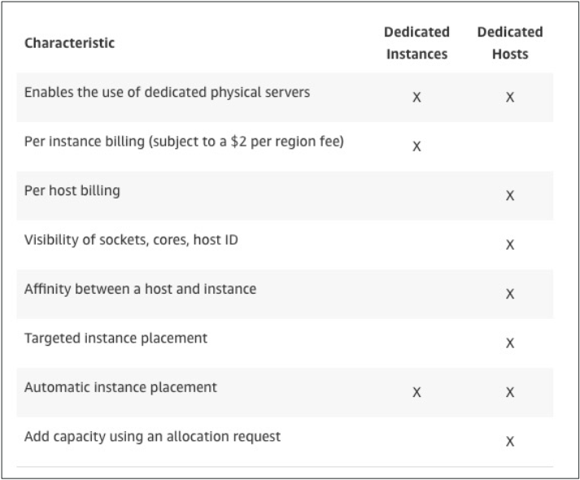

### 1. Amazon EC2 (Elastic Compute Cloud)
It mainly consists in the capability of :

- Renting virtual machines (EC2)
- Storing data on virtual drives (EBS)
- Distributing load across machines (ELB)
- Scaling the services using an auto-scaling group (ASG)

### 2. EC2 Instance Types - Overview
m5.2xlarge

- m: instance class
- 5: generation (AWS improves them over time)
- 2xlarge: size within the instance class

### 3. Introduction to Security Groups

- Security groups only contain **allow** rules
- Security groups rules can reference by IP or by security group

### 4. Security Groups Good to know

- Can be attached to multiple instances
- Locked down to a region / VPC combination
- Does live "outside" the EC2 – if traffic is blocked the EC2 instance won't see it
- It's good to maintain one separate security group for SSH access
- If your application is not accessible (time out), then it's a security group issue
- If your application gives a "connection refused" error, then it's an application error or it's not launched
- All inbound traffic is blocked by default
- All outbound traffic is authorised by default

### 5. Classic Ports to know

- 22 = SSH (Secure Shell) - log into a Linux instance
- 21 = FTP (File Transfer Protocol) – upload files into a file share
- 22 = SFTP (Secure File Transfer Protocol) – upload files using SSH
- 80 = HTTP – access unsecured websites
- 443 = HTTPS – access secured websites
- 3389 = RDP (Remote Desktop Protocol) – log into a Windows instance

### 6. SSH Summary Table

|              | SSH  | Putty | EC2 Instance Connect |
| :----------: | :--: | :---: | :------------------: |
|     Mac      |  √   |       |          √           |
|    Linux     |  √   |       |          √           |
| Windows < 10 |      |   √   |          √           |
| Windows > 10 |  √   |   √   |          √           |

### 7. EC2 Instances Purchasing Options

- **On-Demand Instances**: short workload, predictable pricing
- **Reserved**: (MINIMUM 1 year)
  - **Reserved Instances**: long workloads
  - **Convertible Reserved Instances**: long workloads with flexible instances
  - **Scheduled Reserved Instances**: example – every Thursday between 3 and 6 pm
- **Spot Instances**: short workloads, cheap, can lose instances (less reliable)
  - Useful for workloads that are resilient to failure: Batch jobs, Data analysis, Image processing, Any distributed workloads, Workloads with a flexible start and end time
  - 如果主动终止一个竞价实例，需要为当前这个完整小时付费
  - 如果因为价格上涨，AWS终止了你的竞价实例，那么这个小时的费用会被免除
- **Dedicated Hosts**: book an entire physical server, control instance placement
  - Dedicated Hosts can help you address compliance requirements and reduce costs by allowing you to use your existing server-bound software licenses
- **Dedicated Instances**: no other customers will share your hardware
  - May share hardware with other instances in same account
  - No control over instance placement (can move hardware after Stop / Start)

### 8. Differences between options

*note: 

- the % discounts are different from the video as AWS change them over time – the exact numbers are not needed for the exam. This is just for illustrative purposes
- Spot Instances: **Spot blocks** during a specified time frame (1 to 6 hours) without interruptions (no longer available from 01/7/2021, support until 31/12/2022)

|                      |    Discount    | Reservation Period |  Upfront Payment   |
| :------------------: | :------------: | :----------------: | :----------------: |
|      On Demand       |       /        |         /          |         No         |
|       Reserved       |   Up to 72%    |  1 year/ 3 years   | No / Partial / All |
| Convertible Reserved |   Up to 66%    |                    |                    |
|  Scheduled Reserved  |       /        |    1 year only     |                    |
|         Spot         |   Up to 90%    |                    |                    |
|   Dedicated Hosts    | More expensive |      3 years       |                    |
| Dedicated Instances  |       /        |                    | / |

### 9. How to terminate Spot Instances?

You can only cancel Spot Instance requests that are open, active, or disabled.
Cancelling a Spot Request does not terminate instances
You must first cancel a Spot Request, and then terminate the associated Spot Instances

### 10. Spot Fleets

- Spot Fleets = set of Spot Instances + (optional) On-Demand Instances
- The Spot Fleet will try to meet the target capacity with price constraints
  - Define possible launch pools: instance type (m5.large), OS, Availability Zone
  - Can have multiple launch pools, so that the fleet can choose
  - Spot Fleet stops launching instances when reaching capacity or max cost
- Strategies to allocate Spot Instances:
  - **lowestPrice**: from the pool with the lowest price (cost optimization, short workload)
  - **diversified**: distributed across all pools (great for availability, long workloads)
  - **capacityOptimized**: pool with the optimal capacity for the number of instances