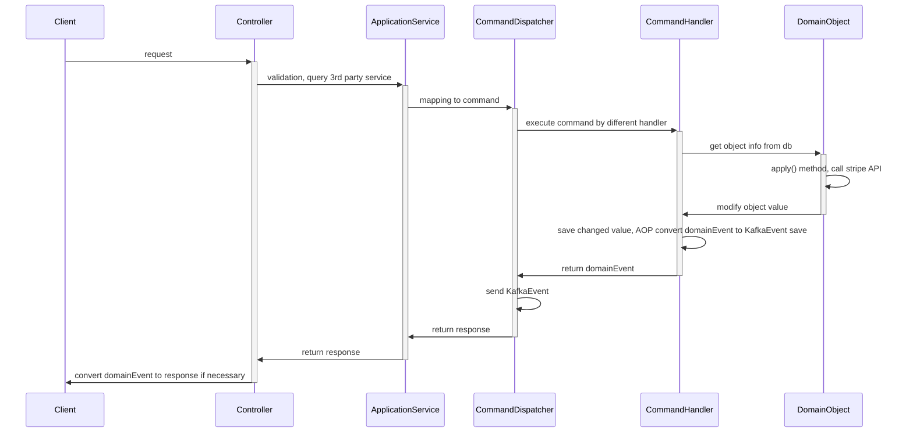

API 请求链路：

```mermaid
sequenceDiagram
    Client->>+Controller: request
    Controller->>+ApplicationService: validation, query 3rd party service
    ApplicationService->>+CommandDispatcher: mapping to command
    CommandDispatcher->>+CommandHandler: execute command by different handler
    CommandHandler->>+DomainObject: get object info from db
    DomainObject->>DomainObject: apply() method, call stripe API
    DomainObject->>-CommandHandler: modify object value
    CommandHandler->>CommandHandler: save changed value, AOP convert domainEvent to KafkaEvent save
    CommandHandler->>-CommandDispatcher: return domainEvent
    CommandDispatcher->>CommandDispatcher: send KafkaEvent
    CommandDispatcher->>-ApplicationService: return response
    ApplicationService->>-Controller: return response
    Controller->>-Client: convert domainEvent to response if necessary
```

