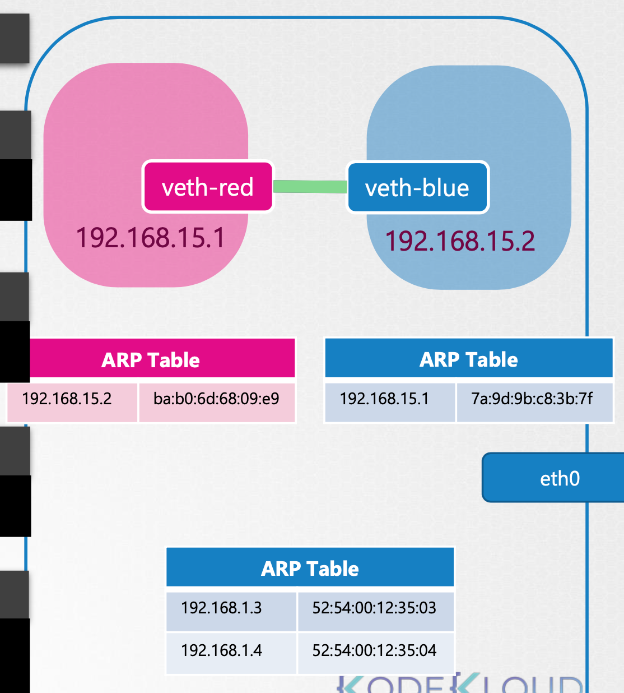

### 1. Network Namespace

<center></center>

Docker 等容器使用 namespace 来实现网络隔离，容器是使用 namespace 与底层主机分离的。如果把 host 当成房子，那么 namespace 就是房子里你分配给每个孩子的房间。

就容器而言，它只看到由它运行的进程，并认为它是独立的。但是，底层 host 可以看到所有进程，包括在容器内运行的进程。

host 有自己的路由表和 ARP 表（IP -> MAC）。创建容器时，我们为其创建一个 namespace，这样，它就无法查看主机上的任何网络相关信息。在其 namespace 内，容器可以有自己的虚拟接口、路由和 ARP 表。

### 2. Create Network NS

```bash
ip netns add red
ip netns
```

### 3. Exec in Network NS

```bash
ip link
ip netns exec red ip link  ## 在ns中查看 ip link，在前面加 ip netns exec
ip -n red link ## 或者使用这个命令查看LOOPBACK接口，看不到eth0接口
```

```bash
arp ## 在host上执行能看到条目
ip nets exec red arp ## 在新建的container内看不到条目，用route命令也是同样
```

### 4. 建立NS之间的网络接口连接

<center></center>

```bash
## 1. 创建veth并连接
ip link add veth-red type veth peer name veth-blue
## 2. 把每个veth附加到ns
ip link set veth-red netns red
ip link set veth-blue netns blue
## 3. 为每个ns分配IP地址
ip -n red addr add 192.168.15.1 dev veth-red # dev 表示 device
ip -n blue addr add 192.168.15.2 dev veth-blue
## 4. 启动每个ns中的相应设备
ip -n red link set veth-red up
ip -n blue link set veth-blue up
```

接口等都建立完成后 `ip netns exec red ping 192.168.15.2` 才能ping通

`arp` 命令才会显示mac地址：

```bash
arp
ip netns exec red arp
ip netns exec blue arp
```

host上的ARP表不知道我们创建的新ns，也不知道我们在其中创建的接口。

ARP表：地址解析协议（ARP）是在只知道主机的IP地址时查找主机的链路层（MAC）地址的方法。ARP表用于维护每个MAC地址与其对应IP地址之间的相关性。

### 5. Linux Bridge

当 host 内需要连接的 ns 很多时，解决方案有：Linux bridge、Open vSwitch 等

<center></center>

```bash
ip link add v-net-0 type bridge ## 对host来说，它只是另一个接口
```

添加后 `v-net-0` 会出现在 `ip link` 的命令结果中

```bash
ip link set dev v-net-0 up
```

把新的连接到bridge `v-net-0`

```bash
# 1. 删除之前的ns之间的连接，另一端的接口会自动删除
ip -n red link del veth-red
# 2. 创建veth并连接
ip link add veth-red type veth peer name veth-red-br
ip link add veth-blue type veth peer name veth-blue-br
# 3. 把两端veth连接到相应的ns和bridge
ip link set veth-red netns red # 把接口veth-red连接到red namespace
ip link set veth-red-br master v-net-0 # 把接口veth-red-br连接到bridge，主设备定为v-net-0
# 4. 分配IP地址
ip -n red addr add 192.168.15.1 dev veth-red # 分配地址
ip -n blue addr add 192.168.15.2 dev veth-blue # 分配地址
# 5. 启动设备
ip -n red link set veth-red up
ip -n blue link set veth-blue up
```

此时在host上仍ping不通其他ns，因为它们属于不同的网络，host上的ARP表不知道我们创建的新ns，也不知道我们在其中创建的接口。

而**bridge交换机实际是host上的网络接口**，如果想在host和ns之间建立连接，我们需要做的就是为bridge分配一个host层面的IP地址， `ip addr add 192.168.15.5/24 dev v-net-0`，此时host才可以ping通ns

### 6. 如何配置 bridge 通过以太网接口到达 LAN 网络？

<center></center>

本地host其实是连接两个网络的Gateway，host此时有两个IP地址，一个在bridge网络上 `192.168.15.5`，另一个在外部网络上`192.168.1.2`

内部ns想要访问到host的eth0 `ip netns exec blue ip route add 192.168.1.0/24 via 192.168.15.5` 

此时 ping `192.168.1.3` 不会等到无法访问的消息，`ip netns exec blue ping 192.168.1.3`，但仍然没有收到任何response，原因类似于家庭网络具有我们的内部私有IP地址，而目标网络不知道这些地址，因此他们无法返回获取这些地址。

需要在作为网关的主机上启用NAT（Network Address Translation），以便它可以使用自己的名称和地址将消息发送到LAN：

```bash
iptables -t nat -A POSTROUTING -s 192.168.15.0/24 -j MASQUERADE
```

在postrouting链中的网络IP表中添加新规则，以伪装或替换来自源网络192.168.15.0/24的数据包。这样，任何在网络外部接收到这些数据包的人都将认为它们来自主机。

此时，ping已通 `ip netns exec blue ping 192.168.1.3`，但 ping 外部Internet网络8.8.8.8仍不通（LAN连接到外部Internet），因为 ns 目前可以到达 host 可以到达的任何网络，我们可以简单地说，要访问任何外部网络，请与我们的主机进行通信 `ip netns exec blue ip route add default via 192.168.15.5`

### 7. 外部网络访问内部专用网络的ns端口的2种解决方案：

- 给host添加IP路由条目，就像上面的过程一样

- 使用IP表添加一个端口转发规则，规定任何到达本地主机上端口80的流量都将被转发到分配给blue ns的IP上的端口80：`iptables -t nat -A PREROUTING --dport 80 --to-destination 192.168.15.2:80 -j DNAT`

  