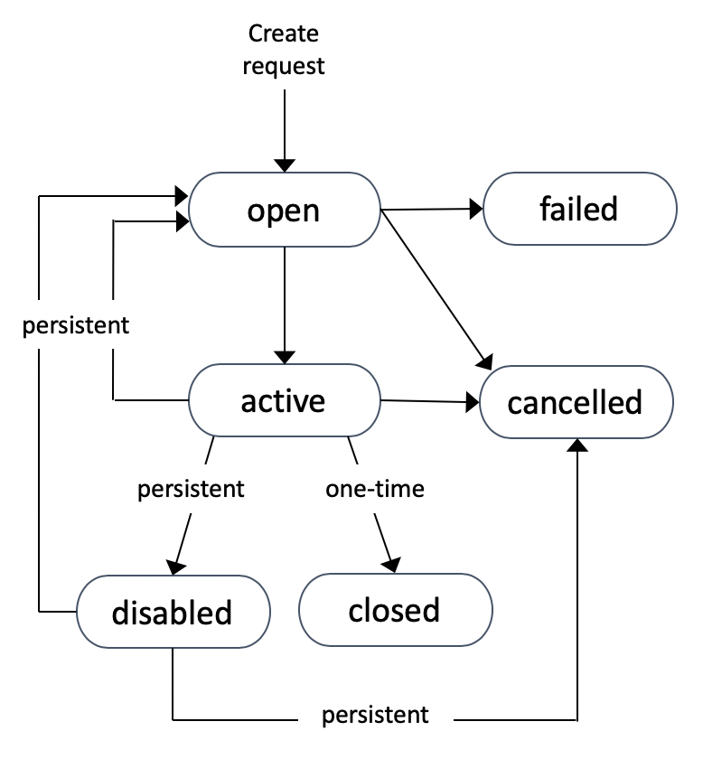

### 1. Amazon EC2 (Elastic Compute Cloud)
它主要包括以下能力：

- 租用虚拟机（EC2）
- 在虚拟驱动器（EBS）上存储数据
- 跨机器分配负载（ELB）
- 使用自动缩放组（ASG）缩放服务

### 2. EC2 Instance Types - Overview
m5.2xlarge
- m：实例类
- 5：生成（AWS会随着时间的推移对其进行改进）
- 2xlarge：实例类中的大小

### 3. Introduction to Security Groups

- 安全组仅包含**allow**规则
- 安全组规则可以按 IP 或按安全组引用

### 4. Security Groups Good to know

- 可以附加到多个实例

- 锁定到某个地区/VPC组合

- 是否位于EC2的“外部”？如果流量被阻塞，EC2实例将看不到它

- 最好为SSH访问维护一个单独的安全组

- 如果您的应用程序不可访问（超时），则这是安全组问题

- 如果您的应用程序出现“拒绝连接”错误，那么这是应用程序错误或未启动

- 默认情况下，所有入站流量都被阻止

- 默认情况下，所有出站流量都已授权

### 5. 要了解的经典端口

- 22=SSH（Secure Shell）-登录到Linux实例

- 21=FTP（文件传输协议）-将文件上传到文件共享

- 22=SFTP（安全文件传输协议）-使用SSH上传文件

- 80=HTTP–访问不安全的网站

- 443=HTTPS–访问安全网站

- 3389=RDP（远程桌面协议）-登录到Windows实例

### 6. SSH Summary Table

|              | SSH  | Putty | EC2 Instance Connect |
| :----------: | :--: | :---: | :------------------: |
|     Mac      |  √   |       |          √           |
|    Linux     |  √   |       |          √           |
| Windows < 10 |      |   √   |          √           |
| Windows > 10 |  √   |   √   |          √           |

### 7. EC2 Instances Purchasing Options

- **On-Demand Instances**：工作负载短，价格可预测

- **Reserved**：（至少1年）

- **Reserved Instances**：工作负载长

- **Convertible Reserved Instances**：具有灵活实例的长工作负载

- **Scheduled Reserved Instances**：例如，每周四下午3点至6点

- **Spot Instances**：工作负载短、成本低、可能丢失实例（可靠性较低）

- 适用于具有故障恢复能力的工作负载：批处理作业、数据分析、图像处理、任何分布式工作负载、具有灵活开始和结束时间的工作负载

- 如果主动终止一个竞价实例，需要为当前这个完整小时付费

- 如果因为价格上涨，AWS 终止了你的竞价实例，那么这个小时的费用会被免除

- **Dedicated Hosts**：预订整个物理服务器，控制实例放置

- 专用主机允许您使用现有的绑定到服务器的软件许可证，可以帮助您满足法规遵从性要求并降低成本

- **Dedicated Instances**：没有其他客户会共享您的硬件

- 可以与同一帐户中的其他实例共享硬件

- 无法控制实例放置（可以在停止/启动后移动硬件）

### 8. Differences between options

*note: 

- %折扣与视频不同，因为AWS会随着时间的推移而改变折扣-考试不需要确切的数字。这只是为了说明

- Spot实例：**Spot块**在指定的时间范围内（1到6小时）不中断（从2021年7月1日起不再可用，支持到2022年12月31日）

|                      |    Discount    | Reservation Period |  Upfront Payment   |
| :------------------: | :------------: | :----------------: | :----------------: |
|      On Demand       |       /        |         /          |         No         |
|       Reserved       |   Up to 72%    |  1 year/ 3 years   | No / Partial / All |
| Convertible Reserved |   Up to 66%    |                    |                    |
|  Scheduled Reserved  |       /        |    1 year only     |                    |
|         Spot         |   Up to 90%    |                    |                    |
|   Dedicated Hosts    | More expensive |      3 years       |                    |
| Dedicated Instances  |       /        |                    | / |

### 9. 如何终止 Spot Instances?

- 只能取消打开、活动或禁用的点实例请求。
- 取消Spot Request不会终止实例
- 您必须首先取消现场请求，然后终止关联的现场实例

### 10. Spot Fleets

- Spot Fleets=一组Spot实例+（可选）随需应变实例

- 现货车队将努力在价格限制的情况下达到目标产能

- 定义可能的启动池：实例类型（m5.large）、操作系统、可用性区域

- 可以有多个发射池，以便舰队可以选择

- Spot Fleet在达到容量或最大成本时停止启动实例

- 分配点实例的策略：

- **最低价**：来自价格最低的池（成本优化，工作量短）

- **多样化**：分布在所有池中（非常适合可用性和长工作负载）

- **capacityOptimized**：具有针对实例数量的最佳容量的池

### 11. EC2 Nitro

下一代EC2实例的基础平台，高速EBS（Nitro对于64000 EBS IOPS是必要的，非Nitro上的最大值为32000）

### 12. EC2 – Capacity Reservations

- 容量预订确保您在需要时拥有EC2容量
- 预订的手动或计划结束日期无需1年或3年的承诺
- 容量访问是即时的，它一开始就向您收费
- 指定：
  - 要在其中保留容量的可用性区域（仅一个）
  - 要为其保留容量的实例数
  - 实例属性，包括实例类型、租赁和平台/OS
  - 与保留实例和节约计划相结合以节省成本