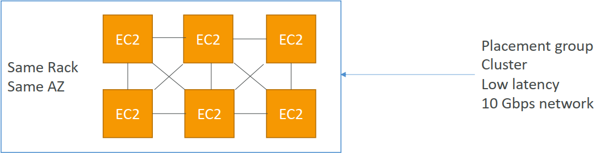
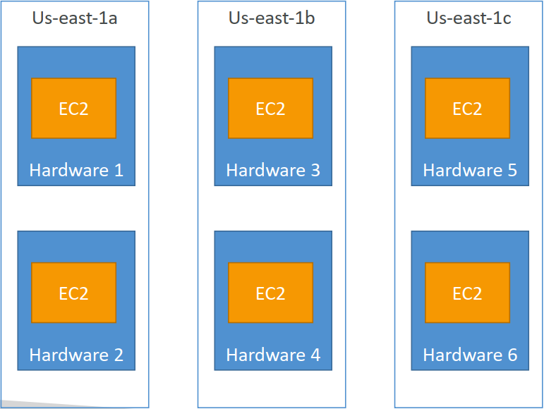
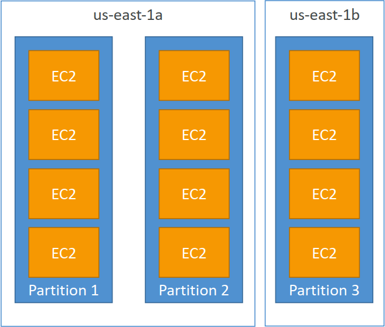

IPv4允许在公共空间中提供 37 亿个不同的地址

### 1. Elastic IPs - 为您的实例提供固定的公共IP

- 使用弹性IP地址，您可以通过快速将地址重新映射到帐户中的另一个实例来掩盖实例或软件的故障。

- 你的账户中只能有 5 个弹性IP（你可以要求 AWS 增加）。

- 总体而言，尽量避免使用弹性IP

- 它们往往反映出糟糕的体系结构决策

- 相反，使用随机的公共IP并向其注册DNS名称

- 或者，正如我们稍后将看到的，使用负载均衡器而不使用公共IP

### 2. Placement Groups

- **群集**-将实例群集到单个可用性区域中的低延迟组中

- 优点：出色的网络（启用增强网络的实例之间的10 Gbps带宽-推荐）
- 缺点：如果机架出现故障，则所有实例都会同时出现故障
- 用例：
- 需要快速完成的大数据工作

- 需要极低延迟和高网络吞吐量的应用程序

- **排列**-在底层硬件之间排列实例（每个AZ每组最多7个实例）
  - 优点：
    - 可以跨越可用性区域（AZ）
    - 同时发生故障可降低风险
    - EC2实例位于不同的物理硬件上
  - 缺点：每个放置组每个AZ最多7个实例
  - 用例：
      - 需要最大限度地提高高可用性的应用程序
      
      - 关键应用程序，其中每个实例必须相互隔离，避免发生故障

**分区**——将实例分布在一个AZ中的许多不同分区（这些分区依赖于不同的机架集）上。每个组可扩展到100个EC2实例（Hadoop、Cassandra、Kafka）

- 每个AZ最多7个分区

- 可以跨越同一地区的多个AZ

- 多达100个EC2实例

- 分区中的实例不与其他分区中的示例共享机架

- 分区故障可能会影响许多EC2，但不会影响其他分区

- EC2实例可以访问作为元数据的分区信息

- 用例：HDFS、HBase、Cassandra、Kafka

### 3. Elastic Network Interfaces (ENI)

- 专有网络中代表**虚拟网卡的逻辑组件**
- ENI可以具有以下属性：
  - 主专用IPv4，一个或多个辅助IPv4
  - 每个专用IPv4一个弹性IP（IPv4）
  - 一个公共IPv4
  - 一个或多个安全组
  - MAC地址
- 您可以独立创建ENI，并在EC2实例上动态附加（移动）它们以进行故障切换
- 绑定到特定可用性区域（AZ）

### 4. EC2 Hibernate
在后台：RAM状态被写入根EBS卷中的一个文件，该文件必须加密
使用案例：

- 长时间运行的处理
- 保存RAM状态
- 初始化需要时间的服务

### 5. EC2 Hibernate – Good to know

- **支持的实例族**-C3、C4、C5、M3、M4、M5、R3、R4和R5
- **实例RAM大小***-必须小于150 GB
- **实例大小**-裸金属实例不支持
- **AMI**：亚马逊Linux 2、Linux AMI、Ubuntu和Windows…
- **根卷**：必须是EBS，加密的，不是实例存储，并且很大
- 可用于随需应变和保留实例
- 实例的休眠时间不能超过60天

