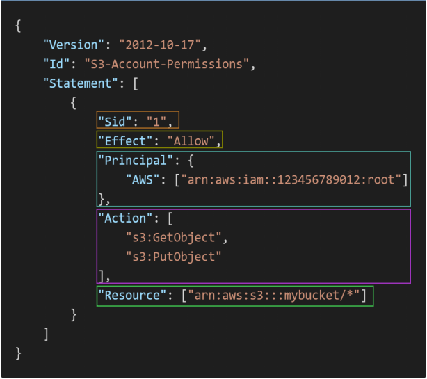

### 1. IAM: Users & Groups

身份和访问管理

- **全球**服务
- **根帐户**默认创建，不应使用或共享
- **用户**是组织内的人员，可以分组
- **组**只包含用户，不包含其他组
- 用户不必属于一个组，用户可以属于多个组

### 2. IAM: Permissions

- **用户或组**可以分配称为策略的JSON文档
- 这些策略定义用户的**权限**
- 在AWS中，您应用**最小权限原则**：不要授予用户所需的权限

### 3. IAM Policies Structure

版本：策略语言版本，始终包含`“2012-10-17”`
Id：策略的标识符（可选）
语句：一个或多个单独的语句（必需）

- Sid：语句的标识符（可选）
- 效果：语句是允许还是拒绝访问（Allow，Deny）
- 主体：应用此策略的帐户/用户/角色
- 操作：此策略允许或拒绝的操作列表
- 资源：应用操作的资源列表
- 条件：此策略生效的条件（可选）

[使用标签控制对 IAM 用户和角色的访问以及他们进行的访问](https://docs.aws.amazon.com/zh_cn/IAM/latest/UserGuide/access_iam-tags.html)

### 4. How can users access AWS ?

- **AWS管理控制台**（受密码+MFA保护）
- **[AWS命令行界面（CLI）](https://github.com/aws/aws-cli)**：受访问密钥保护（基于AWS SDK for Python）
- **AWS软件开发工具包（SDK）**用于代码：受访问密钥保护

### 5. IAM Security Tools
IAM凭据报告（帐户级别）：
- 列出帐户的所有用户及其各种凭据状态的报告

IAM Access Advisor（用户级别）：
- Access advisor显示授予用户的服务权限以及上次访问这些服务的时间
- 您可以使用这些信息来修改您的策略

### 6. IAM Guidelines & Best Practices

- 除了AWS帐户设置之外，不要使用根帐户
- 一个物理用户=一个AWS**用户**
- **将用户分配给组**并将权限分配给组
- 创建**强密码策略**
- 使用和强制使用**多因素身份验证（MFA）**
- 创建并使用**角色**授予AWS服务权限
- 使用访问密钥进行编程访问（CLI/SDK）
- 使用IAM凭据报告审核您帐户的权限
- **永远不要共享IAM用户和访问密钥**

### 7. Shared Responsibility Model for IAM

| AWS                                                        | you                                                          |
| ---------------------------------------------------------- | ------------------------------------------------------------ |
| 基础设施（全球网络安全） 配置和漏洞分析 合规性验证 | 用户、组、角色、策略管理和监控 在所有帐户上启用MFA 经常轮换所有密钥 使用IAM工具应用适当的权限 分析访问模式并审查权限 |