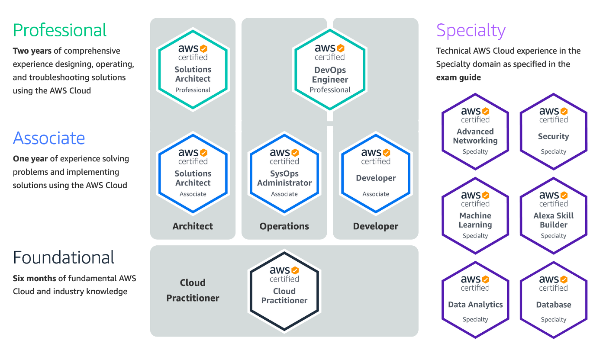

### 1. AWS 考试证书类型

### 2. SAA-C02参加最新考试的最后日期是 2022 年 8 月 29 日
[AWS 认证解决方案架构测试考试概览](https://aws.amazon.com/cn/certification/certified-solutions-architect-associate/)

- AWS Certification 帐户的“Benefits”中的半价优惠券，可以用于再认证或用于您之后参加的任何认证考试
- 参加同等或更高级别的考试可以满足再认证的要求。如果您未通过考试，必须等待14天才能重考
- 重考次数没有限制，但每次重考都必须全额支付报名费（2022年9月30日之前，PSI考试不过免费补考）
- 一旦通过了考试，则在两年内不能重考同一门课程
- 费用 Foundational 100美元，Associate 150美元，Professional 和 Specialty 300美元
- 130分钟65道题，其中包括15道不计分（AWS收集评估以作为将来计分使用），及格分720分（可能会根据难易程度换算分数）
- 单选四选一，多选在五个或更多答案选项中具有两个或更多正确答案（会告诉你正确的个数）

### 3. 备考资料

- [AWS官方文档](https://docs.aws.amazon.com/index.html)
- [AWS官方白皮书](https://aws.amazon.com/cn/whitepapers/)
- 在线题库
  - [ExamTopics](https://www.examtopics.com/exams/amazon/aws-certified-solutions-architect-associate-saa-c02/)
  - [AWS认证模拟题](https://mytodo.vip/)
  - [Free Briefing exams](https://www.briefmenow.org/amazon/)
- 博客
  - [Jayendra's Cloud Certification Blog](https://jayendrapatil.com/)
  - [LiuYuchen](https://liuyuchen777.github.io/2021/10/04/AWS-Study-Note/AWS-SAA-C02/)
  - [Bing哥的博客](http://www.cloudbin.cn/?tag=aws&paged=2)
- Udemy 视频课程 Ultimate AWS Certified Solutions Architect Associate SAA-C0N，全英文带习题

