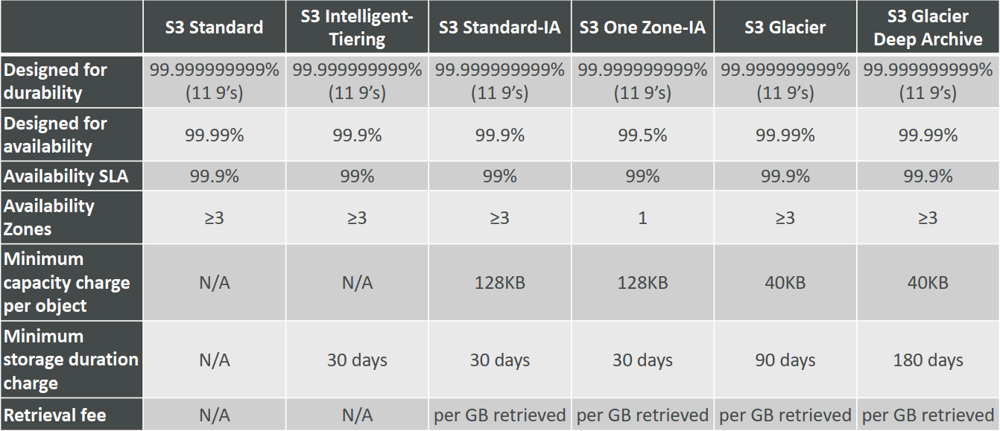

### 1. Amazon S3 Overview - Buckets

- AmazonS3允许人们将对象（文件）存储在“bucket”（目录）中
- Buckets必须具有**全局唯一名称**
- Buckets是在区域级别定义的
- 命名约定
  - 无大写字母
  - 没有下划线
  - 3-63个字符长
  - 不是IP
  - 必须以小写字母或数字开头

### 2. Amazon S3 Overview – Objects

- 对象值是主体的内容：
  - 最大对象大小为5TB（5000GB）
  - 如果上传超过5GB，必须使用“多部分上传”
- 元数据（文本键/值对列表——系统或用户元数据）
- 标签（Unicode键/值对-最多10个）-对安全性/生命周期非常有用
- 版本ID（如果启用了版本控制）

### 3. S3 Encryption for Objects
SSE-S3：使用AWS处理和管理的密钥加密S3对象

- 对象是加密的服务器端
- AES-256加密类型
- 必须设置标头：**“x-amz-server-side-encryption”：“AES256”**

SSE-KMS：利用AWS密钥管理服务管理加密密钥
- SSE-KMS：使用KMS处理和管理的密钥进行加密
- KMS优势：用户控制+审计跟踪
- 对象是加密的服务器端
- 必须设置标头：**“x-amz-server-side-encryption”：“aws:kms”**

SSE-C：当您想要管理自己的加密密钥时
- 服务器端加密，使用完全由AWS以外的客户管理的数据密钥
- Amazon S3不存储您提供的加密密钥
- **必须使用HTTPS**
- 必须在HTTP标头中为每个HTTP请求提供加密密钥

客户端加密
- 客户端库，如Amazon S3加密客户端
- 客户端在发送到S3之前必须自己加密数据
- 从S3检索时，客户端必须自己解密数据
- 客户全面管理密钥和加密周期

### 4. S3 Security
**User based**

- IAM策略——应允许从IAM控制台为特定用户调用API

**Resource Based**
- Bucket Policies-来自S3控制台的Bucket范围规则-允许跨帐户
- 对象访问控制列表（ACL）–细粒度
- Bucket访问控制列表（ACL）–不太常见

**Note**: IAM主体可以访问S3对象，如果

- 用户IAM权限允许**或**资源策略允许
- **和**没有明确的DENY

### 5. CORS (Cross-Origin Resource Sharing)
using **CORS Headers (ex: Access-Control-Allow-Origin)**

### 6. AWS EC2 Instance Metadata

- AWS EC2实例元数据功能强大，但却是开发人员最不了解的功能之一
- 它允许AWS EC2实例“了解自己”**，而无需为此目的使用IAM角色**。
- URL是[http://169.254.169.254/latest/meta-data](http://169.254.169.254/latest/meta-data)
- 您可以从元数据中检索IAM角色名称，但无法检索IAM策略

### 7. Amazon FSx

- 在AWS上推出第三方高性能文件系统
- 全面管理的服务

### 8. Amazon FSx for Windows (File Server)

- EFS是一个用于Linux系统的共享POSIX系统。
- **FSx for Windows**是一个完全管理的**Windows**文件系统共享驱动器
- 支持SMB协议和Windows NTFS
- Microsoft Active Directory集成、ACL、用户配额
- 内置SSD，可扩展至10 GB/s，数百万IOPS，100s PB数据
- 可以从您的内部部署基础架构访问
- 可以配置为Multi-AZ（高可用性）
- 数据每天备份到S3

### 9. Amazon FSx for Lustre

- Lustre是一种并行分布式文件系统，用于大规模计算
- Lustre这个名字来源于“Linux”和“集群”
- 机器学习，**高性能计算（HPC）**
- 视频处理、财务建模、电子设计自动化
- 可扩展到100s GB/s、数百万IOPS、亚毫秒延迟
- **与S3无缝集成**
  - 可以作为文件系统“读取S3”（通过FSx）
  - 可以将计算结果写回S3（通过FSx）
- 可从内部部署服务器使用

### 10. AWS Storage Gateway

- S3中本地数据和云数据之间的桥梁
- 使用案例：灾难恢复、备份和恢复、分层存储

### 11. File Gateway

- 可以使用NFS和SMB协议访问配置的S3存储桶
- 支持S3标准、S3 IA、S3 One Zone IA
- 使用IAM角色对每个文件网关进行存储桶访问
- 最近使用的数据缓存在文件网关中
- 可以安装在许多服务器上
- **与Active Directory（AD）**集成，用于用户身份验证

### 12. Volume Gateway

- 使用S3支持的iSCSI协议的块存储
- 由EBS快照支持，这可以帮助恢复本地卷！
- **缓存卷**：对最新数据的低延迟访问
- **存储的卷**：整个数据集都是内部部署的，计划备份到S3

### 13. Tape Gateway

- 有些公司有使用物理磁带的备份过程（！）
- 使用磁带网关，公司使用相同的流程，但在云中
- 由Amazon S3和Glacier支持的虚拟磁带库（VTL）
- 使用现有的基于磁带的进程（和iSCSI接口）备份数据
- 与领先的备份软件供应商合作

### 14. Storage Comparison
- **S3**：对象存储
- **冰川**：实物档案
- **EFS**：Linux实例的网络文件系统，POSIX文件系统
- **FSx for Windows**：适用于Windows服务器的网络文件系统
- **FSx for Lustre**：高性能计算Linux文件系统
- **EBS卷**：一次一个EC2实例的网络存储
- **实例存储**：EC2实例的物理存储（高IOPS）
- **存储网关**：文件网关、卷网关（缓存和存储）、磁带网关
- **Snowball/Snowmobile**：将大量数据物理地移动到云中
- **数据库**：用于特定的工作负载，通常带有索引和查询

### 15. S3 MFA-Delete

- MFA（多因素身份验证）强制用户在S3上执行重要操作之前，在设备（通常是手机或硬件）上生成代码
- 要使用MFA Delete，请在S3存储桶上启用Versioning
- 您需要MFA
  - 永久删除对象版本
  - 挂起bucket的版本控制
- 您不需要MFA
  - 启用版本控制
  - 列出已删除的版本
- **只有bucket所有者（root帐户）才能启用/禁用MFA Delete**
- MFA Delete当前只能使用CLI启用
- ***注意：**Bucket策略在“默认加密”之前进行评估

### 16. S3 Replication (CRR & SRR)

- **必须在源和目标中启用版本控制**
- 跨区域复制（CRR）
- 同一区域复制（SRR）
- Buckets可以在不同的帐户中
- 复制是异步的
- 必须向S3授予适当的IAM权限
- CRR—使用案例：法规遵从性、较低延迟的访问、跨帐户复制
- SRR–用例：日志聚合、生产和测试帐户之间的实时复制

### 17. S3 Replication – Notes

- 激活后，仅复制新对象（不可追溯）
- 对于DELETE操作：
  - 可以将删除标记从源复制到目标（可选设置）
  - 不复制具有版本ID的删除（以避免恶意删除）
- 不存在复制的“链接”
  - 如果存储桶1具有到存储桶2中的复制，则存储桶2具有到存储盒3中的复制
  - 然后，在bucket 1中创建的对象不会复制到bucket 3

### 18. S3 Pre-Signed URLs

- 可以使用SDK或CLI生成预签名URL
  - 对于下载（很容易，可以使用CLI）
  - 对于上传（更难，必须使用SDK）
- 有效期默认为3600秒，可以在[TIME_BY_seconds]参数中使用--expires更改超时
- 给定预签名URL的用户将继承生成GET/PUT URL的人的权限

### 19. Amazon S3存储类别

[S3 Storage Classes Comparison](https://aws.amazon.com/cn/s3/storage-classes/)

### 20. S3 – Moving between storage classes

### 21. S3 Lifecycle Rules

- **转换操作**：它定义对象何时转换到另一个存储类。
  - 创建后60天将对象移动到标准IA类
  - 6个月后移到Glacier存档
- **过期操作**：将对象配置为在一段时间后过期（删除）
  - 访问日志文件可以设置为在365天后删除
  - **可用于删除旧版本的文件（如果启用了版本控制）**
  - 可用于删除不完整的多部分上传
- 可以为某个前缀创建规则（例如-s3://mybucket/mp3/*）
- 可以为某些对象标记创建规则（例如部门：财务）

### 22. S3 Analytics – Storage Class Analysis

- 您可以设置S3 Analytics以帮助确定何时将对象从Standard转换为Standard_IA
- 不适用于ONEZONE_IA或GLACIER
- 报告每天更新
- 首次启动大约需要24小时到48小时
- 制定生命周期规则（或改进它们）的第一步很好！

### 23. S3 – Baseline Performance

- Amazon S3自动扩展到高请求率，延迟100-200毫秒
- 您的应用程序在一个bucket中的每个前缀每秒至少可以实现**3500 PUT/COPY/POST/DELETE和5500 GET/HEAD请求**

### 24. S3 Performance

- **Multi-Part upload:**
  - 建议用于大于100MB的文件，必须用于大于5GB的文件
  - 可以帮助并行上传（加快传输速度）
- **S3 Transfer Acceleration**
  - 通过将文件传输到AWS边缘位置来提高传输速度，该位置将数据转发到目标区域中的S3存储桶
  - 兼容多部分上传

### 25. Athena

一次性SQL查询、S3上的无服务器查询、日志分析