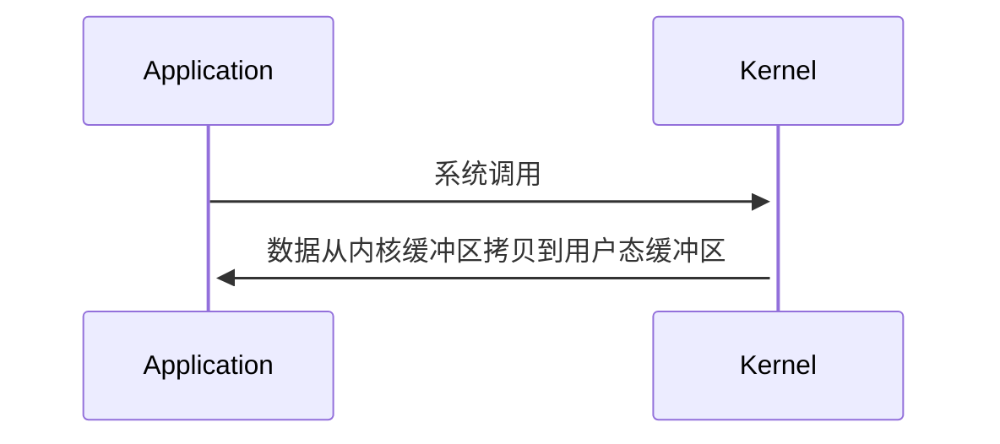
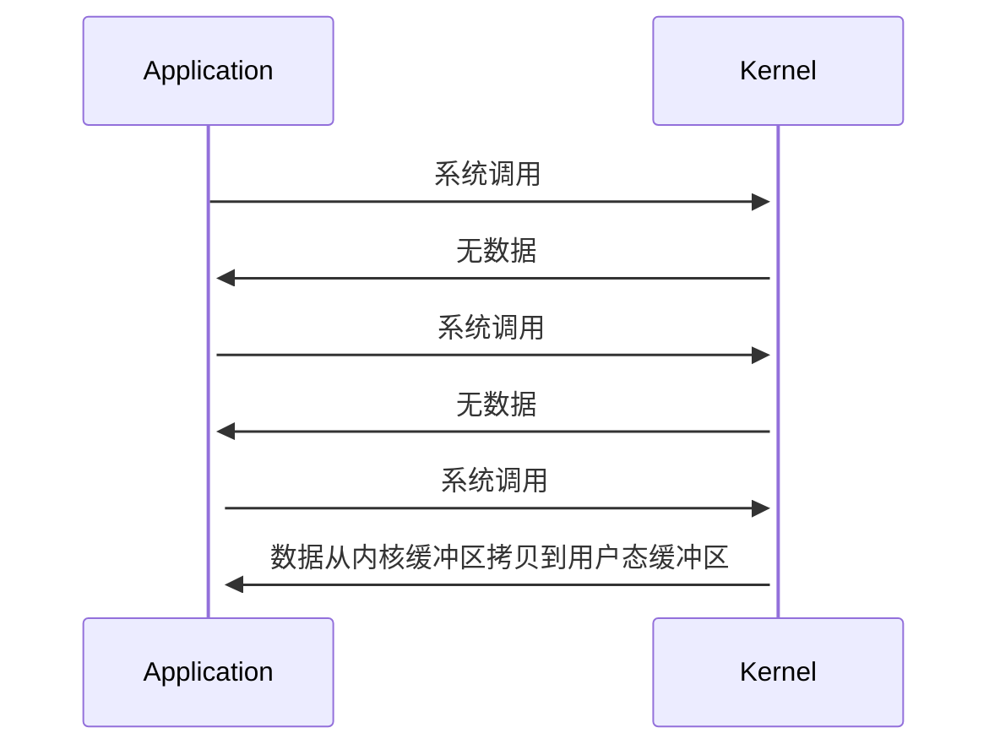
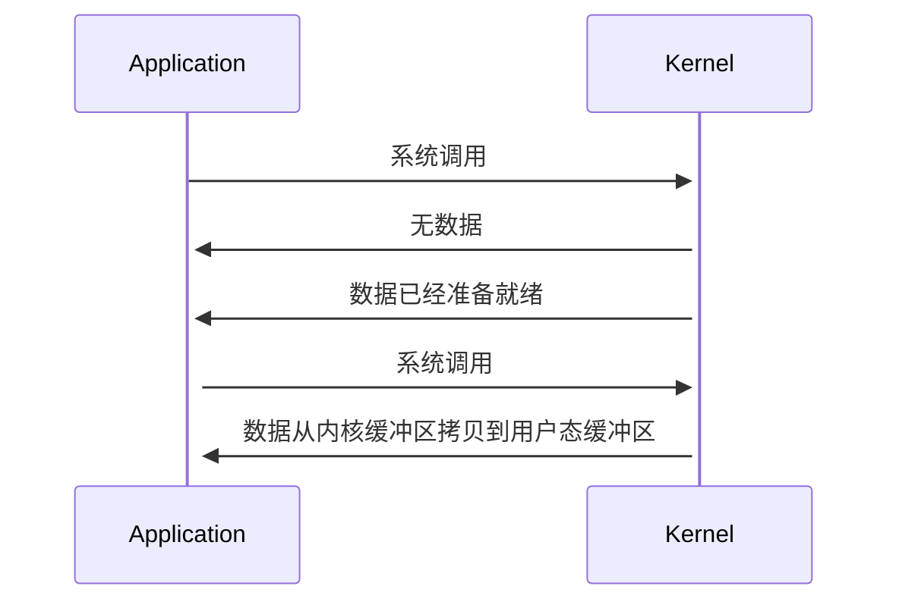
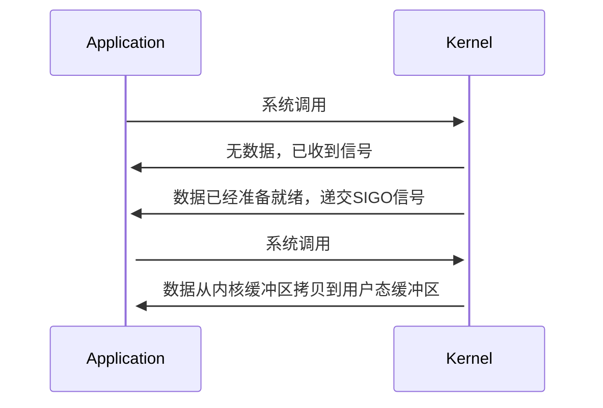
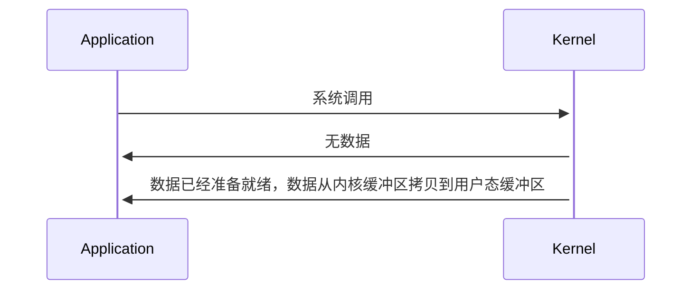

### 1. IO 多路复用 select、poll、epoll
- select 模型，使用的是数组来存储 Socket 连接文件描述符，容量是固定的，需要通过轮询来判断是否发生了 IO 事件
- poll 模型，使用的是链表来存储 socket 连接文件描述符，容量是不固定的，同样需要通过轮询来判断是否发生了 IO 事件
- epoll 模型，epoll 和 poll 是完全不同的，epoll 是一种事件通知模型，当发生了 IO 事件时，应用程序才进行 IO 操作，不需要像 poll 模型那样主动去轮询

**select：**

```c
sockfd = socket(AF_INET,SOCK_STREAM, 0);
memset(&addr, 0, sizeof(addr));
addr.sin_family = AF_INET;
addr.sin_port = htons(2000);
addrsin_addr.s_addr = INADDR ANY;
bind(sockfd, (struct sockaddr*)&addr, sizeof(addr));
listen(sockfd, 5);

for (i=0;i<5;i++)
{
    memset(&client, 0, sizeof(client));
    addrlen = sizeof(client);
    fds[i] = accept(sockfd, (struct sockaddr*)&client, &addrlen);
    if(fds[i] > max)
        max = fds[i];
}
// 上面用来创建5个文件描述符
while(1){
    FD_ZER0(&rset); // 初始化赋空值
    for (i = 0; i< 5; i++ ) {
        FD_SET(fds[i],&rset);
    }
}

puts("round aqain");
select(max+1, &rset, NULL, NULL, NULL); // max+1表示最大文件描述符为止的长度

for(i=0;i<5;i++) {
    if (FD_ISSET(fds[i],&rset)){ // 如果fd被置位
        memset(buffer, 0, MAXBUF);
        read(fds[i], buffer, MAXBUF); // 读
        puts(buffer); // 处理
    }
}
```

select 中由内核来判断 fd（rset 是 bitmap 形式保存 fd 的状态） 是否有数据。

- fd 没有数据时，会一只阻塞在 select()
- 有数据时，fd 置位表示有数据（注意这里的 FD 置位中 FD 指的其实是 rset 中对应的那一位，而不是真正的 fds 中的元素），select() 返回

缺点：

- fd 的大小默认是 1024，可以调整，但是仍然有上限
- FDset 不可重用，每次都需要初始化
- rset 拷贝到内核态仍然需要一定的开销，虽然比判断单个 fd 效率高
- select() 返回后仍需要遍历，不清楚其中哪个 fd 有数据，复杂度 O(n)

**poll：**

```c
struct pollfd {
    int fd;
    short events; // 表示 读、写、读写 事件
    short revents;
}

for (i=0;i<5;i++)
{
    memset(&client, 0, sizeof(client));
    addrlen = sizeof(client);
    pollfds[i].fd = accept(sockfd, (struct sockaddr*)&client, &addrlen);
    pollfds[i].events = POLLIN; // 读事件
}
sleep(1);
while(1){
    puts("round again");
    poll(pollfds, 5, 50000); // fd个数，超时时间。有数据时，置位 pollfd.revents，然后返回
    
    for(i=0;i<5;i++) {
        if (pollfds[i].revents & POLLIN){ // 判断是否置位
            pollfds[i].revents = 0; // 还原
            memset(buffer,0,MAXBUF);
            read(pollfds[i].fd, buffer, MAXBUF); // 读
            puts(buffer); // 处理
        }
    }
}
```

用户态是数组存储 fd 状态，内核态使用的是链表

**epoll：**

```c
struct epoll_event events[5];
int epfd = epoll_create(10);// 白板
...
...
for (i=0;i<5;i++)
{
    static struct epoll_event ev;
    memset(&client，0，sizeof (client));
    addrlen = sizeof(client);
    ev.data.fd = accept(sockfd,(struct sockaddr*)&client, &addrlen);
    ev.events = EPOLLIN; // 没有revents
    epoll_ctl(epfd, EPOLL_CTL_ADD, ev.data.fd, &ev);
}

while(1){
    puts("round again");
    nfds = epoll_wait(epfd, events, 5, 10000);
	for(i=0;i<nfds;i++) {
        memset(buffer,0,MAXBUF);
        read(events[i].data.fd, buffer, MAXBUF);
        puts(buffer);
    }
}
```

用户态和内核态共享 epfd，没有拷贝的开销。

有数据时通过重排置位，把有数据的 fd 放到最前面，然后返回有数据的个数 nfds。

epoll LT 模式和 ET 模式详解：https://cloud.tencent.com/developer/article/1636224

### 2. CAP 理论
CAP理论是分布式领域中非常重要的一个指导理论，C（Consistency）表示强一致性，A（Availability）表示可用性，P（Patition Tolerance）表示分区容错性，CAP 理论指出在目前的硬件条件下，一个分布式系统是必须要保证分区容错性的，而在这个前提下，分布式系统要么保证 CP，要么保证 AP，无法同时保证 CAP。

- 分区容错性表示，，一个系统虽然是分布式的，但是对外看上去应该是一个整体，不能由于分布式系统内部的某个结点挂点，或网络出现了故障，而导致系统对外出现异常所以，对于分布式系统而言是一定要保证分区容错性的。
- 强一致性表示，一个分布式系统中各个结点之间能及时的同步数据，在数据同步过程中，是不能对外提供服务的，不然就会造成数据不一致，所以强一致性和可用性是不能同时满足的。
- 可用性表示，一个分布式系统对外要保证可用。

### 3. BASE 理论

由于不能同时满足 CAP，所以出现了 BASE 理论：

- BA：Basically Available，表示基本可用，表示可以允许一定程度的不可用，比如由于系统故障，请求时间变长，或者由于系统的障导致部分非核心功能不可用，都是允许的
- S：Soft state：表示分布式系统可以处于一种中间状态，比如数据正在同步
- E：Eventually consistent，表示最终一致性，不要求分布式系统数据实时达到一致，允许在经过一段时间后再达到一致，在达到一致过程中，系统也是可用的

### 4. Linux 的五种主要 IO 模式

**同步阻塞 I/O（BIO）**



应用进程向内核发起 IO 请求，发起调用的线程一直等待内核返回结果，只能使用多线程模型，一个请求对应一个线程。

**同步非阻塞 I/O（NIO）**



应用进程向内核发起 IO 请求后，不再会同步等待结果，而是会立即返回，通过轮询的方式获取请求结果。NIO 相比 BIO 虽然大幅提升了性能，但是轮询过程当中大量的系统调用，导致上下文切换开销很大，所以单独使用非阻塞 IO 时效率并不高，并且随着并发量的提升，非阻塞 IO 会存在严重的性能浪费。

**I/O 多路复用**



多路复用实现了一个线程处理多个 IO 句柄的操作，多路指的是多个数据通道，复用指的是使用一个或多个固定线程来处理每一个 socket、select、poll、epoll，都是 IO 多路复用的具体实现。线程一次 select 调用，可以获取内核态中多个数据通道的数据状态。多路复用解决了同步阻塞 IO 和同步非阻塞 IO 的问题，是一种非常高效的 IO 模型。

**信号驱动 I/O**



信号驱动 IO 并不常用，它是一种半异步的 IO 模型，当数据准备就绪后，内核通过发送一个 SIGO 信号，通知应用进程，应用进程就可以开始读取数据了

**异步 I/O**



异步 IO 最重要的一点是，从内核缓冲区拷贝数据到用户态缓冲区的过程，也是由系统异步完成，应用进程只需要在指定的数组中引用数据即可。异步 IO 和信号驱动 IO 这种半异步模式的主要区别是信号驱动 IO 由内核通知何时可以开始一个 IO 操作，而异步 IO 由内核通知 IO 操作何时已经完成。
