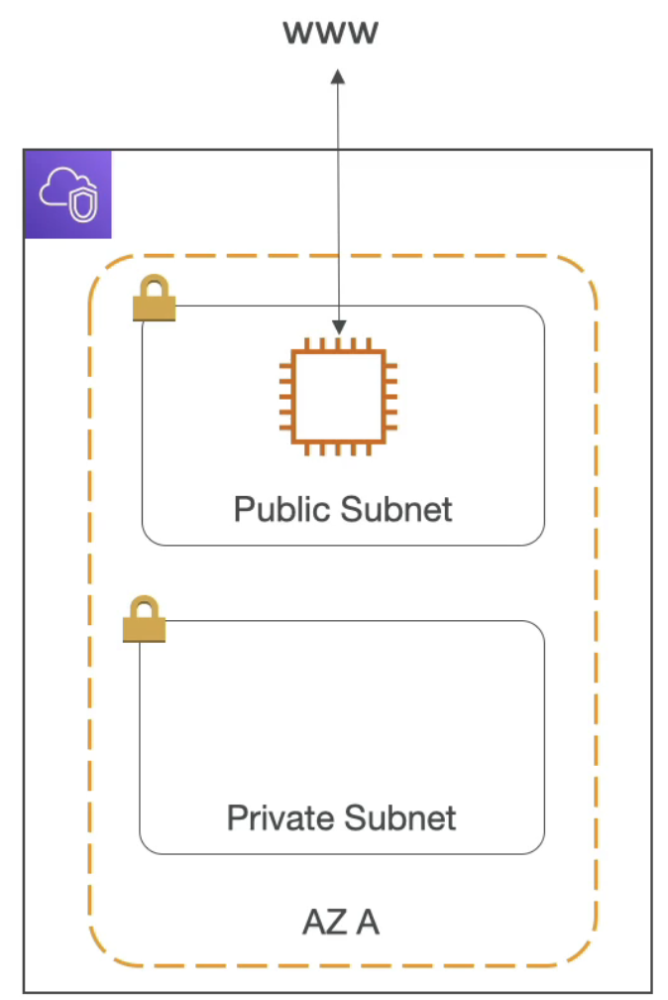
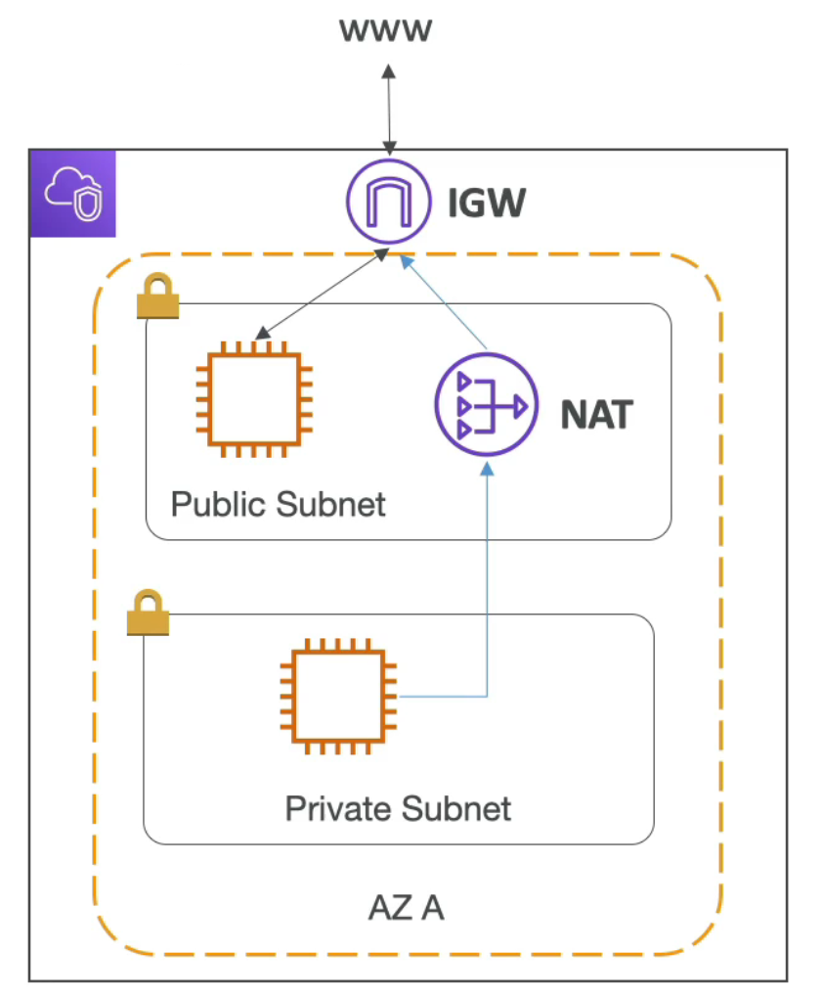
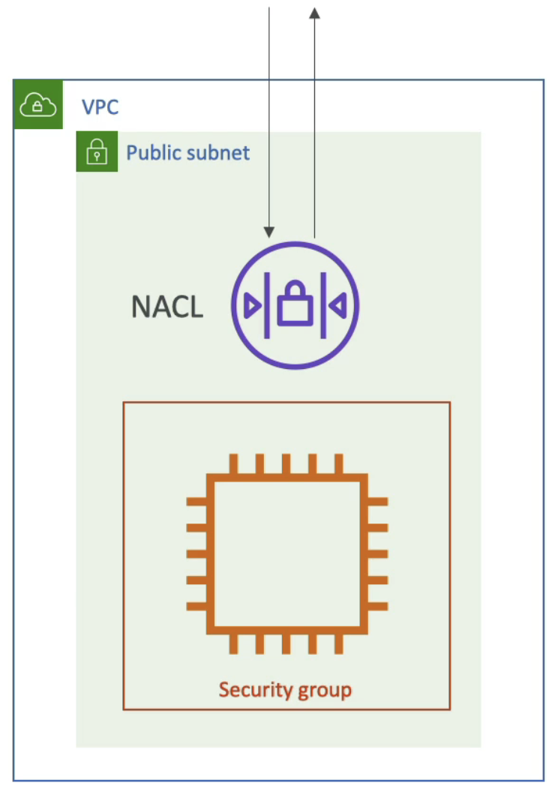
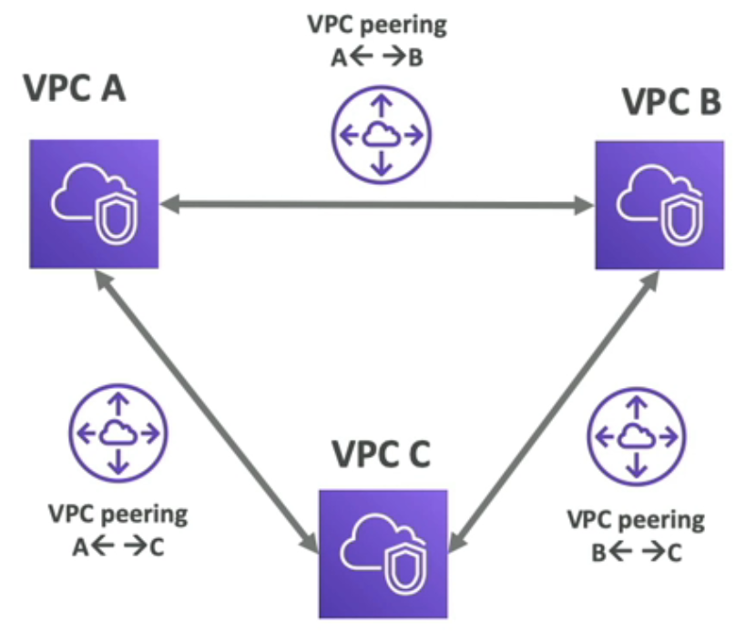
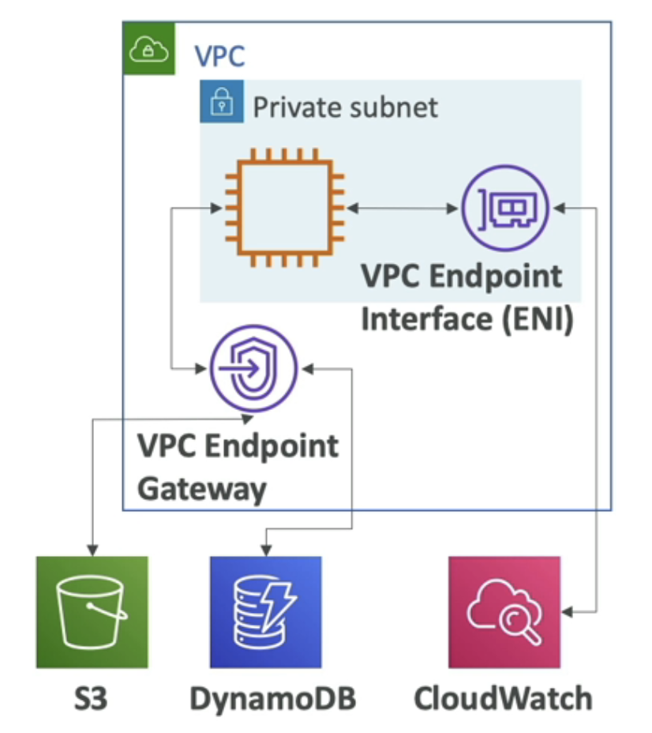
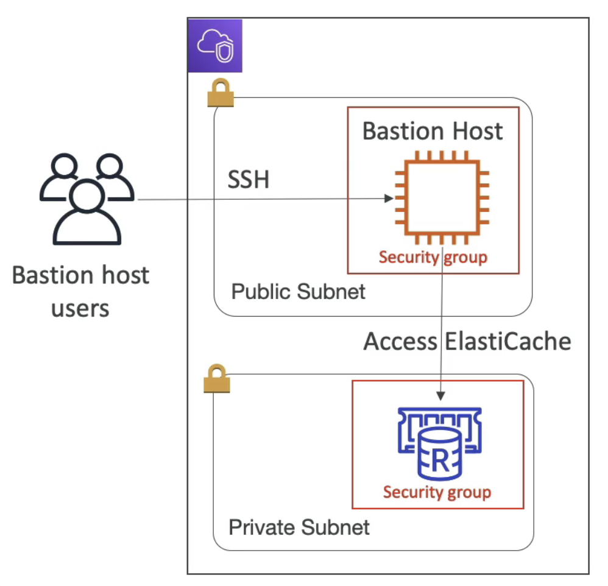

### 1. VPC 和子网

- VPC：部署资源的专用网络（region 层面）
- 子网：允许您在VPC内分区网络（AZ 层面）
- 公共子网：是可从互联网访问的子网
- 专用子网：是不能从互联网访问的子网
- 为了定义对互联网和子网之间的访问，我们使用路由表

### 2. Internet Gateway & NAT Gateways

- 互联网网关帮助我们的 VPC 实例与互联网连接
- 公共子网有通往互联网网关的路由
- NAT 网关（AWS管理）和 NAT 实例（自我管理）允许您的私有子网中的实例在保持私有状态的同时访问互联网

### 3. Network ACL & Security Groups

- 网络访问控制列表
  - 控制子网和子网之间流量的防火墙
  - 可以具有 ALLOW 和 DENY 规则
  - 附加在子网级别
  - 规则仅包括 IP 地址
- 安全组
  - 控制往返 ENl / EC2 实例的流量的防火墙
  - 只能有 ALLOW 规则
  - 规则包括 IP 地址和其他安全组

### 4. 网络访问控制列表和安全组对比

| Security Group                                               | Network ACL                                                  |
| ------------------------------------------------------------ | ------------------------------------------------------------ |
| 运行在实例层面                                               | 运行在子网层面                                               |
| 只支持allow规则                                              | 支持allow和deny规则                                          |
| 无状态：返回的流量自动允许                                   | 有状态：返回的流量必须经规则允许                             |
| 比对所有规则                                                 | 按顺序比对规则                                               |
| 仅在启动实例时指定了安全组，或在之后与实例关联时，才适用于实例 | 自动应用于与之关联的子网中的所有实例（因此，您不必依赖用户来指定安全组） |

### 5. VPC Flow Logs

- 捕获有关进入接口的 IP 流量的信息
  - VPC 流日志
  - 子网流日志
  - 弹性网络接口流日志
- 帮助监控和定位连接问题。比如：
  - 子网到互联网
  - 子网到子网
  - 因特网到子网
- 还从 AWS 托管接口捕获网络信息：弹性负载均衡器，ElastiCache，RDS，Aurora等...
- VPC Flow日志数据可以转到 S3、CloudWatch Logs 和 Kinesis Data Firehose

### 6. VPC Peering

- 连接两个VPC，单独使用AWS的网络
- 使它们的行为就像在同一个网终中一样
- 不能有重叠的CIDR（IP地址范围）
- VPC 对等连接不具有可传递性（必须为需要彼此通信的每个 VPC 建立对等连接）

### 7. VPC Endpoints

- 端点允许您使用专用网络而不是公共万维网网络连接到AWS服务
- 这增强了安全性并降低了访问AWS服务的延迟
- VPC端点网关：S3和DynamoDB
- VPC端点接口：其余部分
- 只在你的VPC中使用

### 8. 堡垒机

- 我们可以使用 Bastion 主机访问我们的私人 RDS 数据库，ElastiCache 集群，等等...
- 堡垒在公共子网中，然后连接到所有其他私有子网
- 必须加强堡垒主机安全组
- 确保数据库安全组允许 bastion 安全组
