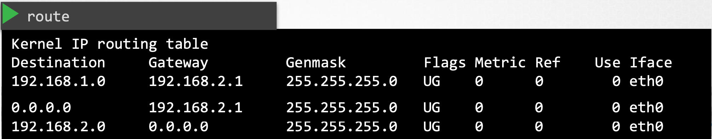

### 1. Volumes
!!!注意题目给的 `mountPath` 后面有没有 `/`，可能会判定为不同路径。

```yaml
apiVersion: v1
kind: Pod
metadata:
  name: random-number-generator
spec:
  containers:
  - image: alpine
    name: alpine
    command: ["/bin/sh","-c"]
    args: ["shuf -i 0-100 -n 1 >> /opt/number.out;"]
    volumeMounts:
    - mountPath: /opt ## Container内的存储路径
      name: data-volume

  volumes:
  - name: data-volume
    hostPath:
      path: /data ## 对应存储在host上的路径
      type: Directory
    ## awsElasticBlockStore: ## 可替换hostPath
      ## volumeID:
      ## fsType: ext4
```

### 2. Persistent Volumes

Persistent Volumes Claim (PVC)

`pv-definition.yaml`

```yaml
apiVersion: v1
kind: PersistentVolume
metadata:
  name: pv-vol1
spec:
  accessModes:
    - ReadWriteOnce
  capacity:
    storage: 1Gi
  awsElasticBlockStore:
    volumeID: <volume-id>
    fsType: ext4
```

管理员创建一组PV，用户创建PVC以用于存储。单个PVC绑定单个PV。

可以使用label进行匹配，如果所有其他条件都匹配，并且没有更好的选项，则较小的PVC可能会绑定到较大的PV，且剩下的存储空间无法再被其他PVC利用。没有PV可用，则PVC会保持pending状态。

```yaml
selector:
  matchLabels:
    name: my-pv ## PVC
```

```yaml
labels:
  name: my-pv ## PV
```

`pvc-definition.yaml`

```yaml
apiVersion: v1
kind: PersistentVolumeClaim
metadata:
  name: myclaim
spec:
  accessModes:
    - ReadWriteOnce
  resources:
    requests:
      storage: 500Mi
```

PVC被删除后，PV的状态取决于：

```yaml
persistentVolumeReclaimPolicy: Retain | Delete | Recycle
```

### 3. Storage Class

在应用程序需要时自动配置 volumes

`sc-definition.yaml` 不需要再配置 pv，由 Storage Class 自动创建

```yaml
apiVersion: storage.k8s.io/v1
kind: StorageClass
metadata:
  name: google-storage
provisioner: kubernetes.io/gec-pd
parameters: ## 取决于磁盘配置
  type: pd-standard
  replication-type: none
```

`pvc-definition.yaml`

```yaml
spec:
  storageClassName: google-storage
```

### 4. Switching

<center></center>

`ip link`：用于列出和修改host上的接口， ip link只能看链路层的状态，看不到ip地址

`ip addr`：查看分配给这些接口的IP地址，即使网卡处于down状态，也能显示出网卡状态，但是ifconfig查看就看不到

`cat /etc/network/interfaces`：查看物理接口

```bash
ip addr add 192.168.1.10/24 dev eth0 # 重启失效
ip addr add 192.168.1.11/24 dev eth0 # 如需永久生效，需要在相应的网络接口文件中修改
```

之后，两个系统之间就可以通过交换机进行通信。路由器连接到2个网络，可以使它们之间可以通信。

一旦链路建立并分配了IP地址，计算机就可以通过交换机相互通信。交换机只能在同一网络内进行通信，这意味着它可以从网络上的主机接收数据包，并将其传送到同一网络内的其他系统。

`ip a | grep internal-ip -B 2`：查看cluster内node间的网络接口，`ip a` 和 `ip addr` 一样

### 5. Routing

<center></center>

路由器可帮助连接两个网络，可以将其视为另一台具有许多网络端口的服务器，它获取IP分配，每个网络一个。

### 6. Gateway

如果说网络是一个房间，那么网关就是通向外部世界、其他网络或Internet的一扇门。系统需要知道门在哪里才能通过。

要查看系统上现有的路由配置，运行 `route`命令，它会显示内核的路由表。

```bash
ip route show default ## 查看默认网关
netstat -nplt | grep scheduler ## 查看目前节点上被scheduler监听的接口
ip route add 192.168.2.0/24 via 192.168.1.1 ## 这样B就可以访问网络2上的系统
ip route add 192.168.1.0/24 via 192.168.2.1 ## 这样C就可以访问网络1上的系统
ip route add 172.217.194.0/24 via 192.168.2.1 ## 如果C需要访问Internet上的某个地址，则也需要把新的路由添加到路由表
```

在互联网上的不同网络上有许多不同的网站，您不必为每个网络的相同路由器IP地址添加路由表条目，而只需简单地说，对于任何您不知道路由的网络，都可以使用此路由器作为默认网关。

```bash
ip route add default via 192.168.1.1 # default = 0.0.0.0
```

<center></center>

在 Gateway 属性列中 `0.0.0.0`表示不需要网关，因为它在自己的网络中。

当网络中有多个路由器时，一个用于 Internet，一个用于内部专用网络，那么您需要为每个网络创建两个单独的 entries 条目。

<center></center>

**如何将Linux主机配置为路由器？**

数据包要到达host C，则C必须向A发回响应，所以两边都得配置。

当2个系统双向都建立好路由时，在Linux中默认情况下，数据包不会从一个接口转发到下一个接口，所以此时仍还ping不通。这是出于安全考虑，例如您将eth0连接到专用网络，而将eth1连接到公共网络，除非您明确允许，否则我们不希望公共网络中的任何人轻松地向专用网络发送消息。

转发的设置在`/proc/sys/net/ipv4/ip_forward`，默认情况下文件中的值为0，表示没有转发，设置为1，ping可以通过，重启后失效。

永久设置：`/etc/sysctl.conf` 中 `net.ipv4.ip_forward = 1`

### 7. DNS

`hostname` 命令可以查看本机的hostname

记录在本地 `/etc/hosts`中，`ssh` 和 `curl` 命令都会根据此文件查找对应的ip地址，先查看本地记录，本地优先级高，如果有则优先使用：

```markdown
192.168.1.11						db
```

DNS配置在 `/etc/resolv.conf` 文件中，将主机指向DNS服务器：

```markdown
nameserver						192.168.1.100  ## 可添加多个
```

为了防止也在每个主机上配置多个DNS服务器地址，可以在DNS服务器上将任何未知的主机名转发到Internet上的公共DNS服务器

优先级顺序可以在 `/etc/nsswitch.conf` 中修改：

```markdown
...
hosts:						files dns
...
```

### 8. Domain Names

`www.google.com`

- 根域名 `.`
- 顶级域名 `.com`
- 分配给google的域名 `google`
- 子域名 `www`

### 9. Search Domain

在 `/etc/resolv.conf` 中添加 `search` 条目并指定要附加的搜索域名

```markdown
search						mycompany.com prod.mycompany.com
```

输入 `web` 时，就会尝试匹配 `web.mycompany.com` 、`web.prod.mycompany.com`

### 10. Record Types

| A     | web-server      | 192.168.1.1                             |
| ----- | --------------- | --------------------------------------- |
| AAAA  | web-server      | 2001:0db8:85a3:0000:0000:8a2e:0370:7334 |
| CNAME | food.web-server | eat.web-server, hungry.web-server       |

### 11. nslookup、dig

Ping不总是测试DNS解析的正确工具，还有 `nslookup`，如 `nslookup www.google.com`，但 `nslookup` 不会考虑本地hosts文件中的条目，仅查询DNS服务器。

类似的还有 `dig www.google.com`，返回更多详细信息

### 12. 将主机配置成DNS服务器

- 下载CoreDNS

- 解压，运行可执行文件coredns

- 默认侦听端口53

- 配置Corefile文件

  ```
  . {
  	hosts /etc/hosts
  }
  ```

- 其他参考信息：

  https://github.com/kubernetes/dns/blob/master/docs/specification.md

  https://coredns.io/plugins/kubernetes/