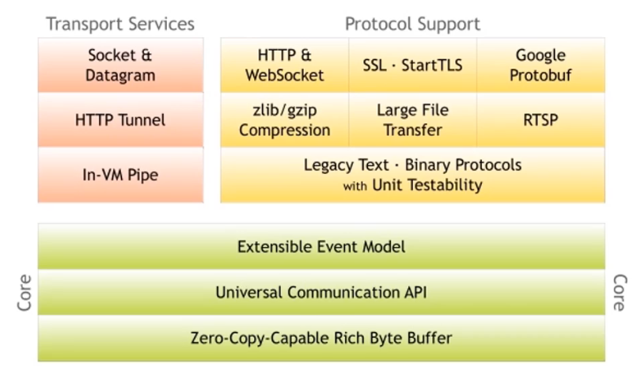
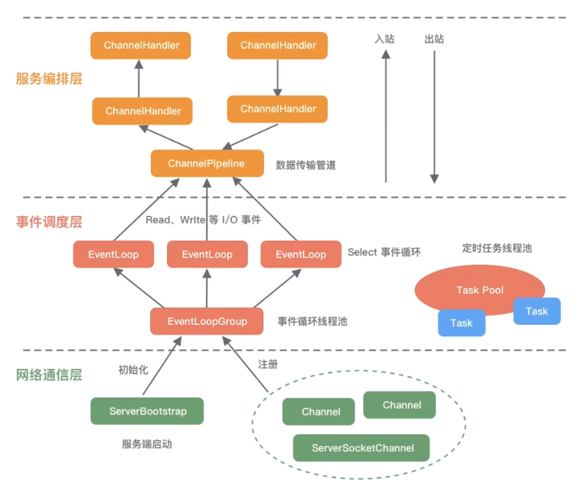
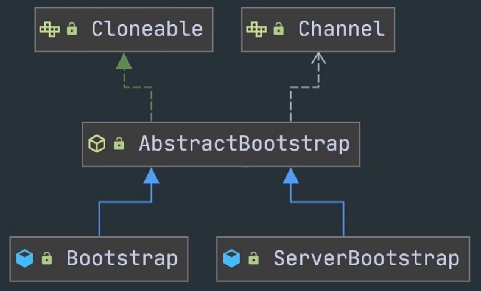
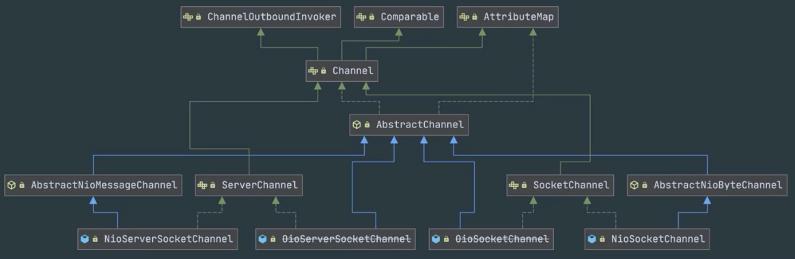
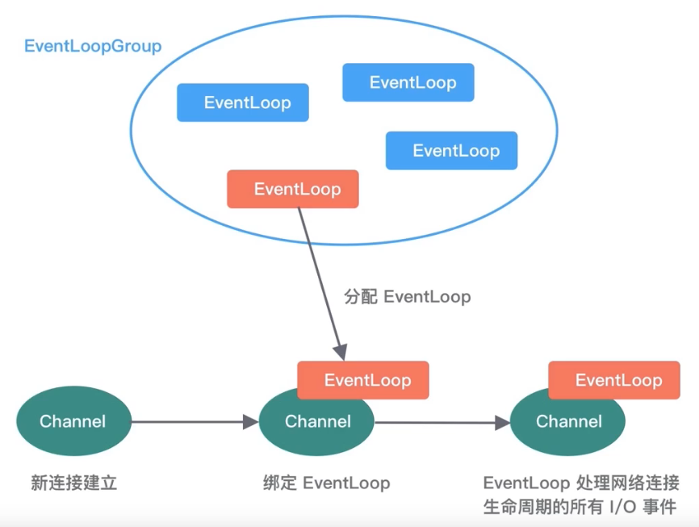
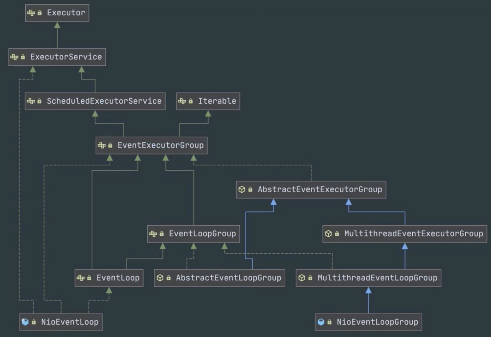
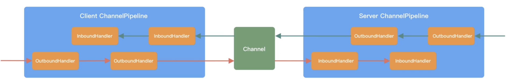
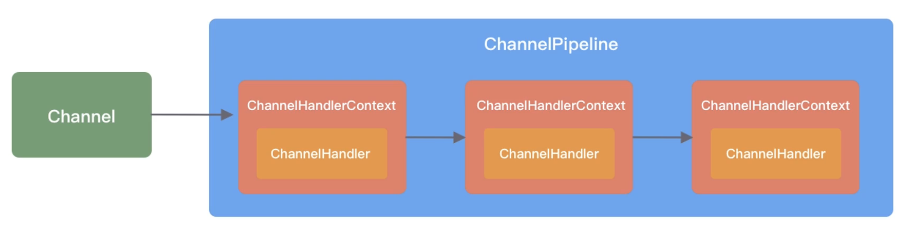
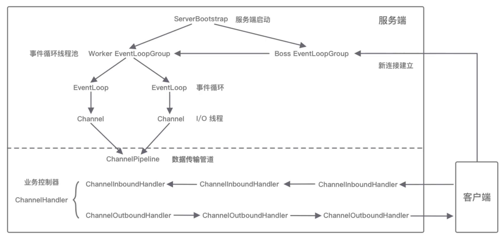
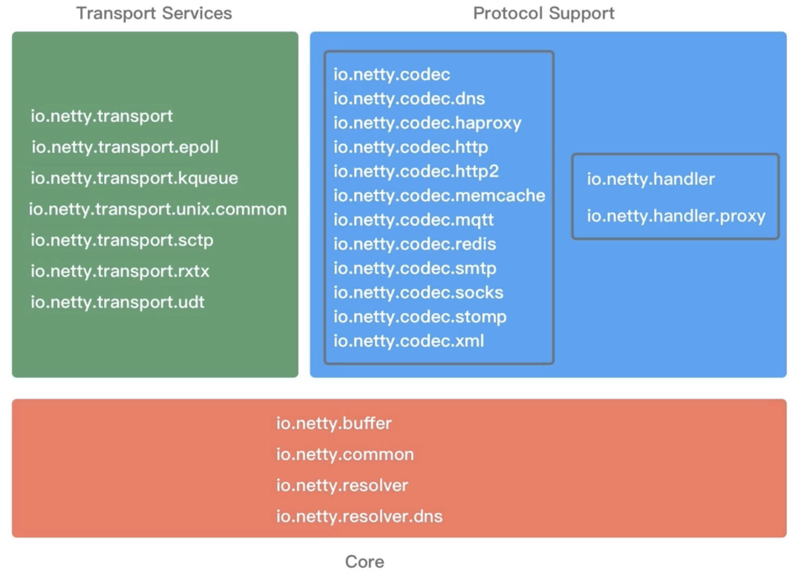

### 1. Netty 如何实现自己的 I/O 模型
基于非阻塞 I/O 实现，底层依赖的是 JDK NIO 框架的多路复用器 Selector，一个多路复用器 Selector 可以同时轮询多个 Channel。

事件分发器 (Event Dispather)：负责将读写事件分发给对应的读写事件处理器(Event Handler)，Reactor和 Proactor。

### 2. Netty 整体架构 v4.1.42

Core 核心层：提供底层网络通信的通用抽象和实现包括可扩展的事件模型、通用的通信 API、支持零拷贝的 ByteBuf 等。

Protocol Support 协议支持层：覆盖了主流协议的编解码实现如 HTTP、SSL、Protobuf、压缩、大文件传输WebSocket、文本、二进制等，支持自定义应用层协议。

Transport Service 传输服务层：传输服务层提供了网络传输能力的定义和实现方法支持 Socket、HTTP 隧道、虚拟机管道等传输方式，Netty 的模块设计具备较高的通用性和可扩展性。

### 3. Netty 逻辑架构

**网络通信层**的职责是执行网络 I/O 的操作，支持多种网络协议和 I/O 模型的连接操作，包含 BootStrap、ServerBootStrap、Channel 三个组件。

- Bootstrap 主要负责整个 Netty 程序的启动、初始化、服务器连接等过程

- Bootstrap 可用于连接远端服务器，只绑定一个 EventLoopGroup（Boss）
- ServerBootStrap 用于服务端启动绑定本地端口，绑定两个 EventLoopGroup（Worker）

每个服务器中都会有一个 Boss，会有一群做事情的 WorkerBoss 会不停地接收新的连接，将连接分配给一个个 Worker 处理连接。

- **Channel 是网络通信的载体**，提供了基本的 API 用于网络 I/O 操作，如 register、bind、connect、read、write、flush 等，Netty 自己实现的 Channel 是以 JDK NIO Channel 为基础的。
  - NioServerSocketChannel 异步 TCP 服务端、NioSocketChannel 异步 TCP 客户端
  - OioServerSocketChannel 同步 TCP 服务端、OioSocketChannel同步 TCP 客户端
  - NioDatagramChannel 异步 UDP 连接、OioDatagramChannel 同步 UDP 连接

Channel 会有多种状态，如连接建立、连接注册、数据读写、连接销毁等。

|        事件         |                     说明                      |
| :-----------------: | :-------------------------------------------: |
|  channelRegistered  |      Channel 创建后被注册到 EventLoop 上      |
| channelUnregistered | Channel 创建后未注册或者从 EventLoop 取消注册 |
|    channelActive    |       Channel 处于就绪状态，可以被读写        |
|   channellnactive   |            Channel 处于非就绪状态             |
|     channelRead     |         Channel 可以从远端读取到数据          |
| channelReadComplete |             Channel 读取数据完成              |

**事件调度层**的职责：通过 Reactor 线程模型对各类事件进行聚合处理，通过 Selector 主循环线程集成多种事件，核心组件包括 EventLoopGroup、EventLoop。

- 一个 EventLoopGroup 往往包含一个或者多个 EventLoop，EventLoop 用于处理 Channel 声明周期内的所有 IO 事件，如 accept、connect、read、write 等 IO 事件
- EventLoop 同一时间会有一个线程绑定，每个 EventLoop 负责处理多个 Channel
- 每新建一个 Channel，EventLoopGroup 会选择一个 EventLoop 与其绑定，该 Channel 在生命周期内都可以对 EventLoop 进行多次绑定和解绑

EventLoopGroup 是 Netty Reactor 线程模型的具体实现方式，Netty 通过不同的 EventLoopGroup 参数配置，就可以支持 Reactor 的三种线程模型。

- 单线程模型：EventLoopGroup 只包含一个 EventLoop，Boss 和 Worker 使用同一个EventLoopGroup
- 多线程模型：EventLoopGroup 包含多个 EventLoop，Boss 和 Worker 使用同一个EventLoopGroup
- 主从多线程模型：EventLoopGroup 包含多个 EventLoop，Boss 是主 Reactor，Worker 是从 Reactor，主 Reactor 负责新的网络连接 Channel 创建，然后把 Channel 注册到从 Reactor

**服务编排层**：负责组装各类服务，用以实现网络事件的动态编排和有序传播，包含 ChannelPipeline、ChannelHandler、ChannelHandlerContext 组件。

**ChannelPipeline**：负责组装各种 ChannelHandler 实际数据的编解码以及加工处理操作由 ChannelHandler 完成，可以理解为 ChannelHandler 的实例列表，内部通过双向链表将不同的 ChannelHandler 链接在一起。当 I/O 读写事件触发时，ChannelPipeline 会依次调用 ChannelHandler 列表对 Channel 的数据进行拦截和处理。每一个新的 Channel 会对应绑定一个新的 ChannelPipeline（线程安全），一个 ChannelPipeline 关联一个 EventLoop 一个 EventLoop 仅会绑定一个线程。

每个 ChannelHandler 绑定 ChannelHandlerContext 的作用是什么呢？

- 保存 ChannelHandler 上下文
- 实现 ChannelHandler 之间的交互
- 包含 ChannelHandler 生命周期的所有事件如 connect、bind、read、flush、write、close 等

如果每个 ChannelHandler 都有一些通用的逻辑需要实现没有 ChannelHandlerContext 这层模型抽象，你是不是需要写很多相同的代码呢？

组件关系梳理：

- 服务端启动初始化时，有 Boss EventLoopGroup 和 Worker EventLoopGroup 两个组件
- 其中 Boss 负责监听网络连接事件，当有新的网络连接事件到达时，则将 Channel 注册到 Worker EventLoopGroup
- Worker EventLoopGroup 会被分配一个 EventLoop，负责处理该 Channel 的读写事件
- 每个 EventLoop 都是单线程的，通过 selector 进行事件循环，当客户端发起 io 读写事件时，服务端 EventLoop 会进行数据的读取
  ，然后通过 pipeline 触发各种监听器，进行数据的加工处理
- 客户端数据会被传递到 ChannelPipeline 的第一个 ChannelInboundHandler 当中，数据处理完成后将加工完成的数据传递给下一个 ChannelInboundHandler
- 当数据写回客户端时，会将处理结果在 ChannelPipeline 的 ChannelOutboundHandler 中传播，最后到达客户端

Netty 源码结构：

netty-common 模块——Netty 的核心基础包，提供了丰富的工具类

- 通用工具类：定时器工具 TimerTask、时间轮 HashedWheelTimer 等
- 自定义并发包：异步模型 Future & Promise、相比 JDK 增强的 FastThreadLocal 等

ByteBuf 工具类——网络通信中的数据载体

- 解决了 ByteBuffer 长度固定造成的内存浪费问题，更安全地更改了 Buffer 的容量
- Netty 对 BvteBuf 做了优化——缓存池化、减少数据拷贝的 CompositeByteBuf 等
- netty-resover 模块提供有关基础设施的解析工具——IP Address、Hostname、DNS 等

Protocol Support 协议支持层模块...（未完待续 https://www.bilibili.com/video/BV1e24y1z7eJ?p=3）
