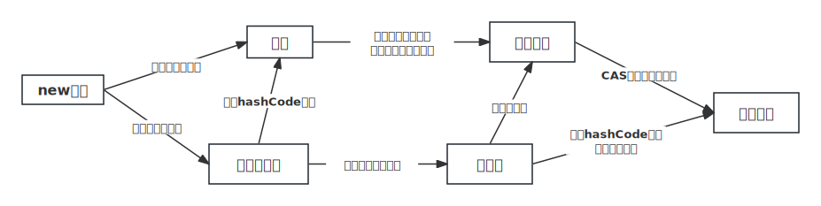

### 1. synchronized 和 Lock 的区别

|   类别   |                  synchronized                  |                 ReentrantLock                 |
| :------: | :--------------------------------------------: | :-------------------------------------------: |
| 存在层次 |         Java 中的一个关键字，JVM 层面          |          JDK 提供的一个类，API 层面           |
| 锁的释放 | 自动加锁与释放锁，线程执行发生异常时，会释放锁 |             需要手动加锁与释放锁              |
| 锁的获取 |                 会阻塞其他线程                 |                可以尝试获取锁                 |
| 锁的类型 |           可重入、不可中断、非公平锁           |       可重入、可判断、公平锁或非公平锁        |
| 锁的状态 |   无法判断，锁的是对象，锁信息保存在对象头中   | 可以判断，int 类型的 state 标识来标识锁的状态 |
|   性能   |                    少量同步                    |                   大量同步                    |

**用法区别：**

- synchronized：在需要同步的对象中加入此控制，synchronized 可以加在方法上，也可以加在特定代码块中，括号中表示需要锁的对象。
- lock：需要显示指定起始位置和终止位置。一般使用 ReentrantLock 类做为锁，多个线程中必须要使用一个 ReentrantLock 类做为对象才能保证锁的生效。且在加锁和解锁处需要通过 lock() 和 unlock() 显示指出。所以要在 finally 块中写 unlock() 以防死锁。

**性能区别：**

- synchronized：
  - 是托管给 JVM 执行的，在 Java 1.5 中是性能低效的。因为这是一个重量级操作，需要调用操作接口，导致有可能加锁消耗的系统时间比加锁以外的操作还多。但是到了 1.6，进行很多优化：适应自旋，锁消除，锁粗化，轻量级锁，偏向锁等等，使其性能并不比 Lock 差。
  - synchronized 原始采用的是 CPU 悲观锁机制，即线程获得的是排他锁。排他锁意味着其他线程只能依靠阻塞来等待线程释放锁。而在 CPU 转换线程阻塞时会引起线程上下文切换，当有很多线程竞争锁的时候，会引起 CPU 频繁的上下文切换导致效率很低。

- lock：是 Java 写的控制锁的代码，用的是乐观锁机制。所谓乐观锁就是，每次不加锁而是假设没有冲突而去完成某项操作，如果因为冲突失败就重试，直到成功为止。乐观锁实现的机制就是 CAS 操作(Compare and Swap)。进一步研究 ReentrantLock 的源码，会发现其中比较重要的获得锁的一个方法是 compareAndSetState。这里其实就是调用的 CPU 提供的特殊指令。

**用途区别：** synchronized 和 ReentrantLock 在一般情况下没有什么区别，但是在非常复杂的同步应用中，请考虑使用 ReentrantLock ，特别是遇到下面几种需求的时候：

- 某个线程在等待一个锁的控制权的这段时间需要中断
- 分开处理一些 wait-notify，ReentrantLock 里面的 Condition 应用，能够控制 notify 哪个线程
- 公平锁功能，每个到来的线程都将排队等候

先说第一种情况，ReentrantLock 的 lock 机制有 2 种，忽略中断锁和响应中断锁，这带来了很大的灵活性。比如：如果 A、B 两个线程去竞争锁，A 线程得到了锁，B 线程等待，但是 A 线程这个时候实在有太多事情要处理，就是一直不返回，B 线程可能就会等不及了，想中断自己，不再等待这个锁了，转而处理其他事情。这个时候 ReentrantLock 就提供了两种机制：可中断/可不中断。

- B 线程中断自己（或者别的线程中断它），但是 ReentrantLock 不去响应，继续让 B 线程等待，你再怎么中断，我全当耳边风（synchronized 原语就是如此）

- B 线程中断自己（或者别的线程中断它），ReentrantLock 处理了这个中断，并且不再等待这个锁的到来，完全放弃

### 2. synchronized 锁的升级过程

- **无锁（No lock）：**初始状态下，共享资源没有被任何线程锁定，可以被任意线程访问。
- **偏向/匿名偏向锁（Biased lock）：**当前锁资源只有一个线程来获取时，就是偏向锁状态。这个线程反复的获取这把锁，就不需要竞争。如果获取锁的是偏向的那个线程，拿锁走人。如果偏向的线程不是当前要获取锁的线程，如果偏向锁被持有，导致获取锁的线程拿锁失败，做锁升级的操作，需要做偏向锁撤销；如果偏向锁没有被持有，直接将偏向的线程更改为要获取锁的线程。
- **轻量级锁（Lightweight lock）：**如果多个线程尝试获取偏向锁失败，JVM 会将锁升级为轻量级锁。在轻量级锁状态下，JVM 会将对象头中的一部分空间用于存储锁记录（Lock Record）的指针。每个线程在进入临界区之前，会通过自旋锁 CAS 的方式尝试几次将锁记录指针替换为自己的线程 ID。如果替换成功，表示获取到锁；否则，表示锁被其他线程占用，需要进行锁膨胀/粗化。
- **重量级锁（Heavyweight lock）：**如果轻量级锁获取失败，JVM 会进行锁膨胀，将锁升级为重量级锁。在重量级锁状态下，JVM  会使用操作系统的互斥量来实现锁。这样，如果一个线程持有重量级锁，其他线程需要等待，直到持有锁的线程释放。

需要注意的是，锁的升级过程是自动逐步发生的。当线程竞争激烈或临界区执行时间较长时，锁可能会直接升级到重量级锁，跳过偏向锁和轻量级锁的阶段。只有偏向锁降级为无锁状态，其他的降级是不可行的。

锁消除：当加的锁不会造成任何线程安全问题时，编译器可能会通过静态分析源代码来确定是否可以将同步锁操作去掉。

**HotSpot 实现：**

|    锁状态     | 25bit  |         31bit          |  1bit  |   4bit   | 1bit<br />偏向锁位 | 2bit<br />锁标志位 |
| :-----------: | :----: | :--------------------: | :----: | :------: | :----------------: | :----------------: |
| 无锁态（new） | unused | hashcode（如果有调用） | unused | 分代年龄 |         0          |         01         |

| 锁状态 |          54bit           | 2bit  |  1bit  |   4bit   | 1bit<br />偏向锁位 | 2bit<br />锁标志位 |
| :----: | :----------------------: | :---: | :----: | :------: | :----------------: | :----------------: |
| 偏向锁 | 当前线程指针 JavaThread* | Epoch | unused | 分代年龄 |         1          |         01         |

|      锁状态      |              62bit              | 2bit<br />锁标志位 |
| :--------------: | :-----------------------------: | :----------------: |
| 轻量级锁（自旋） | 指向线程栈中 Lock Record 的指针 |         00         |
|     重量级锁     |  指向互斥量（重量级锁）的指针   |         10         |
|   GC 标记信息    |     CMS 过程用到的标记信息      |         11         |

无锁态：内部正常存储对象的信息，hashCode，分代年龄等，锁标记位001

偏向锁：内部没地方存储 HashCode了，大部分空间都存储偏向哪个线程，存储了线程的标识，锁标记位101

轻量级锁：内部直接存储了 Lock Record 的地址，Lock Record中存储了对象的信息，锁标记位00

重量级锁：内部直接存储了 ObjectMonitor 的地址，ObjeMonitor 中存储了对象的信息，锁标记为10

查看 MarkWord 信息需要导入包`org.openjdk.jol:jol-core:0.9`，`ClassLayout.parseInstance(obj).toPrintable()`

匿名偏向锁：当前线程指针为空，再次打印当前 obj 的 MarkWord 信息，先休眠 5s 之后，再构建的对象，锁标记未是匿名偏向锁如果你是先构建的对象，他默认就是无锁状态，即便休眠了 5s 后，JVM 也不会监控对象动态修改 Markword，因为 JVM 默认有一个偏向锁延迟的设置，会延迟 4s 再次开启偏向锁机制。

为什么要开启偏向锁延迟的机制？首先，因为 JVM 的启动时，需要基于 ClassLoader 将大量的 Class 对象加载到堆内存。在这个加载的过程中，会涉及到 synchronized 的使用。

在这种锁竞争时，偏向锁状态基本不会停留。那偏向锁正常的升级到轻量级锁不就ok了么？因为偏向锁升级到轻量级锁涉及到了一个操作，偏向锁撤销。偏向锁撤销需要找到一个安全点才可以做撤销操作。安全点可以是，比如方法调用，循环的跳转，异常跳转之类的操作，这种操作一般都是安全的，不会对整体程序造成什么问题。

如果业务线程一致在处理 sleep 或者是这种休眠的状态，如果出现了业务线程池一直休眠，很长时间，这时候还会有一个概念叫做安全区域 ，线程执行到了某个位置，标识自己在安全区域，离开的时候，会修改标识，告知 JVM 我已经离开了安全区域。如果恰巧程序在安全区域内离开时，执行偏向锁撤销或者是 GC 时，这个刚刚离开安全区域的线程会等待。偏向锁撤销时，会在安全点或者是安全区域内执行，需要等到这个时间点才可以执行。



### 3. ReentrantLock

```java
lock.lockInterruptibly() // 允许被中断的拿锁方式
```

基于 java.util.concurrent 包中的抽象类 AbstractQueuedSynchronizer 实现，AQS 本质是一个并发包下的基础类，并没有什么具体的业务实现，但是很多 JUC 包下的工具类，都是基于 AQS 实现的，比如 ReentrantLock、ReentrantReadWriteLock、CountDownLatch、线程池、CyclicBarrier 等等。

**AQS 核心内容：**

- state属性：其实就是一个 int 属性，对应 synchronized 中的 _recursions，表示持有当前资源的线程数量

```java
// The synchronization state.
private volatile int state;
```

- 双向链表

```java
// Head of the wait queue, lazily initialized.Except for ...
private transient volatile Node head;
// Tail of the wait queue, lazily initialized. Modified only via ...
private transient volatile Node tail;
```

- 单向链表：存在于 AQS 的内部类 ConditionObject 中，单向链表是持有锁的线程，在执行了 await（相当于 synchronized 的 wait）方法，线程会释放掉锁资源，然后添加到这个单向链表中，然后挂起线程。在 wait 状态的线程被 signal（相当于synchronized 的 notify）方法唤醒后，会从单向链表扔到双向链表中等待获取锁资源

```java
// First node of condition queue
private transient Node firstWaiter;
// Last node of condition queue
private transient Node lastWaiter;
```

**非公平锁流程：**

- 场景：有 A、B 两个线程尝试获取锁资源
- 线程 A 先执行了加锁方法，执行执行 CAS，尝试将 ReentrantLock 中的 state 从0改为1。成功拿到锁资源，将exclusiveOwnerThread 属性设置为线程 A
- 线程 B 执行加锁方法，进行 CAS 尝试将 ReentrantLock 中的 state 从0改为1，失败
- 接着线程 B 或再次尝试拿锁，但是这次不会执行尝试修改 state，先判断 state 是否为0
  -  如果为0，再次尝试将 ReentrantLock 中的 state 从0改为1
    - 成功，拿锁走人
    - 失败，拿锁失败，准备排队
  - 不为0，查看一下，持有锁的线程是否是线程 B
      -  如果是自己持有，走锁重入逻辑
      -  如果不是自己持有，拿锁失败，准备排队
- 将线程 B 封装为 Node，添加到 AQS 的双向链表（head 节点不存在就进行初始化）
- 线程 B 进入到队列之后，会再次判断自己的位置位置是否是 head.next
  - 如果是，可以再次尝试走抢锁逻辑（如果失败，走挂起线程的逻辑）
  - 如果不是，走挂起线程的逻辑
- 因为线程要挂起，必须得有其他线程唤醒。必须让 prev 节点知道线程 B 要挂起了。如果 prev 节点知道了当前线程要挂起了，那就直接挂起线程
- 线程 A 释放锁资源之后，会让 head 节点看有没有需要唤醒的 Node
    - 如果有，head 节点会唤醒 head.next
    - 如果没有，啥事不做
    

**公平锁流程：**

- 场景：有 A、B 两个线程尝试获取锁资源
- 线程 A 优先执行 lock 方法拿锁，因为是公平锁，不会直接 CAS 抢
- 线程 A 会先判断 state 是否为0
  - 如果是0，查看当前 AQS 的双向链表中是否有排队的节点
    - 如果没有排队的，直接抢锁（CAS 将 state 从0改为1），线程 A 拿到锁
- 线程 B 再来执行拿锁的方法
  - 线程 B 判断 state 是否为0 -> 不是，查看持有锁的线程是否是 B -> 不是 B，拿锁失败，准备排队
  
- 将线程 B 封装为 Node，添加到 AQS 的双向链表中
  - 线程 B 进入到队列之后，会再次判断自己的位置，位置是否是 head.next
  - 如果是，再次走抢锁逻辑

- ...后续和上面非公平锁流程一样

**公平锁和非公平锁的核心区别，其实就是两个方法的实现不同：**

- lock 方法实现不同
  - 非公平锁会在 lock 方法中直接执行 CAS，尝试将 state 从0改为1，如果失败才走 acquire 方法
  - 公平锁在 lock 方法中，直接直接 acquire
- tryAcquire 方法实现不同
  - 非公平锁，在 state 为0时，直接 CAS 抢
  - 公平锁，在 state 为0时，查看是否有排的节点，才会根据情况尝试 CAS 抢锁

### 4. 公平锁和非公平锁

**公平锁**：

- **概念**：公平锁是一种锁获取机制，它按照请求锁的顺序来分配锁，即先来先服务。在公平锁中，等待锁的线程会按照它们请求锁的顺序逐个获得锁，确保每个线程有公平的机会获得锁。
- **特点**：公平锁可以防止饥饿（starvation），即某个线程永远无法获得锁的情况。它适用于需要确保所有线程都有机会获得锁的场景，即使需要等待一段时间，会导致线程频繁地从用户态和内核态之间切换，增加了上下文切换的开销，降低了系统的吞吐量。
- **实现**：在 Java 中，`ReentrantLock` 类可以创建公平锁，通过传递 `true` 给构造函数来创建公平锁。

**非公平锁**：

- **概念**：非公平锁是一种锁获取机制，它不按照请求锁的顺序来分配锁。在非公平锁中，新请求锁的线程有机会在等待队列中插队，即使有其他线程在等待锁，新线程仍有机会获得锁。
- **特点**：非公平锁可能会导致某些线程饥饿，因为它不考虑等待时间，新线程有可能在老线程之前获得锁。
- **实现**：在 Java 中，默认情况下，`synchronized` 关键字创建的锁是非公平的。同时，`ReentrantLock` 类也可以创建非公平锁，通过传递 `false` 给构造函数来创建非公平锁。

不管是公平锁和非公平锁，它们的底层实现都会使用 AQS （Abstract Queued Synchronizer 队列同步器）来进行排队，它们的区别在于线程在使用`lock()`方法加锁时，一旦没竞争到锁，都会进行排队，当锁释放时，都是唤醒排在最前面的线程，所以非公平锁只是体现在了线程加锁阶段，而没有体现在线程被唤醒阶段，**ReentrantLock是可重入锁，不管是公平锁还是非公平锁都是可重入的。**

比较公平锁和非公平锁的选择通常取决于应用的需求和性能要求：

- 如果需要确保锁的获取顺序与请求顺序一致，以防止某些线程长时间等待（避免饥饿），则可以选择公平锁。
- 如果对锁获取的顺序不敏感，且更关注性能，允许一些线程插队来提高并发性能，那么可以选择非公平锁。

### 5. 悲观锁和乐观锁

线程挂起不是JVM层面能解决的问题。需要操作系统来完成这个事情。那就需要涉及到用户态和内核态之间的切换，这种切换，会影响一定效率。

**悲观锁**：synchronized 关键字、ReentrantLock、ReentrantReadWriteLock

- **概念**：悲观锁假设并发访问会导致冲突，因此在访问共享资源之前，它会假定其他线程会修改资源，因此会阻塞或限制其他线程的访问，以确保数据的一致性。
- **实现**：悲观锁常常使用互斥锁或数据库事务（如 SQL 中的锁机制）来实现。当一个线程获得锁时，其他线程会被阻塞，直到获得锁的线程释放它。
- **适用场景**：适用于写操作较多的情况，因为它阻塞其他线程的读写操作，以避免并发冲突。

**乐观锁**：CAS

- **概念**：乐观锁假定并发访问不会导致冲突，因此它不会阻塞其他线程的访问。它允许多个线程同时访问共享资源，但在提交更新时，会检查是否有其他线程已经修改了资源，如果有冲突，则会回滚更新。
- **实现**：乐观锁通常使用版本控制或时间戳来实现。每个数据项都包含一个版本号或时间戳，当一个线程读取数据后，它在写回时会检查版本号或时间戳是否发生了变化。
- **适用场景**：适用于读操作较多、写操作较少的情况，因为它允许多个线程同时读取数据，只有在写操作时才会检查冲突。

比较悲观锁和乐观锁的选择通常取决于应用的需求和特点：

- 悲观锁适用于需要强制数据一致性和事务性的场景，例如银行系统中的转账操作，其中不允许并发的读写操作。
- 乐观锁适用于读操作频繁，且写操作较少的情况，例如社交媒体网站中的帖子浏览，多个用户可以同时读取数据，但只有在更新帖子时才会检查冲突。

在实际应用中，有时会将悲观锁和乐观锁结合使用，以根据不同情况综合考虑并发控制的策略。

### 6. 可重入锁和不可重入锁

**可重入锁**：

- **概念**：可重入锁允许同一个线程多次获得同一把锁，而不会被自己所持有的锁所阻塞。这个特性通常称为锁的嵌套，获取了几次就需要释放几次。
- **特点**：可重入锁使得线程可以在执行临界区代码时，再次进入其他依赖相同锁的临界区，而不会被自己所持有的锁所阻塞。这提高了编程的灵活性，允许设计更复杂的数据结构和算法。
- **实现**：在 Java 中，`ReentrantLock` 类、`synchronized` 关键字就是可重入锁的实现。

**不可重入锁**：

- **概念**：不可重入锁不允许同一个线程多次获得同一把锁。如果一个线程已经持有了这把锁，再次尝试获取它时会被阻塞。
- **特点**：不可重入锁通常更简单，但在某些情况下可能会导致死锁，因为线程无法嵌套地访问需要这把锁的不同临界区。
- **实现**：Java 中也有不可重入锁，不过并不是来实现原子性的，比如线程池中的 Worker 对象，它没有实现重入锁机制。

比较可重入锁和不可重入锁的选择通常取决于应用的需求和设计：

- 如果你的设计需要线程能够多次进入同一把锁的临界区，或者需要锁的嵌套来保护数据结构的一致性，那么可重入锁是一个更好的选择。
- 如果你的设计要求简单，并且不需要嵌套锁，或者为了避免潜在的死锁情况，那么不可重入锁可能更合适。

### 7. CAS (Compare And Swap)

- 内存位置，预期值，新值
- 原子操作，CPU 硬件指令集提供，硬件保证一个语义看起来需要多次操作才能完成的行为，通过一条处理器指令 CAS 就能完成
- JDK 1.5 之后提供了 CAS 操作 Unsafe 类，里面有很多 native 的 compareAndSwapXXX 方法
- 还有 Atomic 类

**存在的问题：**

- ABA 问题：可以通过版本号解决，如 AtomicStampedReference 类。
- 一直自旋可能会浪费 CPU 资源
  - synchronized 的处理方案：synchronized 提供了轻量级锁的概念，这个概念下，会基于 CAS 尝试获取锁资源，但是他指定了 CAS 的次数，如果超过了次数没获取到锁，挂起线程。
  - LongAdder 的处理方案：如果使用 LongAdder 对一个元素做自增时，如果失败就会在其他的位置做自增。当需要元素的 sum 时，会将 LongAdder 多处存储值的内容做总和，然后返回，类似分段锁的方案。
- 只针对一个属性保证原子性：本身就是 CAS 的特性，不过，类似 synchronized 和 ReentrantLock 虽然都可以锁住一段代码，但是他们底层都用到了CAS。

```java
public final int getAndAddInt(Object varl, long var2, int var4) {
  int var5;
	do {
    var5 = this.getIntVolatile(varl, var2);
  } while(!this.compareAndSwapInt(varl, var2, var5, var5 + var4)
	return var5;
}
```

### 8. 传统的生产者消费者问题，防止虚假唤醒

线程也可以唤醒，而不会被通知，中断或超时，即所谓的虚促唤醒 。 虽然这在实践中很少会发生，但应用程序必须通过测试应该使线程被唤醒的条件来防范，并目如果条件不满足则继续等待。 换句话说，等待应该总是出现在循环中，就像这样：

```java
synchronized (obj) {
  while (<condition does not hold>)
    obi.wait(timeout);
  ...// Perform action appropriate to condition
}
```

如果当前线程interrupted任何线程之前或在等待时，那么InterruptedException被抛出。 如上所述，在该对象的锁定状态已恢复之前，不会抛出此异常。

### 9. Lock 版的生产者消费者问题

Condition 可以实现精准通知唤醒

```java
class BoundedBuffer<E> {
	final Lock lock = new ReentrantLock();
	final Condition notFull  = lock.newCondition(); 
	final Condition notEmpty = lock.newCondition(); 

	final Object[] items = new Object[100];
	int putptr, takeptr, count;

	public void put(E x) throws InterruptedException{
		lock.lock();
		try {
			while (count == items.length)
				notFull.await();
			items[putptr] = x;
			if (++putptr == items.length) putptr = 0;
			++count;
			notEmpty.signal();
		} finally {
			lock.unlock();
		}
	}

	public E take() throws InterruptedException {
		lock.lock();
		try {
			while (count == 0)
				notEmpty.await();
			E x = (E) items[takeptr];
			if (++takeptr == items.length) takeptr = 0;
			--count;
			notFull.signal();
			return x;
		} finally {
			lock.unlock();
		}
	}
}
```

### 10. 八锁现象
[JUC 学习之8锁现象](https://cloud.tencent.com/developer/article/1665932)

- syncMethod 方法使用 synchronized 关键字修饰，锁定对象为当前实例（this），nonSyncMethod 方法没有使用同步关键字，不会进行锁定
- static 修饰的方法属于 Class 模版，只有一个

### 11. 如何避免死锁？

造成死锁的几个原因:

- 一个资源每次只能被一个线程使用
- 一个线程在阻塞等待某个资源时，不释放已占有资源
- 一个线程已经获得的资源，在未使用完之前，不能被强行剥夺
- 若干线程形成头尾相接的循环等待资源关系

这是造成死锁必须要达到的 4 个条件，如果要避免死锁，只需要不满足其中某一个条件即可。而其中前 3 个条件是作为锁要符合的条件，所以要避免死就需要打破第 4 个条件，不出现循环等待锁的关系。

在开发过程中:

- 要注意加锁顺序，保证每个线程按同样的顺序进行加锁
- 要注意加锁时限，可以针对所设置一个超时时间
- 要注意死锁检查，这是一种预防机制，确保在第一时间发现死锁并进行解决