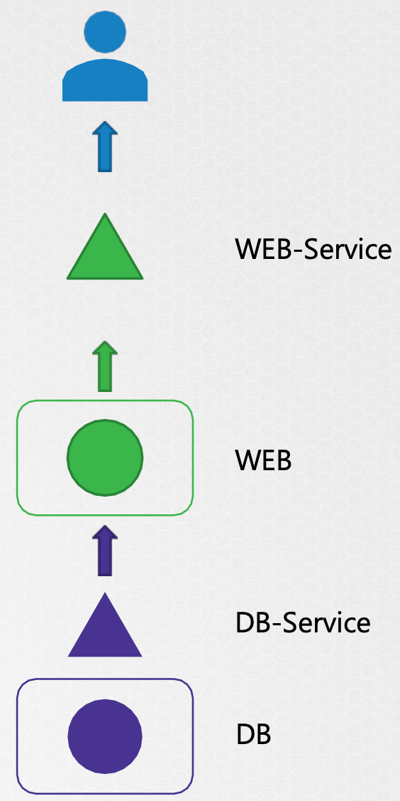

### 1. 已通过 2022.12.04 记

考试版本：1.25.2

考试价格：原价395刀（一直在涨价，Cyber Monday 单门半价，两门三五折）

注意点：

- 考试选中文证书无差别，只要 Verify Name 时填对（根据汇率可能会便宜几块钱）
- 购买后用考试券在1年内参加，如果第一次未通过，免费的 retake 也是按购买时间算的1年内
- 购买后没有送模拟考试，不会像 aws 送一次模拟考试机会让你熟悉PSI考试界面
- 使用 PSI 内远程浏览器，可以多开tab，但不能导入书签，需要自己搜索，所以请熟悉完整命令（有些 node 上没有alias）和 yaml 格式
- 考前请仔细阅读[考试手册](https://docs.linuxfoundation.org/tc-docs/certification/tips-cka-and-ckad)（预约考试页面有链接），特别是熟悉[考试界面](https://docs.linuxfoundation.org/tc-docs/certification/lf-handbook2/exam-user-interface/examui-performance-based-exams)（右上角有notepad），牢记复制粘贴的按键
- 为了防止把cluster搞挂，etcd备份与恢复和集群版本升级请在最后做

课程推荐：Udemy上的 **Certified Kubernetes Administrator (CKA) with Practice Tests**，配套有免费的 KodeKloud 练习平台，实时更新

### 2. 经验贴

- [LinuxFoundation官方手册](https://docs.linuxfoundation.org/tc-docs/certification/tips-cka-and-ckad)：包含考试要求、报销等
- [CKA 认证笔记 - CKA 认证经验帖](https://chowdera.com/2022/02/202202150617582329.html)：2022年2月考试经验，真题模糊描述
- [CKA考试经验：报考和考纲](https://blog.csdn.net/fly910905/article/details/102966474)：考试经验整理
- [CKA、CKAD考试经验Github](https://github.com/yuyicai/cka-ckad-exam-experience)：知识点
- [CKA考试指南和攻略](https://blog.csdn.net/zhaopeng_yu/article/details/109155299)：有界面截图

### 3. 常用命令

```bash
kubectl explain replicaset ## List the fields for supported resources
kubectl api-resources ## list a complete list of supported resources
kubectl run test-nslookup --image=busybox:1.28 --rm -it --restart=Never -- nslookup nginx-resolver-service ## 运行后删除pod
kubectl top pods --selector="app=demo" | grep -v NAME | sort -k 2 -nr ## 找到指定service下的pod中，cpu利用率按高到底排序
## 删除 .spec.claimRef，可让pv从released状态重新变为available
```

### 4. 刷题

- [CKA Exercises](https://github.com/stretchcloud/cka-lab-practice)
- [CKA 真题](https://cloud.tencent.com/developer/article/1638808)
- [2022年8月 CKA 考试真题整理](http://liyuankun.top/Kubernates-Certified-Kubernetes-Administrator-CKA.html)
- [2022.9.9更详细](https://zhuanlan.zhihu.com/p/564737349)

### 5. 考试 Tips

- 书签栏搜索插件：Bookmark Sidebar
- 考试时有 Notepad 可供复制
- `Ctrl+X,Ctrl+E` 可编辑以 `\` 分隔的多行命令
- 复制后 `cat > static.yaml `，有时会比跨 node `scp static.yaml node01:/root/` 方便的多

### 6. 深入

- [Kubernetes 网络通信原理](https://zhuanlan.zhihu.com/p/81667781)
- [《Kubernetes In Action》](https://book.douban.com/subject/26997846/)
- [《Kubernetes Patterns》](https://www.redhat.com/cms/managed-files/cm-oreilly-kubernetes-patterns-ebook-f19824-201910-en.pdf)
- 极客时间专栏《深入剖析 Kubernetes》
- [《kubernetes-best-practices》](https://learning.oreilly.com/library/view/kubernetes-best-practices/9781492056461/ch01.html)

### 7. Application Failure

<center></center>

- 查看Service的状态
  - 使用应用程序或者 `curl` 检查是否可以在节点端口的IP上访问web服务器 `curl http://web-service-ip:node-port`
  - 检查服务 `kubectl describe svc web-service` 的Endpoints
  - 如果没有查询到以上Endpoint，比对一下 `Selector`

- 查看Pod的状态
  - `kubectl describe pod web`
  - `kubectl logs web`，`-f` 全称 `--follow`，因为应用程序关闭就无法看到日志，只能等的应用程序再次失败，或者使用`--previous`查看上一个pod的日志

- 查看依赖Service
  - 检查 `db-service`状态
  - 检查 db pod 自身

参考文档：https://kubernetes.io/docs/tasks/debug/debug-application/debug-pods/

### 8. Control Plane Failure

- 查看 Node 状态 `kubectl get nodes`
- 查看 Pod 状态 `kubectl get pods`
- 查看 Control Plane 组件状态
  - 如果 controlplane 组件部署为 pod，使用 kubeadm 工具部署集群的情况下，查看controlplane pod 状态 `kubectl -n kube-system get pods`
  - 如果 controlplane 组件被部署为 service，则检查 master node 上的 service 的状态：如 `service kube-apiserver status`，`service kube-controller-manager status`，`service kube-scheduler status`，`service kubelet status`，`service kube-proxy status`
- 查看 Service 日志
  - 如果使用 kubeadm 工具部署集群，则使用`kubectl -n kube-system logs kube-apiserver-master`
  - 如果服务是在主节点上本地配置的，清使用host的日志解决方案查看 service 日志，`journalctl -u kube-apiserver`

更多参考资料：https://kubernetes.io/docs/tasks/debug-application-cluster/debug-cluster

### 9. Worker Node Failure

- 查看 Node 状态 `kubectl get nodes`，查看节点详细 `kubectl describe node worker-1`

  

- 检查节点上可能得CPU、内存和磁盘空间 `top`，`df -h`

- 查看 kubelet 状态 `service kubelet status`，`sudo journalctl -u kubelet`

- 检查 kubelet 证书，确保它们未过期，属于正确的组，并且证书由正确的 CA 颁发 `openssl x509 -in /var/lib/kubelet/worker-1.crt -text`

### 10. Network Troubleshooting

**CoreDNS：**

- 如果 CoreDNS pod 处于 pending 状态，请首先检查 CNI 是否安装

- 如果 CoreDNS pod 处于 CrashLoopBackOff 或 Error 状态：

  如果节点使用旧版本的 Docker 运行 SELinux，可能会遇到 CoreDNS pod 未启动的情况，要解决此问题，可以尝试以下选项

  - 升级到更新版本的 Docker

  - 禁用 SELinux

  - 修改 CoreDNS 部署，将 allowPrivilegeEscalation 设置为 true

  - CoreDNS 发生 CrashLoopBackOff 的另一个原因是  CoreDNS pod 检测到循环

    解决方式有：

    - 将以下内容添加到您的 kubelet 配置 yaml：`resolvConf: <path-to-your-real-resolv-conf-file>` 此标志告诉 `kubelet` 将备用 `resolv.conf` 传递给 Pod 。对于使用 `systemd-resolved` 的系统，`/run/systemd/resolve/resolv.conf` 通常是“真实” `resolv.conf` 的位置，尽管这可能因您的发行版而异
    - 禁用主机节点上的本地 DNS 缓存，并将 `/etc/resolv.conf` 恢复为原始
    - 一个快速的解决方法是编辑您的 Corefile，替换 forward /etc/resolv.conf 与您的上游 DNS 的 IP 地址，例如 forward 8.8.8.8。但这仅解决了 CoreDNS 的问题，kubelet 将继续将无效的 resolv.conf 转发到所有默认的 dnsPolicy Pod，使它们无法解析 DNS  

- 如果 CoreDNS pod 和 kube-dns 服务工作正常，请检查 kube-dns 服务是否有有效的端点。如果服务没有端点，请检查服务并确保它使用正确的选择器和端口

**kube-proxy：**

kube-proxy 负责监视与每个服务关联的服务和端点。当客户端要使用虚拟 IP 连接到服务时，kube-proxy 负责将流量发送到实际的 Pod

- 检查 kube-system ns 中的 kube-proxy pod 正在运行
- 检查 kube-proxy 日志
- 检查 configmap 是否正确定义，运行 kube-proxy 二进制文件的配置文件是否正确
- kube-config 在 config map 中定义
- 检查 kube-proxy 是否在容器内运行


更多参考资料：

https://kubernetes.io/docs/tasks/debug-application-cluster/debug-service/

https://kubernetes.io/docs/tasks/administer-cluster/dns-debugging-resolution/