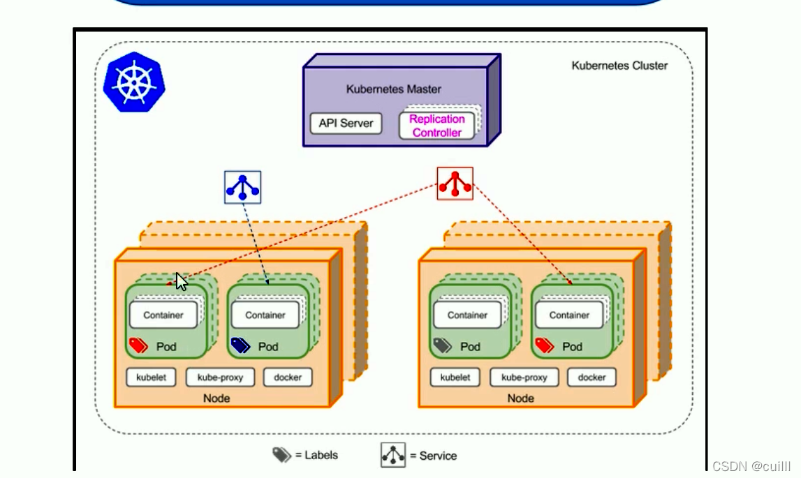

### 1. 常用名词

[官方词汇表](https://kubernetes.io/zh-cn/docs/reference/glossary/?fundamental=true) [考试报名链接CN](https://training.linuxfoundation.cn/certificates/1) [考试报名链接EN](https://training.linuxfoundation.org/certification/certified-kubernetes-administrator-cka/)

Master：manage, plan, schedule, monitor nodes（主节点上也可以安装容器引擎）

worker nodes：host application containers

etcd cluster：存储所有集群数据的数据库

kube-scheduler：调度程序，确定要放置容器的正确节点

controller-manager：

- node-controller：加载新节点，替换不可用节点

- replication-controller：保证一定数量的容器运行

kube-api：协调集群中的所有操作（api是公开的），定期从kubelet获取状态报告

kubelet：集群中在每个节点上运行的代理

kube-proxy：负责节点间通信

### 2. ETCD 等组件

kubectl 命令看到的所有信息都来自 ETCD

k8s 部署的2种方式：kubeadm工具和 scratch

ETCD 监听地址：`--advertise-client-urls https://${INTERNAL_IP}:2379`，kube-api访问etcd时，应配置这个。ETCD 之间连接用2380接口，与其他控制面板组件连接用2379。

kubeadm 设置集群，则会将ETCD服务器部署为kube-system名称空间中的POD`kubectl get pods -n kube-system `

`etcdctl get / --prefix -keys-only`列出k8s存储的所有密钥

k8s 存储目录 registry：下面有 minions、pods、replicasets、deployments、roles、secrets

kubectl 命令运行实际是在访问 kube-apiserver

kube-apiserver 负责认证和验证请求，检索和更新ETCD数据存储中的数据

node-controller：每5s访问一次，等待40s然后标记为不可访问（通过kube-apiserver），会给节点5min时间恢复，如果node-controller没有恢复节点，则会删除分配给该节点的pod。

scheduler：只负责决定哪个pod在哪个node上运行，不执行放置（kubelet干这个）

kubelet：kubeadm 不会自动部署 kubelet，必须手动在 node 上安装

<center></center>

service：没有任何接口或主动监听进程，存在于k8s内存中

kube-proxy：在每个node上运行的进程，作为守护者进程部署，它的工作是寻找新的service。

- IPTABLES规则：将流量从节点的10.32.0.x发送到service的10.96.0.12

### 3. PODs

`kubectl run xxx --image=xxx `这类命令首先自动创建一个pod，并部署容器引擎如docker img的实例

查看cluster中pod列表：`kubectl get pods -o wide`

`pod-definition.yml`

```yaml
apiVersion: v1|apps/v1
kind: Pod|Service|ReplicaSet|Deployment
metadata:
  name: myapp-pod
  labels:
    app: myapp
    type: front-end
spec: 
  containers:
    - name: nginx-container
      image: nginx
```

`kubectl create -f pod-definition.yml`

`kubectl describe pod nginx`：查看pod详细信息

`kubectl delete pod nginx`：删除pod

`kubectl edit pod redis`：修改pod配置，或者修改yml文件后`kubectl apply -f redis-definition.yaml`

`kubectl run --help`：查看帮助

`kubectl run redis --image=redis123 --dry-run=client -o yaml > redis.yaml`：模拟运行输出到yaml文件

### 4. ReplicaSets

Replication Controller：管理跨越集群中多个node

`rc-definition.yml`

```yaml
apiVersion: v1
kind: ReplicationController
metadata:
  name: myapp-rc
  labels:
    app: myapp
    type: front-end
spec:
  template:
    metadata:
    labels:
      app:
      type:
    spec:
      containers:
      - name:
        image:
  replicas: 3
```

`kubectl get replicationcontroller`：查看复制控制器

`replicaset-definition.yml`

```yaml
apiVersion: apps/v1
kind: ReplicaSet
metadata:
  name: myapp-replicaset
  labels:
    app: myapp
    type: front-end
spec:
  template:
    metadata:
    labels:
      app:
      type:
    spec:
      containers:
      - name:
        image:
  replicas: 3
  selector: 
    matchLabels:
      type: front-end
```

Scale：

- 修改replicas，然后`kubectl replace -f replicaset-definition.yml`
- `kubectl scale --replicas=6 -f replicaset-definition.yml`
- `kubectl scale --replicas=6 replicaset myapp-replicaset` type + name 不会更改yaml文件中的replicas

`kubectl delete replicaset myapp-replicaset`：也会删除所有依赖的PODs

`replicaset` 可以缩写为 `rs`

`deployment-definition.yml`

```yaml
kind: Deployment
```

`kubectl create deployment my-dep-name --image==busybox --replicas=3`

### 5. Service

NodePorts范围：30000 - 32767

`service-definition.yml`

```yaml
apiVersion: V1
kind: Service
metadata:
  name: myapp-service

spec:
  type: NodePort       ##LoadBalancer
  ports:
    - targetPort: 80   ##pod端口  不填则默认和port相同
      port: 80         ##Servoce端口  必填
      nodePort: 30008  ##对外端口  不填自动分配30000-32767
  selector:            ##选择pods的label内容
    app: myapp
    type: front-end
```

`kubectl create -f service-definition.yml`

`192.168.1.2:30008`

### 6. Namespace

`mysql.connect("db-service")`

`mysql.connect("db-service.dev.svc.cluster.local")`

- cluster.local : domain
- svc : sub domain for service
- dev : Namespace
- db-service : Service Name

`kubectl get pods --namespace=kube-system`

确保在dev Namespace中创建的pod

- `kubectl create -f pod-definition.yml --namespace=dev`
- 在yaml文件中，指定`metadata.namespace=dev`

namespace-dev.yml

```yaml
apiVersion: v1
kind: Namespace
metadata:
  name: dev
```

设置永久切换Namespace

`kubectl config set-context $(kubectl config current-context) --namespace=dev`

查看所有Namespace中的pods：`kubectl get pods --all-namespaces`，`-A`short for `--all-namespaces`

设置Resource Quota，Compute-quota.yaml：

```yaml
apiVersion: v1
kind: ResourceQuota
metadata:
  name: compute-quota
  namespace: dev
spec:
  hard:
    pods: "10"
    requests.cpu: "4"
    requests.memory: 5Gi
    limits.cpu: "10"
    limits.memory: 10Gi
```

`kubectl run redis --image=redis -n=finance`其中`-n`short for `--namespace`