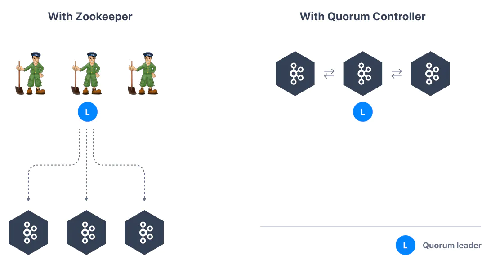

### 1. Kafka Topics

- Topics：一种特殊的数据流
- 就像数据库中的表，但没有所有的约束
- 可以有任意多的 Topics
- 一个 Topic 由它的 name 定义
- 任意格式的消息格式
- Topic 中的消息序列称为 data stream
- 你无法像数据库一样查询 Topics

### 2. Partitions and offsets

- Topics 被划分为 Partitions
  - 每个分区中的消息会被排序
  - 每个分区中的消息会有一个递增的 id，即 offset
- Kafka topics是不可变的，一旦数据写入到分区就不可修改
- 数据只保留有限时间（默认是一周，可配置）
- 即使前面的数据被删除，offset 也不会被复用
- 消息的顺序只在一个分区内得到保证
- 当数据（Record消息记录，包含key和value）被发送到kafka主题时，但key为空时，会以轮询的方式写入不同的分区，key不为空时，相同key的消息会被写入到同一个分区

### 3. Leader, Follower, and In-Sync Replica (ISR) List

- ISR 集合包含了当前可用的、与 Leader 分区保持同步的副本（Replica）
- ISR 集合的信息保存在每个 Broker 的日志目录中的元数据文件中，文件名为 `isr-[partition-id]`。该元数据文件包含了每个分区的 ISR 集合及其相关的信息，比如 Leader 副本、副本列表、最后一次同步的位置等。
- 如果某个副本不能正常同步数据或者落后的比较多，那么kafka会从ISR中将这个节点移除，直到它追赶上来之后再重新加入

### 4. Producers

- 生产者向主题分区写入数据
- 生产者事先知道写入到哪个分区，哪个kafka代理拥有它

### 5. send()异步发送


缓冲区会为主题的每个分区创建一个大小用来存放消息，生产者首先将消息放入到对应分区的缓冲区中，当他放入消息后立刻返回，不等消息是否发送给服务端，也不管它是否成功发送消息，后台IO线程负责将消息发送给broker。

### 6. 同步发送

```java
Future<RecordMetadata> result = producer.send(new ProducerRecord<String, String>("topic_name", "" + (i%5), Integer.toString(i)));
try{
    RecordMetadata recordMetadata = result.get();	//阻塞
} catch (InterruptedException e) {
    e.printStackTrace();
} catch (ExecutionException e) {
    e.printStackTrace();
}
```

### 7. 批量发送

linger.ms 每一批消息最大大小

batch.size 延迟时间

满足任意一项即可

### 8. acks

- acks=0 生产者不会等待服务器端的任何请求，当消息被放到缓冲区的时候，我们就认为他成功发送了，可能会造成数据丢失
- acks=1 消息已经被服务器端的leader存入到本地了，leader未同步到follower就宕机会导致数据丢失
- acks=all

至多一次 acks=0或1

至少一次 acks=-1或all, retries>0

### 9. Producers: Message keys

- 生产者可以发送带有key (string, number, binary, etc...) 的消息
- 如果key=null，数据将循环发送到各分区
- 如果key!=null，那么数据将一直发送到相同分区（哪个分区由生产者决定）
- 如果你需要根据指定字段对消息进行排序，那么就需要发送key

### 10. Kafka 消息剖析

- key、value（可以为空）
- 压缩格式：none，gzip，snappy，lz4，zstd
- Headers：可选的键值对列表
- 消息要发送到的分区及其偏移量
- 时间戳（由系统或者用户设置）

### 11. Kafka 消息 key 哈希算法

```java
targetPartition = Math.abs(Utils.murmur2(keyBytes))%(numPartitions-1)
```

### 12. Consumers

- 消费者根据 name 从某个 topic 读取数据，是 pull model，不是kafka server把数据推送给消费者
- 消费者自动知道从哪个broker读取数据
- 如果broker失效了，消费者知道如何恢复
- 在每个分区中，数据根据 offset 从低到高被读取

### 13.生产者：精确一次

```ini
enable.idempotence=true
##retries=Integer.MAX_VALUE
acts=all
```

### 14. 消费者：精确一次

通过offset来防止重复消费不是一个好的办法
通常在消息中加入**唯一ID** (例如流水ID，订单D)，在处理业务时，通过判断 ID来防止重复处理

### 15. 事务

在kafka中，消息会尽可能地发送到服务端，如果提交成功了，消息后面会有成功提交的标志，如果未成功提交，那么它的状态是未提交的。

Isolation_level 隔离级别，默认为 read_uncommitted 脏读，如果只读取成功提交的数据，可以设置为 read_committed

### 16. Consumer Groups

- 在一个应用中的所有消费者作为消费者组读取数据
- 组内的每个消费者从独立的分区读取
- 如果消费者多于分区，那么一些消费者会处于非活动状态（作为备用的消费者）
- 分区是最小的并行单位
- 一个消费者可以消费多个分区
- 一个分区可以被多个消费者组里的消费者消费
- 但是，一个分区不能同时被同一个消费者组里的多个消费者消费

#### 16.1 发布 - 订阅模式

每条消息需要被每个消费者都进行消费：每个消费者都属于不同的消费者组

#### 16.2 点对点（一对一）

一条消息只要有被消费就可以：所有消费者都属于同一个消费者组

### 17. Consumer Offsets

- kafka 保存消费者组的 offsets
- 提交的 offsets 在 kafka topic 中被称为 `__consumer_offsets`
- 当组内的一个消费者处理完从 kafka 收到的数据后，它会阶段性地提交 offsets （kafka 代理会写入到`__consumer_offsets`，而不是消费者组自身）
- 如果一个消费者崩溃，重启后能根据提交的消费者偏移量重新开始读取数据

### 18. 消费者交付语义

- Java 消费者默认会自动提交偏移量（至少一次）
- 手动提交有3种语义
- ***至少一次（推荐）***
  - 消息被处理后提交偏移量
  - 如果处理失败，消息会再被读取
  - 这意味着，我们可以对消息进行重复处理，因此，我们需要确保我们的处理是幂等的（指再次处理不会影响我们的系统）
- ***最多一次***
  - 消息收到就提交偏移量
  - 如果处理失败，消息就会丢失（当然也不会再次被读取）
- ***正好一次***
  - 对于 kafka => kafka workflows：使用 Transactional API
  - 对于 kafka => 外部系统 workflows：使用幂等消费者

### 19. Kafka Brokers

- 一个kafka集群由多个 brokers（servers）组成
- 每个代理由ID（整数）标识
- 每个代理只包含特定的主题分区
- 连接到任何kafka代理（也称为引导代理后），客户端、生产者或使用者将连接到整个kafka集群
- 最好是从3个代理开始，但在有些大型集群中会有超过100个代理
- 代理的编号可以选择从任意数开始

### 20. Kafka 代理机制

- 每个 kafka 代理也被称为“引导服务器”
- 每个代理知道所有的代理、主题和分区（元数据）

### 21. 主题复制因子

- 主题应有一个复制因子>1（通常在2与3之间）
- 因此，万一有一个代理挂了，其他代理仍可以提供服务

### 22. 分区领导者的概念

- 在任何时刻，一个分区只会有一个代理作为领导者
- 生产者只会把数据发送给作为分区领导者的代理
- 其他的代理会从分区领导者复制数据
- 因此，每个分区拥有一个领导者和多个ISR（in-sync replica 同步副本）

### 23. 生产者、消费者和领导者之间的默认行为

- kafka 生产者只会向分区的领导者代理写入数据
- kafka 消费者默认会从分区的领导者读取数据

### 24. afka 消费者副本获取（Kafka v2.4+）

- 自从 Kafka 2.4，可以配置让消费者从最近的副本进行读取，这可以降低延迟，如果是在云上，则可以降低网络成本

### 25. 生产者的确认机制 acks

生产者可以选择是否接受写入数据的确认消息：

- acks=0：生产者不会等待确认，如果代理崩溃，可能会导致数据丢失
- acks=1：生产者会等待领导者的确认，可能会导致有限的数据丢失
- acks=all：要求领导者和所有副本的确认，不会有数据丢失

### 26. Zookeeper

- Zookeeper管理代理，保留一份代理的名单
- Zookeeper帮助完成分区的领导者选举
- 当kafka有更改时，Zookeeper会发送通知，比如新的主题、代理崩溃、代理启动、删除主题等等
- **Kafka 2.x 版本运行必需要有 Zookeeper**
- **Kafka 3.x 可以使用 Raft (KIP-500) 作为代替**
- **Kafka 4.x 没有 Zookeeper**
- Zookeeper 以单数个数运行，1、3、5、7...通常不会超过7个
- Zookeeper 拥有一个领导者作为写入，其他的作为追随者进行读取
- v0.10 版本之后，Zookeeper不再存储消费者的偏移量

### 27. 你应该使用 Zookeeper 吗？

- 和 Kafka 代理？
  - 是的，除非4.0版本发布并可用于生产环境
- 和 Kafka 客户端？
  - 随着时间的推移，Kafka客户端和CLI已经被迁移，以利用代理作为唯一的连接端点，而不是Zookeeper
  - 自从 0.10 版本之后，消费者将偏移量储存在 Kafka 中，不再连接到 Zookeeper
  - 从 2.2 版本之后，CLI命令 `kafka-topics.sh` 用 Kafka 代理而不是 Zookeeper来进行主题管理，Zookeeper CLI命令已被废弃
  - 所有使用 Zookeeper 的API和命令会被迁移，这样新版本的集群可以不再绑定 Zookeeper，这些操作对于客户端是不可见的
  - Zookeeper 的安全性比 Kafka 低，这意味着如果你应该用 Zookeeper 只接受来自代理的连接，拒绝客户端的连接

### 28. 关于 Kafka KRaft

- 在2020年，Apache Kafka项目做开始着手移除 Zookeeper 依赖（KIP-500）
- 当Kafka集群拥有超过10万个分区时，Zookeeper 有扩展问题
- 删除 Zookeeper 之后，Apache Kafka 可以
  - 扩展到百万级分区，变得更容易维护和设置
  - 提升稳定性，更易监控、支持和管理
  - 为整个系统提供单一的安全模型
  - 启动 Kafka 也会容易很多
  - 更快的关闭和恢复时间
- Kafka 3.x 实现了 Raft 协议，以替代 Zookeeper（Not production ready）

### 29. Kafka KRaft Architecture

<center></center>

[Kafka Raft Readme](https://github.com/apache/kafka/tree/trunk/raft)
[Kafka performance improvement](https://www.confluent.io/blog/kafka-without-zookeeper-a-sneak-peek/)