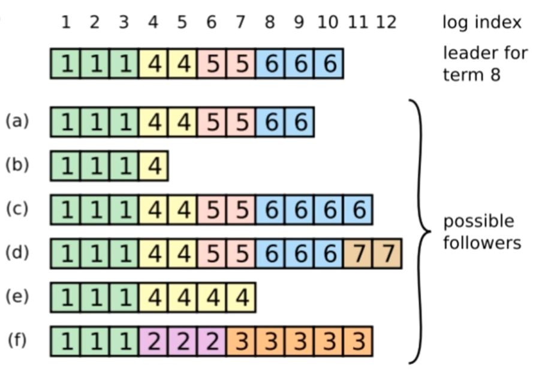

### 1. 什么是 Raft
相比于 Paxos，Raft 最大的特性就是易于理解，为了达到这个目标 Raft 主要做了两方面的事情：

- 问题分解：把共识算法分为三个子问题，分别是
  - 领导者选举（leader election）
  - 日志复制（log replication）
  - 安全性（safety）
- 状态简化：对算法做出一些限制，减少状态数量和可能产生的变动

**复制状态机的概念：相同的初始状态 + 相同的输入 = 相同的结束状态**

**状态简化：**

只有 leader、follower 或 candidate 三个状态之一。另外可以通过查看一台服务器是否具有某任期内的日志，来判断它是否在这期间出现过宕机。

Raft 算法中服务器节点之间使用 RPC 进行通信，并且 Raft 中只有两种主要的 RPC：

- **RequestVote RPC（请求投票）：**由 candidate 在选举期间发起
- **AppendEntries RPC（追加条目）：**由 leader 发起，用来复制日志和提供一种心跳机制

### 2. 领导者选举

开始一个选举过程后，follower **先增加自己的当前任期号**，并转换到 candidate 状态。**然后投票给自己**，并且并行地向集群中的其他服务器节点发送投票请求（RequestVote RPC）。

最终会有三种结果：

- 它获得超过半数选票赢得了选举 -> 成为主并开始发送心跳
- 其他节点赢得了选举 -> 收到新 leader 的心跳后，如果新 leader 的任期号不小于自己当前的任期号，那么就从 candidate 回到 follower 状态
- 一段时间之后没有任何获胜者 -> 每个 candidate 都在一个自己的随机选举超时时间后增加任期号开始新一轮投票

```c
//请求投票RPC Request
type RequestVoteRequest struct {
  term         int  //自己当前的任期号
  candidateld  int  //自己的ID
  lastLogindex int  //自已最后一个日志号
  lastLogTerm  int  //自己最后一个日志的任期
}
```

```c
// 请求投票RPC Response
type RequestVoteResponse struct {
  term         int  //自己当前任期号
  voteGranted  bool // 自己会不会投票给这个candidate
}
```

第一个认识到集群中没有 leader 的节点会把自己变成 candidate，对于没有成为 candidate 的 follower 节点，对于同一个任期，会按照**先来先得**的原则投出自己的选票。

### 3. 日志复制

客户端怎么知道新 leader 是哪个节点呢？客户端随机向一个节点发送请求：

- 节点正好是 leader
- 节点是 follower，可以通过心跳得知 leader 的 ID
- 节点正好宕机，客户端只能再去找另一个节点，重复上述过程

日志需要具有的三个信息：

- 状态机指令，比如赋值操作
- leader 的任期号
- 日志索引

Leader **并行**发送 AppendEntries RPC 给 follower，让它们复制该条目。当该条目被超过半数的 follower 复制后，leader 就可以在本地执行该指令并把结果返回客户端。我们把本地执行指令，也就是leader应用日志与状态机这一步，称作**提交**。

如何保证所有节点的日志都是完整且顺序一致的呢？

- follower 缓慢：如果有 follower 因为某些原因**没有给 leader 响应**，那么 leader 会不断地**重发**追加条目请求 （AppendEntries RPC），<u>哪怕 leader 已经回复了客户端</u>。
- follower 宕机：如果有 follower 崩溃后恢复，这时 Raft 追加条目的**一致性检查**生效，保证follower能按顺序恢复崩溃后的缺失的日志。

Raft 的一致性检查：leader 在每一个发往 follower 的追加条目 RPC 中，会放入前一个日志条目的索引位置和任期号，如果 follower 在它的日志中找不到前一个日志，那么它就会拒绝此日志，leader 收到 follower 的拒绝后，会发送前一个日志条目，从而逐渐向前定位到 follower 第一个缺失的日志。（Raft 设计者认为这种优化是没有必要的，因为失败不经常发生并且也不可能有很多不致的日志条目）

- leader 宕机：如果 leader 崩溃，那么崩溃的 leader 可能已经复制了日志到部分 follower 但还没有提交，而被选出的新 leader 又可能不具备这些日志这样就有部分 follower 中的日志和新 leader 的日志不相同。

  Raft 在这种情况下，leader 通过强制 follower 复制它的日志来解决不一致的问题，这意味着 <u>follower 中跟leader 冲突的日志条目会被新 leader 的日志条目覆盖</u>（因为没有提交，所以不违背外部一致性）。

<center></center>

这样的日志复制机制，就可以保证一致性特性：

- 只要过半的服务器能正常运行，Raft 就能够接受、复制并应用新的日志条目；
- 在正常情况下，新的日志条目可以在一个 RPC 来回中被复制给集群中的过半机器；
- 单个运行慢的 follower 不会影响整体的性能

如果 leaderCommit > commitlndex，那么把 commitlndex 设为 min(leaderCommit, index of last new entry)

```c
//追加日志RPC Request
type AppendEntriesRequest struct {
  term          int     //自己当前的任期号
  leaderld      int     //leader(也就是自己)的ID
  prevLogindex  int     //前一个日志的日志号
  prevLogTerm   int     //前一个日志的任期号
  entries       []byte  //当前日志内容
  leaderCommit  int     //leader的已提交日志号
}
```

```c
//追加日志RPC Response
type AppendEntriesResponse struct {
  term      int   //自己当前任期号
  success   bool  //如果follower包括前一个日志，则返回true
}
```

prevLoglndex 和 prevLogTerm 是来进行一致性检查的，只有这两个都与 follower 中的相同，follower 才会认为日志是一致的。

### 4. 安全性

