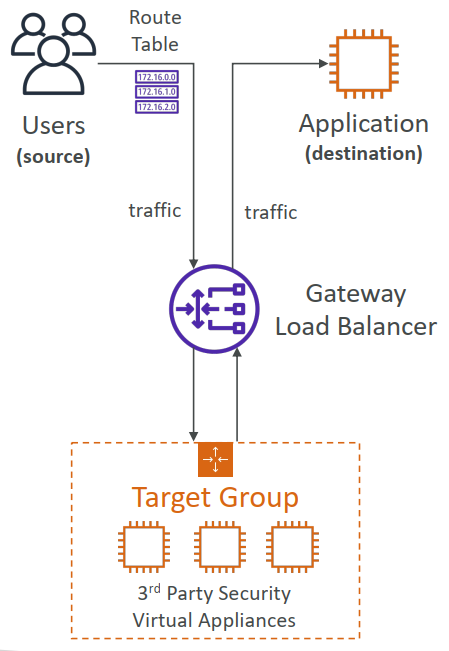
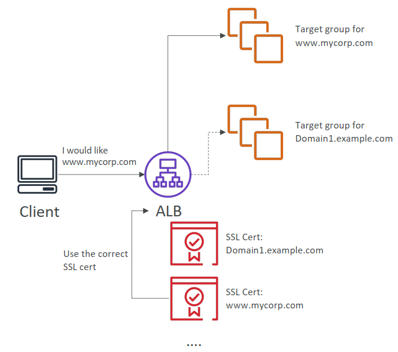

### 1. Why use a load balancer?

- Spread load across multiple downstream instances
- Expose a single point of access (DNS) to your application
- Seamlessly handle failures of downstream instances
- Do regular health checks to your instances
- Provide SSL termination (HTTPS) for your websites
- Enforce stickiness with cookies
- High availability across zones
- Separate public traffic from private traffic

### 2. Types of load balancer on AWS

- AWS has 4 kinds of managed Load Balancers
- **Classic Load Balancer** (v1 - old generation) – 2009 – CLB
  - HTTP, HTTPS, TCP, SSL (secure TCP)
  - Supports TCP (Layer 4), HTTP & HTTPS (Layer 7)
  - Health checks are TCP or HTTP based
  - Fixed hostname : xxx.region.elb.amazonaws.com

- **Application Load Balancer** (v2 - new generation) – 2016 – ALB
  - HTTP, HTTPS, WebSocket
  - Application load balancers is Layer 7 (HTTP)
  - Load balancing to multiple HTTP applications across machines (target groups)
  - Load balancing to multiple applications on the same machine (ex: containers)
  - Support for HTTP/2 and WebSocket
  - Support redirects (from HTTP to HTTPS for example)
  - Routing tables to different target groups:
    - Routing based on path in URL (example.com/users & example.com/posts)
    - Routing based on hostname in URL (one.example.com & other.example.com)
    - Routing based on Query String, Headers (example.com/users?id=123&order=false)
  - ALB are a great fit for micro services & container-based application (example: Docker & Amazon ECS)
  - Has a port mapping feature to redirect to a dynamic port in ECS
  - In comparison, we'd need multiple Classic Load Balancer per application
  - **Target Groups:**
    - EC2 instances (can be managed by an Auto Scaling Group) – HTTP
    - ECS tasks (managed by ECS itself) – HTTP
    - Lambda functions – HTTP request is translated into a JSON event
    - IP Addresses – must be private IPs
  - ALB can route to multiple target groups
  - Health checks are at the target group level
  - Fixed hostname (xxx.region.elb.amazonaws.com)
  - The application servers don’t see the IP of the client directly
  - The true IP of the client is inserted in the header **X-Forwarded-For** 请求标头可自动添加并帮助您识别客户端的 IP 地址
  - We can also get Port (X-Forwarded-Port 请求标头可帮助您识别客户端与您的负载均衡器连接时所用的目标端口) and proto (X-Forwarded-Proto 请求标头可帮助您识别客户端与您的负载均衡器连接时所用的协议 (HTTP 或 HTTPS))

- **Network Load Balancer** (v2 - new generation) – 2017 – NLB
  - TCP, TLS (secure TCP), UDP
  - Network load balancers (Layer 4) allow to:
    - Forward TCP & UDP traffic to your instances
    - Handle millions of request per seconds
    - Less latency ~100 ms (vs 400 ms for ALB)
  - **NLB has <u>one static IP per AZ</u>, and supports assigning Elastic IP** (helpful for whitelisting specific IP)
  - NLB are used for extreme performance, TCP or UDP traffic
  - **Target Groups:**
    - EC2 instances
    - IP Addresses – must be private IPs
    - Application Load Balancer

- **Gateway Load Balancer** – 2020 – GWLB
  - Operates at layer 3 (Network layer) – IP Protocol
  - Deploy, scale, and manage a fleet of 3rd party network virtual appliances in AWS
  - Example: Firewalls, Intrusion Detection and Prevention Systems, Deep Packet Inspection Systems, payload manipulation, …
  - Operates at Layer 3 (Network Layer) – IP Packets
  - Combines the following functions:
    - **Transparent Network Gateway** – single entry/exit for all traffic
    - **Load Balancer** – distributes traffic to your virtual appliances
  - Uses the **GENEVE** protocol on port **6081**
  - **Target Groups:**
    - EC2 instances
    - IP Addresses – must be private IPs

### 3. Sticky Sessions (Session Affinity)

- It is possible to implement stickiness so that the same client is always redirected to the same instance behind a load balancer
- This works for Classic Load Balancers & Application Load Balancers
- The "cookie" used for stickiness has an expiration date you control
- Use case: make sure the user doesn’t lose his session data
- Enabling stickiness may bring imbalance to the load over the backend EC2 instances

### 4. Sticky Sessions – Cookie Names

- **Application-based Cookies**
   - Custom cookie
     - Generated by the target
     - Can include any custom attributes required by the application
     - Cookie name must be specified individually for each target group
     - Don’t use **AWSALB**, **AWSALBAPP**, or **AWSALBTG** (reserved for use by the ELB)
   - Application cookie
     - Generated by the load balancer
     - Cookie name is **AWSALBAPP**
- **Duration-based Cookies**
  - Cookie generated by the load balancer
  - Cookie name is **AWSALB** for ALB, **AWSELB** for CLB

### 5. Cross-Zone Load Balancing

- **Application Load Balancer**
  - Always on (can't be disabled)
  - No charges for inter AZ data
- **Network Load Balancer**
  - Disabled by default
  - You pay charges ($) for inter AZ data if enabled
- **Classic Load Balancer**
  - Disabled by default
  - No charges for inter AZ data if enabled

### 6. SSL – Server Name Indication (SNI)
SSL refers to Secure Sockets Layer, used to encrypt connections
TLS refers to Transport Layer Security, which is a newer version

- SNI solves the problem of loading **multiple SSL certificates onto one web server** (to serve multiple websites)
- It's a "newer" protocol, and requires the client to **indicate** the hostname of the target server in the initial SSL handshake
- The server will then find the correct certificate, or return the default one
*Note:
- Only works for ALB & NLB (newer generation), CloudFront
- Does not work for CLB (older gen)

### 7. Elastic Load Balancers – SSL Certificates

- **Classic Load Balancer (v1)**
  - Support only one SSL certificate
  - Must use multiple CLB for multiple hostname with multiple SSL certificates 
- **Application Load Balancer (v2)** & **Network Load Balancer (v2)**
  - Supports multiple listeners with multiple SSL certificates
  - Uses Server Name Indication (SNI) to make it work

### 8. ASG Brain Dump

- Scaling policies can be on CPU, Network… and can even be on custom metrics or based on a schedule (if you know your visitors patterns)
- ASGs use Launch configurations or Launch Templates (newer)
- To update an ASG, you must provide a new launch configuration / launch template
- IAM roles attached to an ASG will get assigned to EC2 instances
- ASG are free. You pay for the underlying resources being launched
- Having instances under an ASG means that if they get terminated for whatever reason, the ASG will automatically **create new ones as a replacement**. Extra safety!
- ASG can terminate instances marked as unhealthy by an LB (and hence replace them)

### 9. Auto Scaling Groups - Scaling Cooldowns

- After a scaling activity happens, you are in the **cooldown period (default 300 seconds)**
- During the cooldown period, the ASG will not launch or terminate additional instances (to allow for metrics to stabilize)
- Advice: Use a ready-to-use AMI to reduce configuration time in order to be serving request fasters and reduce the cooldown period

### 10. ASG for Solutions Architects

- **ASG Default Termination Policy (simplified version):**
1. Find the AZ which has the most number of instances
2. If there are multiple instances in the AZ to choose from, delete the one with the oldest launch configuration
- **ASG tries the balance the number of instances across AZ by default**

### 11. ASG for Solutions Architects - Lifecycle Hooks
- By default as soon as an instance is launched in an ASG it’s in service.
- You have the ability to perform extra steps before the instance goes in service (Pending state)
- You have the ability to perform some actions before the instance is terminated (Terminating state)