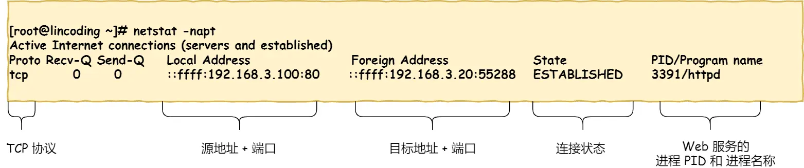

[**建议直接看小林coding**](https://xiaolincoding.com/network/)

### 1. TCP/IP 网络模型有哪几层？

- 应用层（message消息或报文）：工作在操作系统中的用户态，传输层及以下则工作在内核态
- 传输层（segment段）：为应用层提供网络支持，如 TCP（Transmission Control Protocol 传输控制协议）、UDP（用户数据报协议 User Datagram Protocol）
- 网络层（packet包）：网络层最常使用的是 IP 协议（Internet Protocol），IP 协议会将传输层的报文作为数据部分，再加上 IP 包头组装成 IP 报文，如果 IP 报文大小超过 MTU（以太网中一般为 1500 字节）就会**再次进行分片**，得到一个即将发送到网络的 IP 报文
- 网络接口层（frame帧）：网络接口层主要为网络层提供「链路级别」传输的服务，负责在以太网、WiFi 这样的底层网络上发送原始数据包，工作在网卡这个层次，使用 MAC 地址来标识网络上的设备。在 IP 头部的前面加上 MAC 头部，并封装成数据帧（Data frame）发送到网络上

 IP 地址分成两种意义：

- 一个是**网络号**，负责标识该 IP 地址是属于哪个「子网」的；
- 一个是**主机号**，负责标识同一「子网」下的不同主机；

IP地址 & 子网掩码 = 网络号

IP地址 & 子网掩码取反 = 主机号

CIDR（Classless Inter-Domain Routing 无类别域间路由）是一种对IP地址进行分配和路由选择的标准方法。

### 2. OSI（Open System Interconnection Reference Model 开放式系统互联通信参考模型）

1. 物理层（Physical Layer）：负责传输原始的比特流，处理物理介质、电压等物理连接细节。
2. 数据链路层（Data Link Layer）：在直接连接的节点之间传输数据，处理帧（Frame）的发送和接收，提供可靠的数据传输。
3. 网络层（Network Layer）：负责在不同网络之间进行路径选择和数据包转发，处理数据包的路由和寻址。
4. 传输层（Transport Layer）：提供端到端的可靠数据传输，负责分段、流控制、差错检测和恢复等功能。
5. 会话层（Session Layer）：建立、管理和终止应用程序之间的会话，负责进行对话控制和同步。
6. 表示层（Presentation Layer）：处理数据的表示格式，负责数据的加密、压缩、解压缩以及数据格式的转换等。
7. 应用层（Application Layer）：提供直接面向用户的应用服务，包括各种应用程序和协议，如电子邮件、文件传输、远程登录等。

### 3. ARP（Address Resolution Protocol 地址解析协议）

ARP 是用于在局域网（LAN）中将IP地址解析为对应的物理MAC地址的协议。

在计算机网络中，数据包在传输过程中需要知道目标设备的物理地址（MAC地址），而通常应用程序使用的是目标设备的IP地址。ARP 协议（如果目标设备的 IP 地址和 MAC 地址映射在 ARP 缓存中不存在）通过在局域网内广播请求，询问某个IP地址对应的MAC地址，从而实现 IP 地址到 MAC 地址的解析。

在 Linux 系统中，我们可以使用 `arp -a` 命令来查看 ARP 缓存的内容。

```bash
> arp -a
? (192.168.3.20) at f0:76:1c:58:f4:bc [ether] on eth2
#     IP地址              MAC地址                网口名称
```

### 4. ICMP（Internet Control Message Protocol Internet控制报文协议）

ICMP 是一种网络协议，用于在IP网络中传输控制和错误消息。

ICMP 协议的主要功能包括以下几个方面：

1. 错误报告：当在网络通信中出现错误时，ICMP 可以生成和传输错误报文给源设备，以通知发送者发生的问题。例如，当目标主机不可达、数据报超时、端口不可达等情况发生时，ICMP 可以生成相应的错误报文。
2. 回显请求和回显回答：ICMP 提供了回显请求（Ping）和回显回答的功能。通过发送一个回显请求消息到目标设备，可以测试目标设备是否可达和计算往返时间（RTT）。目标设备收到回显请求后，会发送一个回显回答消息作为响应。
3. 传输状况报告：ICMP 可以传输有关网络状况的信息。例如，当路由器转发数据报时，可以使用 ICMP 来发送传输状况报告，如 TTL（生存时间）过期报文等。
4. 网络重定向：当路由器发现数据包正在沿着非最佳路径传输时，它可以使用 ICMP 报文发送网络重定向消息，告知发送者采用更佳的路径。

ICMP 协议通常工作在网络层（第3层），它直接封装在 IP 数据报中传输。它在网络通信中起到控制和诊断的作用，帮助网络管理员监控和排除网络问题，并提供了一些基本的网络工具和命令，如 Ping 和 Traceroute。

### 5. TCP报文

<center></center>

- 源端口和目的端口：各16bits，端口是传输层与应用层的服务接口

- 序号seq：32bits，TCP 连接中传送的数据流中的每一个字节都编上一个序号，序号字段的值则指的是本报文段所发送的数据的第一个字节的序号

- 确认号ack：32bits，是期望收到对方的下一个报文段的数据的第一个字节的序号

- 数据偏移：4bits，表示首部长度包含可选部分，最小单位为32bits

- 保留：6bits，保留为今后使用，但目前应置为 0

- URG：当 URG=1 时，表示紧急数据，相当于高优先级的数据，尽快传送

  ACK：当 ACK=1 时确认号字段才有效，当 ACK=0 时无效

  PSH(PuSH)：当 PSH = 1 时，就尽快地交付接收应用进程，而不再等到整个缓存都填满了后再向上交付

  RST (ReSeT)：当 RST=1 时，由于主机崩溃或其他等原因必须释放然后再重新建立连接

  SYN：当 SYN = 1 时，表示这是一个连接请求或连接接受报文

  FIN：但 FIN=1 时，表示发送方的数据已发送完毕，要求释放连接

- 窗口大小：16bits，窗口字段用来控制对方发送的数据量，单位为字节。TCP 连接的一端根据设置的缓存空间大小确定自己的接收窗口大小，然后通知对方以确定对方的发送窗口的上限。  

- 检验和：16bits，校验首部前12字节 + 数据部分

- 紧急指针：16bits，指出在本报文段中紧急数据共有多少个字节（紧急数据放在本报文段数据的最前面）

- 选项options：长度可变。TCP首部可以有多达40字节的可选信息，用于把附加信息传递给终点，或用来对齐其它选项。 这部分最多包含40字节，因为TCP头部最长是60字节（其中还包含前面讨论的20字节的固定部分）

- 填充：使整个首部长度是 4 字节的整数倍

### 6. options 字段

TCP报文中的选项（Options）字段具有以下结构：

1. 选项类型（Option Kind）：1字节，表示选项的类型。常见的选项类型包括：
   - 0：表示选项字段的结束标记（End of Option List）。
   - 1：表示无操作（No-Operation），用于填充字节和对齐选项字段。
   - 2：表示最大报文段长度（Maximum Segment Size，MSS）。
   - 3：表示窗口扩大因子（Window Scale）。
   - 4：表示选择确认（Selective Acknowledgment，SACK）。
   - 其他选项类型还包括时间戳（Timestamp）、窗口探测（Window Probe）等。
2. 选项长度（Option Length）：1字节，表示选项字段的长度，包括选项类型字段和选项数据字段的总长度。
3. 选项数据（Option Data）：可变长度，根据选项类型的不同而具体确定。选项数据字段包含了选项的具体内容和参数。

TCP报文的选项字段可以包含多个选项，按顺序排列。每个选项的结构由选项类型、选项长度和选项数据组成。选项字段的长度是根据选项数据的实际长度计算得出的。

在TCP报文头中，选项字段紧跟在固定长度的报文头字段后面。如果选项字段的长度不是4字节的倍数，将会使用填充字节进行对齐，确保选项字段的起始位置是4字节对齐的。

选项字段的使用是根据需要和协商来确定的。发送方和接收方需要共同支持并理解使用的选项类型和相应的选项数据格式，以确保正确的解析和处理。选项字段的存在为TCP协议提供了一定的灵活性和功能扩展性，允许在TCP报文中传递额外的信息和实现协议的扩展功能。

### 7. 三次握手

目的是保证双方都有发送和接收的能力

ISN：初始化序列号（Initial Sequence Number）

<center></center>

### 8. 查看 TCP 连接状态

```shell
netstat -napt
#-n（或 --numeric）：以数字形式显示 IP 地址和端口号，而不进行反向解析。
#-a（或 --all）：显示所有的连接，包括监听和非监听状态的连接。
#-p（或 --program）：显示与连接相关的程序名称和 PID。
#-t（或 --tcp）：仅显示 TCP 协议相关的连接信息。
```

<center></center>

### 9. http报文

TCP 报文中的数据部分就是存放 HTTP 头部 + 数据

<center></center>

**（1）请求方法 URI 协议 / 版本**

 ```http
GET /index.html HTTP/1.1
 ```

http 1.1协议支持以下几种请求方法：

- GET：用于从服务器获取指定资源（幂等）
- POST：用于向服务器提交数据
- HEAD：与 GET 方法类似，但只请求获取资源的元数据，而不包含实际的资源内容。主要用于获取资源的元信息，如资源的大小、最后修改时间等
- PUT：将请求中包含的实体存储在服务器上的指定位置。PUT 方法用于上传、替换或创建指定位置的资源
- DELETE：请求服务器删除指定的资源
- OPTIONS：用于请求服务器返回对指定资源支持的通信选项。主要用于获取服务器支持的请求方法、报文头部支持的字段等信息
- TRACE：用于对服务器进行环回测试。服务器收到 TRACE 请求后，应该将请求报文的内容作为响应主体返回给客户端，用于检测中间的代理服务器或网关对请求的修改。
- CONNECT：用于建立与目标服务器的隧道连接，通常用于进行安全的HTTPS通信。

**（2）请求头 (Request Header)**

请求头包含许多有关的客户端环境和请求正文的有用信息。例如，请求头可以声明浏览器所用的语言，请求正文的长度等。

```http
Accept:image/gif.image/jpeg.*/*
Accept-Language:zh-cn
Connection:Keep-Alive
Host:localhost
User-Agent:Mozila/4.0(compatible:MSIE5.01:Windows NT5.0)
Accept-Encoding:gzip,deflate.
```

**(3) 请求正文**

请求头和请求正文之间是一个空行，这个行非常重要，它表示请求头已经结束，接下来的是请求正文。请求正文中可以包含客户提交的查询字符串信息。

### 10. IP报文

<center></center>

- 版本（Version）：4 bits，IP协议的版本号，常用4、6
- 首部长度（Header Length）：4 bits，不包含Data部分，单位4 bytes，最大 60 bytes
- 服务类型（Type of Service）：8 bits，用于指定IP报文的优先级、延迟和吞吐量要求等服务质量(QoS)相关信息
- 总长度（Total Length）：16 bits，指定整个IP报文的总长度（包括IP首部和数据部分），单位 bytes，最大值为65535
- 标识（Identification）：16 bits，用于标识IP报文的唯一标识符。在分片传输中，这个字段在所有片段中保持不变
- 标志（Flags）：3 bits，用于指示是否进行分片以及如何处理分片
  - 第一个比特位为保留位
  - 第二个比特位为不分片DF （Don't Fragment）标志位，用于指示该报文是否允许分片
  - 第三个比特位为更多分片MF（More Fragments）标志位，用于指示是否还有更多分片

- 片偏移（Fragment Offset）：13 bits，用于指示该分片相对于原始IP报文开始位置的偏移量，以8字节为单位
- 生存时间（Time to Live）：8 bits，表示报文在网络中可以经过的最大跳数（即经过的路由器数量）
- 协议（Protocol）：8 bits，指定IP报文中携带的上层协议类型，例如TCP(6)、UDP(17)、ICMP(1)等。
- 首部校验和（Header Checksum）：16 bits，用于检验IP首部的完整性，以便在接收端进行错误检测
- 源IP地址（Source IP Address）：32 bits，指定报文的发送者的IP地址
- 目标IP地址（Destination IP Address）：32 bits，指定报文的接收者的IP地址
- 选项（Options）：可选字段，用于在IP报文中传递一些额外的控制和参数信息，如记录路由路径、时间戳等
- 数据（Data）：IP报文的数据部分，根据协议类型的不同而具有不同的格式和含义

### 11. 假设客户端有多个网卡，就会有多个 IP 地址，那 IP 头部的源地址应该选择哪个 IP 呢？

当存在多个网卡时，在填写源地址 IP 时，就需要判断到底应该填写哪个地址。这个判断相当于在多块网卡中判断应该使用哪个一块网卡来发送包。

这个时候就需要根据**路由表**规则，来判断哪一个网卡作为源地址 IP。

在 Linux 操作系统，我们可以使用 `route -n` 命令查看当前系统的路由表。

```bash
> route -n
Kernel IP routing table
Destination   	Gateway        Genmask          Flags   Metric   RefUse   Iface
192.168.3.0   	0.0.0.0        255.255.255.0      U       0        0       eth0
192.168.10.0  	0.0.0.0        255.255.255.0      U       0        0       eth1
0.0.0.0       	192.168.3.1    0.0.0.0            UG      0        0       eth0
```

举个例子，根据上面的路由表，我们假设 Web 服务器的目标地址是 `192.168.10.200`。

1. 首先先和第一条目的子网掩码（`Genmask` Generalized netmask）进行 **与运算**，得到结果为 `192.168.10.0`，但是第一个条目的 `Destination` 是 `192.168.3.0`，两者不一致所以匹配失败。
2. 再与第二条目的子网掩码进行 **与运算**，得到的结果为 `192.168.10.0`，与第二条目的 `Destination 192.168.10.0` 匹配成功，所以将使用 `eth1` 网卡的 IP 地址作为 IP 包头的源地址。

那么假设 Web 服务器的目标地址是 `10.100.20.100`，那么依然依照上面的路由表规则判断，判断后的结果是和第三条目匹配。

第三条目比较特殊，它目标地址和子网掩码都是 `0.0.0.0`，这表示**默认网关**，如果其他所有条目都无法匹配，就会自动匹配这一行。并且后续就把包发给路由器，`Gateway` 即是路由器的 IP 地址。

### 12. MAC 报文

MAC（Media Access Control）报文是在数据链路层上使用的一种格式，用于在本地网络中的主机之间进行通信。下面是MAC报文的基本格式：

| 目的MAC地址（6字节） | 源MAC地址（6字节） | 类型/长度字段（2字节） | 数据（46-1500字节） | 帧校验序列（4字节） |
| -------------------- | ------------------ | ---------------------- | ------------------- | ------------------- |

- 目的MAC地址（Destination MAC Address）：指示报文的目标设备的物理地址，通常是一个唯一的标识符，采用十六进制表示法（如00:11:22:33:44:55）
- 源MAC地址（Source MAC Address）：指示报文的发送设备的物理地址，也是一个唯一的标识符
- 类型/长度字段（Type/Length Field）：用于指示数据字段中包含的协议类型或者报文长度。
  - 如果该字段的值大于等于0x600（1536），则表示指示的是协议类型，一般在 TCP/IP 通信里，MAC 包头的协议类型只使用：`0800` ： IP 协议，`0806` ： ARP 协议
  - 如果该字段的值小于0x600，则表示指示的是报文的长度
- 数据（Data）：MAC报文携带的有效数据部分，长度通常为46至1500字节。这部分数据是由上层协议（如IP协议）产生的数据。
- 帧校验序列（Frame Check Sequence，FCS）：用于校验报文是否在传输过程中发生错误。它是通过对报文中的数据部分进行计算所得到的一种校验值，长度为4个字节。

需要注意的是，上述格式是Ethernet（以太网）中MAC报文的**基本格式**，还有其他类型的局域网技术和数据链路协议也使用不同的报文格式，但是以太网是目前应用最广泛的局域网技术之一。

### 13. 出口 —— 网卡

网络包只是存放在内存中的一串二进制数字信息，没有办法直接发送给对方。因此，我们需要将**数字信息转换为电信号**，才能在网线上传输，也就是说，这才是真正的数据发送过程。

负责执行这一操作的是**网卡**，要控制网卡还需要靠**网卡驱动程序**。

网卡驱动获取网络包之后，会将其**复制**到网卡内的缓存区中，接着会在其**开头加上报头和起始帧分界符，在末尾加上用于检测错误的帧校验序列**。

<center></center>

- 起始帧分界符是一个用来表示包起始位置的标记
- 末尾的 `FCS`（帧校验序列）用来检查包传输过程是否有损坏

最后网卡会将包转为电信号，通过网线发送出去。

### 14. 交换机和路由器

[交换机](https://xiaolincoding.com/network/1_base/what_happen_url.html#%E9%80%81%E5%88%AB%E8%80%85-%E4%BA%A4%E6%8D%A2%E6%9C%BA)

[路由器](https://xiaolincoding.com/network/1_base/what_happen_url.html#%E5%87%BA%E5%A2%83%E5%A4%A7%E9%97%A8-%E8%B7%AF%E7%94%B1%E5%99%A8)